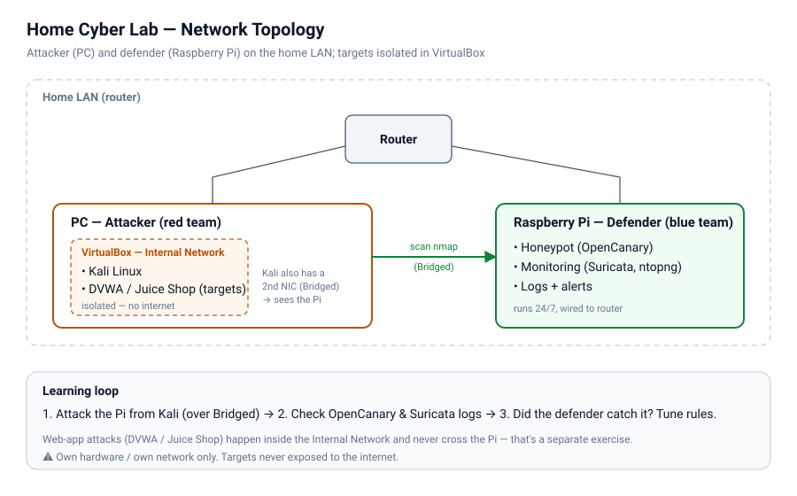

# Raspberry Pi 4 Home Cyber Lab 🛡️⚔️

A home cybersecurity lab built on a Raspberry Pi 4, documenting the full build from unboxing to a working **blue team (defense) / red team (attack)** setup.

🇵🇱 **Polski:** [README.pl.md](README.pl.md) · detailed step notes in [`docs/`](docs/) are in Polish.

> ⚠️ **Ethics & legal:** Everything here runs on **my own hardware and my own network**, or on platforms that explicitly allow it. Attack targets live in an isolated virtual network, never exposed to the internet. Scanning or attacking systems you don't own is illegal (in Poland: art. 267 of the Penal Code). This repo is for learning defensive and offensive security on equipment I control.

## What this is

Two roles across two machines:

- **Raspberry Pi 4 = the defender (blue team).** Runs 24/7, acts as a honeypot (OpenCanary) and monitors network traffic (Suricata, ntopng). It logs anyone probing it. The Pi deliberately does not monitor other devices on the home network; it only sees connections aimed at itself.
- **A laptop/PC = the attacker (red team).** Runs Kali Linux in VirtualBox plus deliberately vulnerable targets (DVWA, OWASP Juice Shop) in an isolated network.

The learning loop: **run an attack → check whether the defender caught it in the logs → tune the rules.**

## Hardware

| Part | Model | Price (PLN) |
|------|-------|-------------|
| Board | Raspberry Pi 4 Model B, 4GB | 479.90 |
| PSU | Official USB-C 5.1V/3A | 37.90 |
| Case | Official Pi 4B case (graphite) | 23.90 |
| Heatsinks | Pi 4B heatsink set (×4) | 4.90 |
| Card (system) | SanDisk Extreme microSD 64GB A2 | 139.00 |
| USB drive (logs) | SanDisk Ultra Fit 64GB USB 3.1 | 79.90 |

Full details: [`docs/01-hardware.md`](docs/01-hardware.md).

## Build documentation

1. [Hardware & shopping list](docs/01-hardware.md)
2. [OS setup — flashing & first boot](docs/02-os-setup.md)
   - [USB log drive — formatting and mounting, command by command (PL)](docs/02b-usb-log-drive.md)
   - [SSH hardening — key, no passwords, port, firewall (PL)](docs/02c-ssh-hardening.md)
   - [Network — wired only and a static IP (PL)](docs/02d-network-basics.md)
3. [The defender — honeypot & monitoring on the Pi](docs/03-defender-raspberry.md)
4. [The attacker — Kali & targets on the PC](docs/04-attacker-kali.md)
   - [VirtualBox networking — virtual NICs, network modes and the default Kali password risk (PL)](docs/04b-sieci-virtualbox.md)
5. [First exercise — attack & detection loop](docs/05-first-exercise.md)
6. [Network topology explained](docs/network-topology.md)
7. [Side exercise — forensics on old microSD cards (PL)](docs/06-forensics-karty-sd.md)
8. [Side mission — attacking my own PC from the Pi (scan & Windows hardening) (PL)](docs/07-skan-wlasnego-pc.md)

🗺️ **Roadmap:** [`ROADMAP.md`](ROADMAP.md) — task checklist: what is done and what is next.

📋 **Stage summaries (PL):** [Stage 1 — Foundations](docs/etap-1-podsumowanie.md) · [Stage 2 — Defender](docs/etap-2-podsumowanie.md) · [Stage 3 — Attacker](docs/etap-3-podsumowanie.md) (each stage in one file: commands, problems, status check)

📓 **Build journal:** [`build-log/build-log.md`](build-log/build-log.md) — dated notes on what was done and what went wrong.

⚙️ **Config & scripts:** [`config/`](config/) — example OpenCanary config, Suricata notes, helper scripts (no secrets, no real IPs).

## Status

🚧 Build in progress — Stages 1 and 2 done 2026-10-09: hardened Pi, OpenCanary honeypot (SSH/web/FTP) and Suricata IDS with daily rule updates. Stage 3 done 2026-10-10: hardened Kali in VirtualBox plus DVWA and Juice Shop targets on the isolated `labnet`. Next: the attack–detect loop. Follow the [build log](build-log/build-log.md).

## License

[MIT](LICENSE) — do what you like, no warranty.
