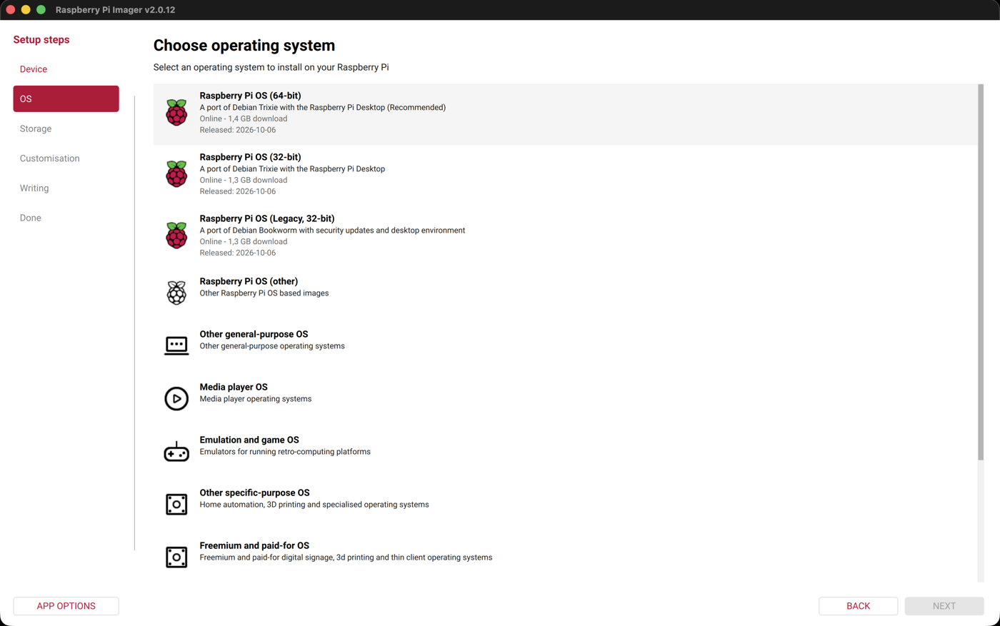
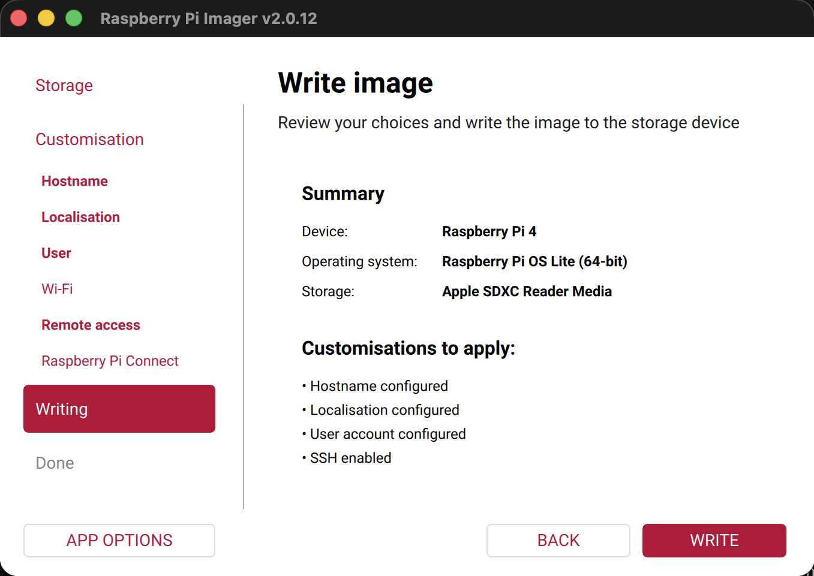
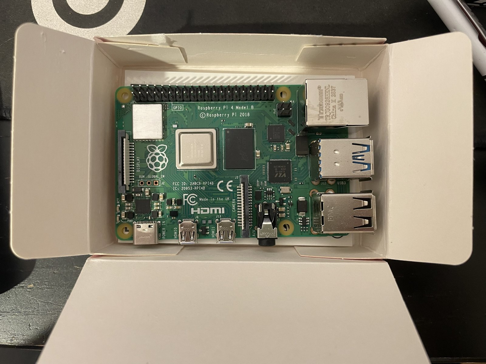
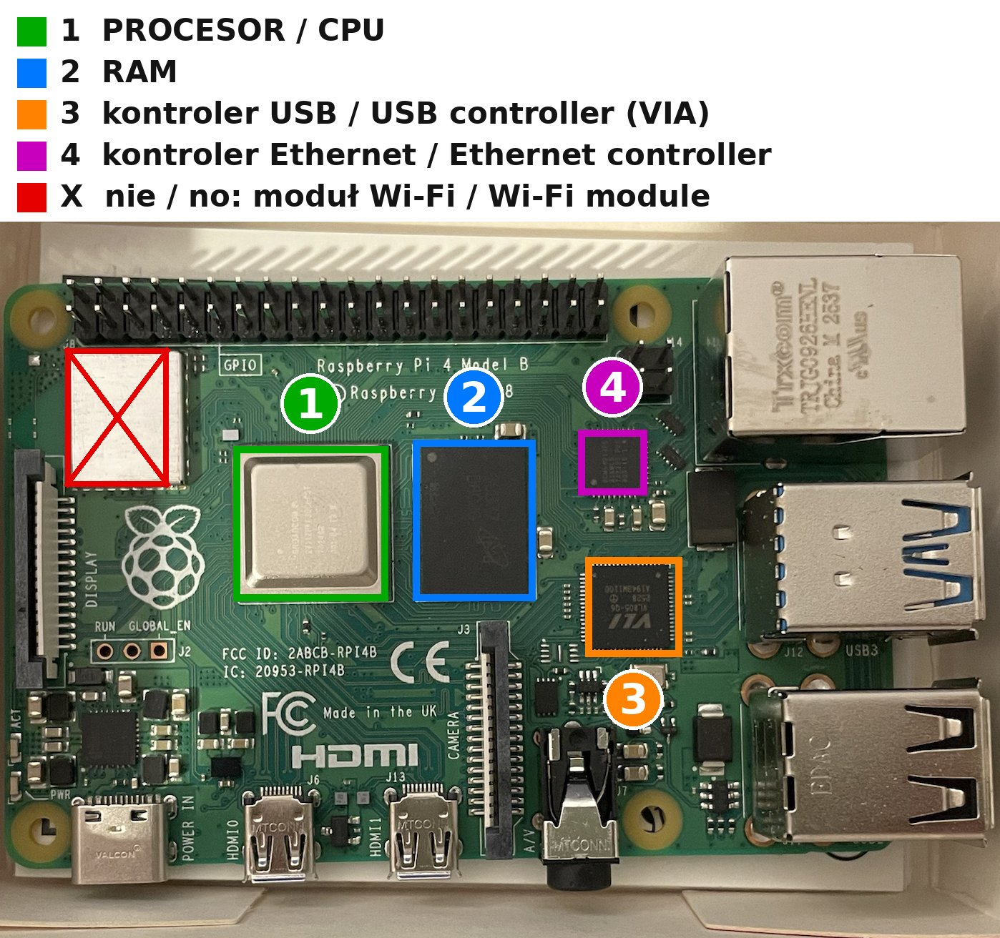
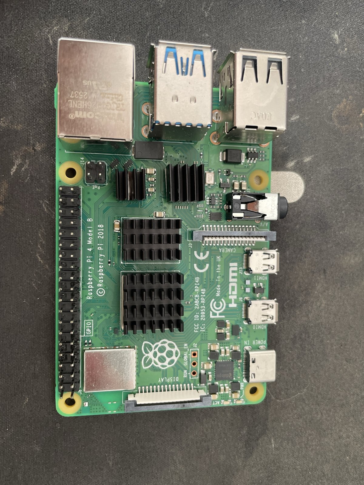
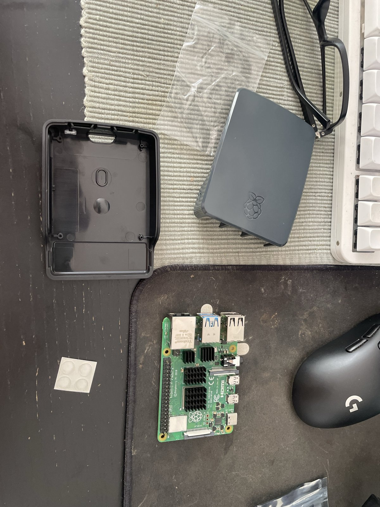
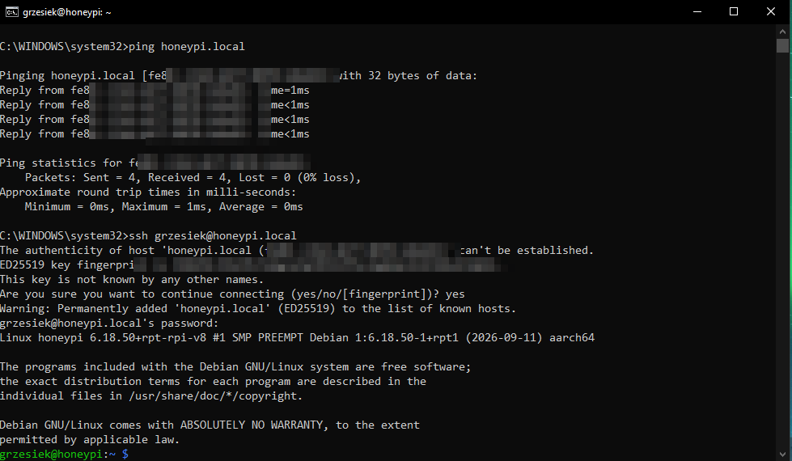
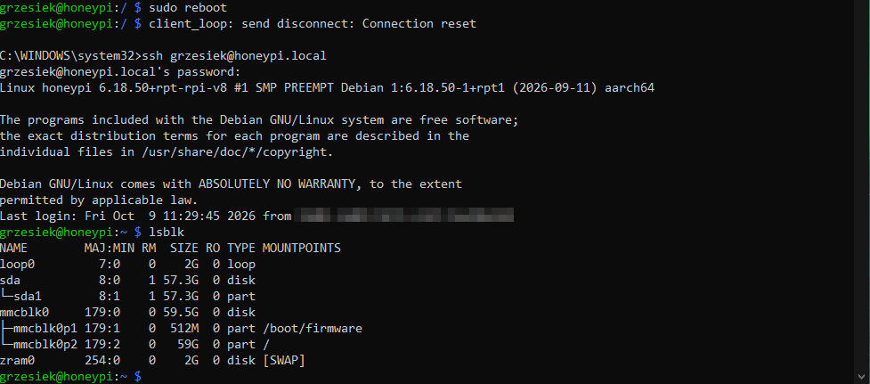
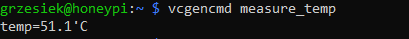

# Dziennik budowy / Build log

Datowane notatki: co zrobione, co poszło nie tak, czego się nauczyłem.
Dated notes: what was done, what broke, what I learned.

Najnowsze na górze / Newest first.

---

## 2026-10-10 — Baza DVWA i soft lockupy / DVWA database and soft lockups

🇵🇱 Na stronie Setup DVWA utworzyłem bazę (*Create / Reset Database*) i zalogowałem się jako `admin`. Setup Check prawie cały zielony; brakuje tylko klucza reCAPTCHA, co psuje jedno ćwiczenie (*Insecure CAPTCHA*). Firefox chciał zapamiętać hasło: odmówiłem, bo na maszynie do ataków haseł nie zapisuję. W konsoli `cele` znalazłem sześć ostrzeżeń *soft lockup*, w tym oba procesory naraz po 490 s: cała maszyna stała ponad 8 minut, najpewniej przez uśpiony PC. Do obserwacji. Przy okazji przegląd wcześniejszych rozdziałów: poprawiona ścieżka logu honeypota w 05, nieaktualne sekcje w 04, martwe kotwice, numeracja na zrzucie 17 i uwagi o sumach SHA-256 i o porównywaniu odcisku klucza z konsolą.

🇬🇧 Created the DVWA database on the setup page and logged in as `admin`. Setup check almost all green; only the reCAPTCHA key is missing, which breaks one module. Declined Firefox's offer to save the password. The target VM's console showed six soft-lockup warnings, both CPUs stalled for 490 s at once, most likely a sleeping PC. Watching it. Also reviewed earlier chapters: fixed the honeypot log path in 05, stale sections in 04, dead anchors, screenshot 17 numbering, and added notes on SHA-256 vs GPG and on checking SSH fingerprints against the console.

**Lekcja / Lesson:** przy ostrzeżeniu jądra patrzę, ile procesorów i kiedy: wszystkie naraz to problem komputera, nie maszyny. / With a kernel warning, check how many CPUs and when: all at once means the host, not the guest.
Zrzuty / Screenshots: [../screenshots/2026-10-10-cele-docker/](../screenshots/2026-10-10-cele-docker/) (`22`–`24`) · Opis / Walkthrough: [docs/04d, część 7](../docs/04d-docker-dvwa-juice-shop.md#część-7-baza-dvwa-i-snapshot-cele-czyste)

---

## 2026-10-10 — Pierwszy kontakt Kali → cele / First contact Kali → target VM

🇵🇱 Kali ze stałym `10.10.10.5` na `eth0` (nmcli, bez bramy, internet zostaje na `eth1` mostkowanej). Ping do `cele` 3/3. `nmap -sV` pokazał tylko 22 i 3000 — DVWA na 4280 zniknęło, bo domyślnie skanuje 1000 portów; dopiero `nmap -p-` pokazał wszystkie trzy usługi, baza 3306 dalej niewidoczna. SSH na `cele` z porównaniem odcisku klucza (zgodny z rannym z PowerShella). DVWA i Juice Shop otwarte w Firefoksie na Kali. To domyka testy z Etapu 3.

🇬🇧 Kali static `10.10.10.5` on `eth0` (nmcli, no gateway, internet stays on the bridged `eth1`). Ping to `cele` 3/3. `nmap -sV` showed only 22 and 3000 — DVWA on 4280 was missing because the default scan covers 1000 ports; `nmap -p-` revealed all three services, the 3306 database still hidden. SSH to `cele` with a fingerprint check (matches the morning's from PowerShell). DVWA and Juice Shop opened in Firefox on Kali. This closes the stage-3 tests.

**Wpadki / Gotchas:** literówka `sSnmap` zamiast `nmap -sV`; domyślny `nmap` nie widzi portu 4280 (lekcja o zakresie skanu). / `sSnmap` typo instead of `nmap -sV`; the default `nmap` misses port 4280 (a lesson about scan scope).

**Lekcja / Lesson:** domyślny skan nmapa to 1000 portów, nie wszystkie — atakujący i obrońca, którzy o tym zapomną, przeoczą usługę na nietypowym porcie. / nmap's default is 1000 ports, not all — anyone who forgets that misses a service on an unusual port.

Opis / Walkthrough: [docs/04d, część 6](../docs/04d-docker-dvwa-juice-shop.md#część-6-pierwszy-kontakt-z-kali) · Zrzuty / Screenshots: [`../screenshots/2026-10-10-cele-docker/`](../screenshots/2026-10-10-cele-docker/)

---

## 2026-10-10 — Docker, DVWA i Juice Shop na `cele` / Docker, DVWA and Juice Shop on the target VM

🇵🇱 Na `cele` Docker 29.9.0 z oficjalnego repozytorium; Ubuntu 26.04 (`resolute`) jest już w nim obsługiwane. W konsoli VirtualBoxa nie da się wklejać, więc przekierowałem port 2201 → 22 w NAT (tylko z `127.0.0.1`) i dalej pracowałem przez SSH z PowerShella. DVWA z `compose.yml` autora z dwiema zmianami: port na wszystkich kartach zamiast tylko `127.0.0.1` (inaczej Kali by go nie zobaczył) i `pull_policy: missing` (inaczej start bez internetu by się wywalił). Juice Shop przez `docker run`. Trzy kontenery `Up`, DVWA odpowiada `302`, Juice Shop `200`. Potem stały adres 10.10.10.10 (netplan, cloud-init wyłączony z sieci), snapshot i karta przełączona na `labnet`: `ping 8.8.8.8` → `Network is unreachable`.

🇬🇧 Docker 29.9.0 on the target VM from Docker's official repo, which already supports Ubuntu 26.04 (`resolute`). The VirtualBox console can't paste, so I forwarded NAT port 2201 → 22 (from `127.0.0.1` only) and worked over SSH from PowerShell. DVWA from the author's `compose.yml` with two edits: listen on all interfaces instead of `127.0.0.1` only (otherwise Kali can't reach it) and `pull_policy: missing` (otherwise it fails to start offline). Juice Shop via `docker run`. Three containers up, DVWA returns `302`, Juice Shop `200`. Then static 10.10.10.10 (netplan, cloud-init networking disabled), snapshot and the adapter moved to `labnet`: `ping 8.8.8.8` → `Network is unreachable`.

**Wpadki / Gotchas:** literówki przy przepisywaniu (`downolad`, `dev` zamiast `deb`, `sources.lisat.d`, `udpate`); `Connection refused` przed zatwierdzeniem reguły portu; odcisk klucza SSH zaakceptowany bez porównania; zgubione `docker compose up -d` przy wklejaniu kilku linijek; timeout Docker Hub przy Juice Shop, naprawiony osobnym `docker pull`; wklejony blok z `sudo` „zjedzony” przez pytanie o hasło. / Typos from retyping; `Connection refused` before the port rule was saved; SSH fingerprint accepted without comparing; a lost `docker compose up -d` when pasting several lines; a Docker Hub timeout on Juice Shop, fixed with a separate `docker pull`.

**Lekcja / Lesson:** grupa `docker` to w praktyce root. Na celowo słabej maszynie w zamkniętej sieci jest OK, na Raspberry nie. / The `docker` group is effectively root: fine on a deliberately weak isolated VM, not on the Pi.

Opis / Walkthrough: [docs/04d](../docs/04d-docker-dvwa-juice-shop.md) · Zrzuty / Screenshots: [`../screenshots/2026-10-10-cele-docker/`](../screenshots/2026-10-10-cele-docker/)

---

## 2026-10-10 — Kali i maszyna z celami / Kali and the target VM

🇵🇱 Kali 2026.2 z gotowego obrazu dla VirtualBoxa: suma SHA-256 zgodna z kali.org, 4 GB RAM, karta 1 w sieci wewnętrznej `labnet`, karta 2 mostkowana. Hasło zmienione od razu, system zaktualizowany (jądro 7.1.5), Kali widzi Raspberry (ping 4/4), rezerwacja DHCP w routerze, snapshot czystego systemu. Potem druga maszyna `cele`: Ubuntu Server 26.04.1 LTS, 2 GB RAM, dysk 25 GB, na razie na NAT, z OpenSSH. Jutro Docker z DVWA i Juice Shop i przełączenie na `labnet`.

🇬🇧 Kali 2026.2 from the pre-built VirtualBox image: SHA-256 matches kali.org, 4 GB RAM, adapter 1 on the internal `labnet`, adapter 2 bridged. Password changed right away, system updated (kernel 7.1.5), Kali reaches the Pi (ping 4/4), DHCP reservation on the router, clean snapshot. Then a second VM, `cele`: Ubuntu Server 26.04.1 LTS, 2 GB RAM, 25 GB disk, on NAT for now, with OpenSSH. Next: Docker with DVWA and Juice Shop, then the switch to `labnet`.

**Wpadki / Gotchas:** `Get-FileHash` w złym folderze nie zwraca nic, nawet błędu; `shasum` ze strony Ubuntu nie istnieje w PowerShellu; kreator VirtualBoxa chciał instalację nienadzorowaną z kontem bez hasła; `soft lockup` w instalatorze to ostrzeżenie, nie awaria. / `Get-FileHash` in the wrong folder prints nothing; Ubuntu's `shasum` command doesn't exist in PowerShell; the VirtualBox wizard defaulted to an unattended install with a passwordless account; the installer's `soft lockup` is a warning, not a crash.

**Lekcja / Lesson:** cele dostają osobną maszynę zamiast Dockera na Kali, bo Kali ma kartę mostkowaną i podatna aplikacja byłaby widoczna w całej sieci domowej. / Targets get their own VM instead of Docker on Kali: Kali is bridged, so a vulnerable app there would be exposed to the whole home network.

Opis / Walkthrough: [docs/04c](../docs/04c-instalacja-kali-i-celow.md) · Zrzuty / Screenshots: [`../screenshots/2026-10-10-kali-cele/`](../screenshots/2026-10-10-kali-cele/)

---

## 2026-10-10 — Sieci w VirtualBoxie i hasło Kali / VirtualBox networking and the Kali password

🇵🇱 Przed pierwszym uruchomieniem Kali rozpisałem od podstaw, czym jest wirtualna karta i czym różnią się tryby sieci: mostkowany (Kali jako osobne urządzenie w domu), wewnętrzny (`labnet`, tylko maszyny wirtualne), host-only („Ethernet 2” w Windowsie, nieużywana) i NAT. Brak karty `vEthernet (Default Switch)` potwierdził, że Hyper-V jest wyłączony. Do tego scenariusz: jak ktoś z sieci domowej przejąłby Kali z hasłem `kali`/`kali`, gdyby włączyć SSH, i lista obrony.

🇬🇧 Before Kali's first boot I wrote up virtual NICs and the VirtualBox network modes from scratch: bridged (Kali as its own device on the LAN), internal (`labnet`, VMs only), host-only (the unused “Ethernet 2” in Windows) and NAT. The missing `vEthernet (Default Switch)` adapter confirmed Hyper-V is off. Plus a scenario of a LAN attacker taking over Kali with `kali`/`kali` once SSH is on, and a defense checklist.

**Lekcja / Lesson:** maszyna w trybie mostkowanym to pełnoprawne urządzenie w sieci domowej, więc zabezpieczam ją jak każde inne: hasło, wyłączone usługi, firewall. / A bridged VM is a full device on the home LAN; secure it like one.

Opis / Walkthrough: [docs/04b](../docs/04b-sieci-virtualbox.md)

---

## 2026-10-09 — Misja dodatkowa: Raspberry atakuje mój PC / Side mission: the Pi attacks my PC

🇵🇱 Odwróciłem role: `nmap -Pn` z Raspberry na mój PC z Windows 10. Mimo profilu sieci Public z sieci domowej widać było 4 otwarte porty: 135 (RPC), 139 (NetBIOS), 445 (SMB) i 2179 (Hyper-V). Winne reguły: udostępnianie plików i drukarek włączone dla sieci publicznych oraz reguły Hyper-V działające wszędzie. Wyłączyłem udostępnianie, NetBIOS i Hyper-V, restart. Skan kontrolny: wszystkie 1000 portów `filtered`, skan trwał 201 s zamiast 4,6 s.

🇬🇧 Roles reversed: `nmap -Pn` from the Pi against my Windows 10 PC. Despite the Public network profile, 4 ports were open to the home network (135, 139, 445, 2179) because of file sharing enabled for public networks and Hyper-V rules set to Any. Turned off sharing, NetBIOS and Hyper-V, rebooted. Verification scan: all 1000 ports filtered, 201 s instead of 4.6 s.

**Wpadka / Gotcha:** lista portów od środka nie pokazała 139, bo NetBIOS nasłuchuje na adresie karty, a nie na `0.0.0.0`. / The inside view missed port 139 because NetBIOS binds to the adapter address, not `0.0.0.0`.

**Lekcja / Lesson:** „kto mnie widzi” sprawdza się z zewnątrz, nie od środka. Realne ryzyko przed zmianami było niskie (tylko sieć domowa, potrzebne hasło albo niezałatana luka), większym jest koniec wsparcia Windows 10 13.10.2026. / Check exposure from outside, not inside. Real risk before was low (LAN only, needs a password or an unpatched bug); the bigger one is Windows 10 consumer ESU ending on 2026-10-13.

Opis / Walkthrough: [docs/07](../docs/07-skan-wlasnego-pc.md) · Zrzuty / Screenshots: [`../screenshots/2026-10-09-pc-self-scan/`](../screenshots/2026-10-09-pc-self-scan/)

---

## 2026-10-10 — Forensics: test F3, koniec ćwiczenia / F3 test, exercise done

🇵🇱 `f3write` + `f3read` na karcie bez marki: 14,39 GB OK, 0 B utraconych, więc pojemność jest prawdziwa. Zapis przez FAT32 słaby (śr. 3,62 MB/s, chwilami poniżej 0,5 MB/s), odczyt równy 22,4 MB/s. **Ćwiczenie forensics zamknięte** (części 1–5).

🇬🇧 F3 on the no-name card: 14.39 GB OK, 0 lost, so the capacity is genuine. Slow writes (3.62 MB/s average), steady 22.4 MB/s reads. **Forensics exercise done.**

**Lekcja / Lesson:** zerowanie nie wykryje fałszywej pojemności; F3 tak, bo każdy kawałek ma inną treść. / Zero-filling can't reveal fake capacity; F3 can.
Opis / Walkthrough: [docs/06, część 5](../docs/06-forensics-karty-sd.md#część-5-test-autentyczności-karty-bez-marki-f3)

---

## 2026-10-09 — Forensics: bezpieczne kasowanie / secure wipe

🇵🇱 Karta bez marki nadpisana zerami (`dd if=/dev/zero`, 31 min, 8,4 MB/s). Dowód: pierwszy MiB to same zera (`hexdump`), cała karta równa `/dev/zero` (`cmp: EOF on stdin`), PhotoRec 0 plików (przed zerowaniem 111). Na macOS koniec karty to `Input/output error`, a postęp `dd` w potoku pokazuje `sudo pkill -INFO -x dd` z drugiej karty Terminala.

🇬🇧 No-name card overwritten with zeros. Proof: first MiB all zeros, whole card equals `/dev/zero` (`cmp: EOF on stdin`), PhotoRec 0 files (111 before).

**Lekcja / Lesson:** formatowanie zostawiło 106 starych plików, nadpisanie 0. / Formatting left 106 old files, overwriting left none.
Opis / Walkthrough: [docs/06, część 4](../docs/06-forensics-karty-sd.md#część-4-bezpieczne-kasowanie-i-dowód)

---

## 2026-10-09 — Forensics: kontrolowany eksperyment / controlled experiment

🇵🇱 Karta bez marki sformatowana (`eraseDisk`), 4 znane pliki zapisane, usunięte `rm` i obraz. TestDisk odzyskał 4 z 4 co do bajta (nazwy 8.3 bez pierwszej litery), PhotoRec 3 z 4 (plik losowych bajtów bez sygnatury przepadł). PhotoRec znalazł jednak 111 plików, w tym 106 starych `mp3` sprzed formatowania. Wpadki: `head -c 2m` nie działa na macOS, obraz z `sudo dd` należy do roota, `ls` bez `-a` nie pokazuje ukrytych folderów skopiowanych przez TestDisk.

🇬🇧 No-name card formatted, 4 known files written, deleted and imaged. TestDisk recovered 4 of 4 byte-for-byte, PhotoRec 3 of 4 (the random-bytes file has no signature). PhotoRec also found 111 files, including 106 old `mp3`s from before the format.

**Lekcja / Lesson:** formatowanie to nie kasowanie. / Formatting is not wiping.
Opis / Walkthrough: [docs/06, część 3](../docs/06-forensics-karty-sd.md#część-3-kontrolowany-eksperyment)

---

## 2026-10-09 — Forensics kart SD: obraz i odzysk / SD card forensics: image and recovery

🇵🇱 Ćwiczenie dodatkowe na MacBooku. Karta SanDisk 16 GB czytała się niepowtarzalnie (trzy odczyty, trzy różne sumy SHA-256), więc jej obrazowi nie ufam i zostaje jako przypadek do opisu. Karta bez marki 15,5 GB: obraz `dd` z blokadą zapisu (suwak LOCK), trzy zgodne sumy (obraz, strumień, drugi odczyt). TestDisk pokazał usunięte `.mp3` w spisie FAT, PhotoRec (tryb `Free`) odzyskał 314 plików: 280 mp3, 25 jpg, 3 txt, 3 ogg, 2 sqlite, 1 zip. Wpadki: PhotoRec nie tworzy folderu docelowego („0 files saved”), a log i pliki sesji zapisuje w bieżącym folderze, czyli w repo.

🇬🇧 Side exercise on the MacBook. The SanDisk 16 GB card returned different data on every read (three reads, three SHA-256 sums), so its image is not trusted. No-name 15.5 GB card: write-blocked `dd` image, three matching sums. TestDisk listed deleted `.mp3` entries; PhotoRec (`Free` mode) carved 314 files: 280 mp3, 25 jpg, 3 txt, 3 ogg, 2 sqlite, 1 zip. Gotchas: PhotoRec won't create the output folder, and drops its log and session files in the current folder (the repo).

**Lekcja / Lesson:** `dd` bez błędu to jeszcze nie wierny odczyt — potrzebne dwa niezależne odczyty z tą samą sumą. Przed uruchomieniem narzędzia sprawdź, gdzie zapisuje wyniki. / An error-free `dd` is not proof of a faithful read; check where a tool writes its output before running it on someone else's data.
Opis / Walkthrough: [docs/06](../docs/06-forensics-karty-sd.md)

---

## 2026-10-09 — Koniec Etapu 2 / Stage 2 done

🇵🇱 Codzienna aktualizacja reguł Suricaty (systemd timer, 4:30 + losowo do 30 min, przeładowanie bez restartu) — test na żądanie przeszedł. `check-logs.sh` przepisany: jedno zdarzenie w linijce, bez komunikatów startowych honeypota. ntopng przeniesiony do Etapu 5 (razem z Grafaną). **Etap 2 zamknięty.**

🇬🇧 Daily Suricata rule updates via a systemd timer (reload without restart), tested on demand. `check-logs.sh` rewritten to one event per line. ntopng moved to stage 5 alongside Grafana. **Stage 2 done.**

📋 Podsumowanie etapu / Stage summary: [docs/etap-2-podsumowanie.md](../docs/etap-2-podsumowanie.md)

---

## 2026-10-09 — Suricata: pierwsze alerty / first alerts

🇵🇱 `EXTERNAL_NET` zmienione z `"!$HOME_NET"` na `"any"`, bo atakujący w labie jest w sieci domowej. Suricata uruchomiona jako usługa, 53 113 reguł, `Engine started`. Zapytanie z PC z nagłówkiem skanera Nmap dało dwa alerty `ET SCAN … Nmap … User-Agent` z priorytetem 1.

🇬🇧 Changed `EXTERNAL_NET` to `"any"` because the lab attacker is on the home network. Suricata running as a service with 53,113 rules. A request from the PC with an Nmap user agent raised two `ET SCAN` priority-1 alerts.

**Wpadka / Gotcha:** test `testmynids.org` nic nie dał — `curl -s` ukrył błąd `Could not resolve host`, strona przestała istnieć. / The testmynids.org test silently failed: the site no longer resolves and `-s` hid the error.

**Lekcja / Lesson:** najpierw sprawdź, czy ruch w ogóle był, potem czy IDS go wykrył. / First confirm the traffic happened, then whether the IDS caught it.

Opis / Walkthrough: [docs/03, część 2, krok 2](../docs/03-defender-raspberry.md#krok-2-atakujący-z-domu-uruchomienie-i-pierwszy-alert)

---

## 2026-10-09 — Suricata: instalacja i reguły / install and rules

🇵🇱 Suricata 7.0.10 z repozytorium Debiana. Konfiguracja domyślna pasuje: słucha na `eth0`, `HOME_NET` obejmuje sieć domową, ścieżka reguł zgadza się z `suricata-update`. Pobrane reguły ET Open: 69 064, włączone 53 108. Test `suricata -T` przeszedł, wolnej pamięci 3,4 GB.

🇬🇧 Suricata 7.0.10 from Debian. Default config fits: listens on `eth0`, `HOME_NET` covers the home network, rule path matches `suricata-update`. ET Open rules: 69,064 total, 53,108 enabled. `suricata -T` passed, 3.4 GB RAM free.

Opis / Walkthrough: [docs/03, część 2](../docs/03-defender-raspberry.md#część-2-monitoring-ruchu--suricata)

---

## 2026-10-09 — Honeypot OpenCanary / OpenCanary honeypot

🇵🇱 Etap 2 ruszył. OpenCanary 0.9.10 zainstalowany w `/opt/opencanary` (venv), udaje SSH (22), stronę logowania „DiskStation” (80) i FTP (21), działa jako osobny użytkownik `opencanary`, logi idą na pendrive. Test z PC: otwarcie strony, logowanie `admin`/`admin132` i `ssh test@…` z hasłem `haslo123` — wszystko zapisane w logu z adresem, programem, loginem i hasłem. Na koniec usługa systemd; po restarcie honeypot wstaje sam.

🇬🇧 Stage 2 started. OpenCanary 0.9.10 in a venv under `/opt/opencanary`, faking SSH (22), a "DiskStation" login page (80) and FTP (21), running as a dedicated `opencanary` user, logging to the USB stick. Tests from the PC (web login and SSH login) were logged with source, client, username and password. Runs as a systemd service and comes back after reboot.

**Wpadki / Gotchas:** `opencanaryd --copyconfig` pod `sudo` użył systemowego Pythona i wypisał „ready”, choć nic nie skopiował — naprawione przez `sudo env PATH=/opt/opencanary/bin:$PATH`. Cztery komendy `ufw` wklejone naraz — wykonała się tylko pierwsza. `ssh honeypi.local` na porcie 22 zablokowany przez `REMOTE HOST IDENTIFICATION HAS CHANGED` — tak ma być, to ochrona przed podszyciem.

**Lekcja / Lesson:** komunikat „gotowe” to nie dowód — sprawdzaj wynik. / A "done" message is not proof — check the result.

Opis / Walkthrough: [docs/03, część 1](../docs/03-defender-raspberry.md)

---

## 2026-10-09 — Montaż i pierwsze logowanie / Assembly and first login

🇵🇱 Nagrałem Raspberry Pi OS Lite (64-bit) w Raspberry Pi Imager: nazwa hosta `honeypi`, strefa Europe/Warsaw, własny użytkownik, SSH z logowaniem hasłem. Wi-Fi i Raspberry Pi Connect zostawiłem wyłączone, bo obrońca ma chodzić po kablu i mieć jak najmniej furtek z zewnątrz. Potem radiatory: procesor, RAM, kontroler USB (VIA) i kontroler Ethernet. Czwarty radiator miał iść na układ zasilania przy USB-C, ale stał na otaczających go cewkach, a nie na chipie, więc przeniosłem go na Ethernet. Płytka w dwuczęściowej obudowie, gumowe nóżki, karta, pendrive, LAN, zasilanie. Pierwsze `ssh` z Windowsa po `honeypi.local` zadziałało od razu.

🇬🇧 Flashed Raspberry Pi OS Lite (64-bit) with Raspberry Pi Imager: hostname `honeypi`, Europe/Warsaw, custom user, SSH with password auth. Left Wi-Fi and Raspberry Pi Connect off, since the defender runs wired and should expose as few ways in as possible. Heatsinks on the CPU, RAM, USB controller (VIA) and Ethernet controller. The fourth one was meant for the power IC next to USB-C, but it rested on the surrounding inductors instead of the chip, so it went on the Ethernet chip instead. Board into a two-part case, rubber feet, SD card, USB stick, LAN, power. First `ssh` from Windows via `honeypi.local` worked straight away.

**Lekcja / Lesson:** radiator, który nie leży płasko na chipie, nic nie chłodzi. Lepiej go przenieść albo pominąć niż wciskać na siłę. / A heatsink that doesn't sit flat on the chip doesn't cool anything. Move it or skip it rather than forcing it.

**Zrzuty / Screenshots:** [`../screenshots/2026-10-09-assembly/`](../screenshots/2026-10-09-assembly/)

| | |
|---|---|
|  |  |
|  |  |
|  |  |



**Po aktualizacji / After the update:** pełna aktualizacja systemu, restart i ponowne logowanie. `lsblk` pokazuje kartę SD (`mmcblk0`, 59,5 GB: `/boot/firmware` i `/`) oraz pendrive (`sda`, 57,3 GB, jedna partycja `sda1`, na razie niezamontowana). Następny krok to sformatowanie pendrive'a pod logi. / Full system upgrade, reboot and login again. `lsblk` shows the SD card (`mmcblk0`, 59.5 GB: `/boot/firmware` and `/`) and the USB stick (`sda`, 57.3 GB, one partition `sda1`, not mounted yet). Next: format the stick for logs.



Temperatura procesora w zamkniętej obudowie, bez obciążenia: **51,1°C**, w normie. / CPU temperature in the closed case at idle: **51.1°C**, within normal range.



**Pendrive na logi / USB log drive:** sformatowany na ext4 (etykieta `logs`) i montowany przy starcie w `/mnt/logs`, 54 GB wolnego. Przy wklejaniu komenda z `tee` rozdzieliła się na dwie linijki (`Permission denied`); po poprawce wpis w `/etc/fstab` jest jeden. Opis komenda po komendzie: [docs/02b](../docs/02b-usb-log-drive.md). / Formatted as ext4 (label `logs`) and auto-mounted at `/mnt/logs`, 54 GB free. The `tee` command split into two lines when pasted (`Permission denied`); after the fix there is a single `/etc/fstab` entry. Command-by-command walkthrough: docs/02b.

**Logi na pendrive / Logs on the USB stick:** cały `/var/log` przeniesiony na pendrive przez *bind mount* (`/mnt/logs/var-log` → `/var/log`). Po restarcie `findmnt /var/log` pokazuje `/dev/sda1[/var-log]`, więc system i wszystkie przyszłe narzędzia piszą logi na pendrive, a nie na kartę. / The whole `/var/log` moved to the stick with a bind mount. After reboot `findmnt /var/log` shows `/dev/sda1[/var-log]`, so the OS and every future tool log to the stick, not the SD card. Opis / Walkthrough: [docs/02b, część 2](../docs/02b-usb-log-drive.md#część-2-logi-z-varlog-na-pendrive)

**Klucz SSH / SSH key:** na PC był już klucz `id_ed25519`, więc go nie nadpisałem i wysłałem na Raspberry ten istniejący. Logowanie działa bez hasła. Klucz nie ma passphrase, do rozważenia. / An `id_ed25519` key already existed on the PC, so I kept it and copied it to the Pi. Login works without a password. The key has no passphrase, worth revisiting. Opis / Walkthrough: [docs/02c](../docs/02c-ssh-hardening.md)

**Bez haseł / No passwords:** nowy plik `/etc/ssh/sshd_config.d/01-hardening.conf` wyłącza logowanie hasłem i jako root. Imager zostawił `50-cloud-init.conf`, ale nasz `01-` jest czytany pierwszy, więc wygrywa. Test: z kluczem loguje, bez klucza `Permission denied (publickey)`. / New drop-in disables password and root login; it sorts before Imager's `50-cloud-init.conf`, so it wins. Key login works, no key gives `Permission denied (publickey)`. Opis / Walkthrough: [docs/02c, część 2](../docs/02c-ssh-hardening.md#część-2-wyłączenie-logowania-hasłem)

**Port 2222 i skrót / Port 2222 and shortcut:** SSH przeniesione na port 2222 (`02-port.conf`), port 22 wolny dla honeypota. Na PC plik `.ssh\config` ze skrótem `ssh honeypi`. Pułapka: Notatnik zapisał go jako `config.txt`, więc SSH go nie widział; poprawione przez `ren`. / SSH moved to port 2222, port 22 left for the honeypot. On the PC a `.ssh\config` with an `ssh honeypi` shortcut. Gotcha: Notepad saved it as `config.txt`, fixed with `ren`. Opis / Walkthrough: [docs/02c, części 3–4](../docs/02c-ssh-hardening.md#część-3-prawdziwy-ssh-na-porcie-2222)

**Firewall:** `ufw` z domyślną blokadą ruchu przychodzącego i jednym wyjątkiem: 2222/tcp (SSH), dla IPv4 i IPv6. Bez ograniczenia do `192.168.1.0/24`, bo Windows łączy się przez IPv6 (`fe80::`). Komendy wklejone w trakcie `apt install` wyświetliły się pomieszane, ale wykonały się poprawnie. / `ufw` denies all incoming traffic except 2222/tcp for IPv4 and IPv6. Not limited to the home subnet because Windows connects over IPv6 link-local. Commands pasted during `apt install` displayed garbled but ran fine. Opis / Walkthrough: [docs/02c, część 5](../docs/02c-ssh-hardening.md#część-5-firewall-ufw)

**Tylko kabel / Wired only:** Wi-Fi i Bluetooth wyłączone sprzętowo w `/boot/firmware/config.txt` (`dtoverlay=disable-wifi`, `disable-bt`). Po restarcie `ip -br link` pokazuje tylko `lo` i `eth0`. / Wi-Fi and Bluetooth disabled at boot via device tree overlays; after reboot only `lo` and `eth0` remain. Opis / Walkthrough: [docs/02d](../docs/02d-network-basics.md)

**Stały adres IP / Static IP:** rezerwacja DHCP w FunBoxie (Ustawienia zaawansowane → Sieć → DHCP → Statyczne adresy IP): `honeypi` ma na stałe `192.168.1.134`. **Etap 1 zamknięty.** / DHCP reservation in the FunBox pins `honeypi` to `192.168.1.134`. **Stage 1 done.** 📋 Podsumowanie etapu / Stage summary: [docs/etap-1-podsumowanie.md](../docs/etap-1-podsumowanie.md). Opis / Walkthrough: [docs/02d, część 2](../docs/02d-network-basics.md#część-2-stały-adres-ip-rezerwacja-dhcp-w-funboxie)

---

## 2026-10-08 — Części zamówione / Parts ordered

🇵🇱 Zamówiłem cały zestaw w Botlandzie (darmowa wysyłka, InPost). Dostawa w czwartek. Wersja 4 GB zamiast 1 GB — z myślą o monitoringu i ewentualnym Home Assistant w przyszłości. Firmową kartę 32 GB za 148 zł odpuściłem na rzecz SanDisk Extreme 64 GB (szybsza, większa, podobna cena). Pendrive na logi, żeby nie zajeżdżać karty.

🇬🇧 Ordered the full kit from Botland (free shipping, InPost). Arrives Thursday. Went with 4 GB over 1 GB for monitoring headroom and a possible future Home Assistant. Skipped the 148 PLN branded 32 GB card for a SanDisk Extreme 64 GB instead. Separate USB drive for logs to spare the SD card.

**Lekcja / Lesson:** firmowe karty z wgranym systemem są mocno przepłacone — system nagrywasz sam za darmo. / Pre-loaded branded cards are heavily overpriced — you flash the OS yourself for free.

---

## Szablon wpisu / Entry template

```
## RRRR-MM-DD — Tytuł / Title

🇵🇱 Co zrobiłem, na co się natknąłem.
🇬🇧 What I did, what I ran into.

Lekcja / Lesson: ...
Zrzuty / Screenshots: ../screenshots/...
```

<!-- Kolejne wpisy dopisuj POWYŻEJ tej sekcji / Add new entries ABOVE this template, below the title -->
