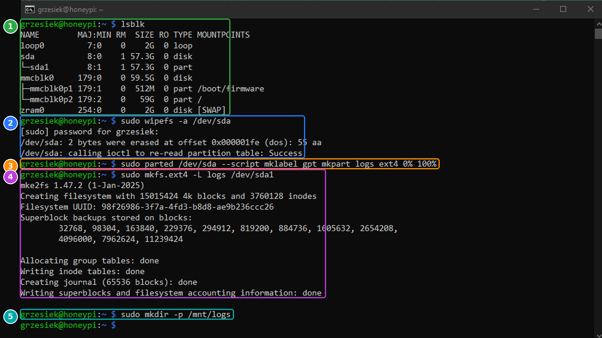
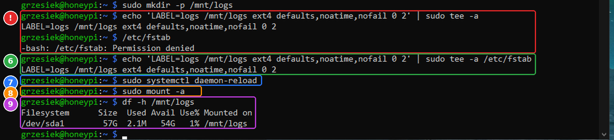
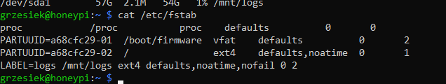
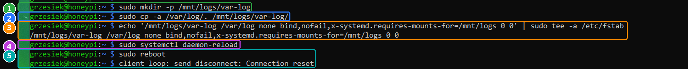
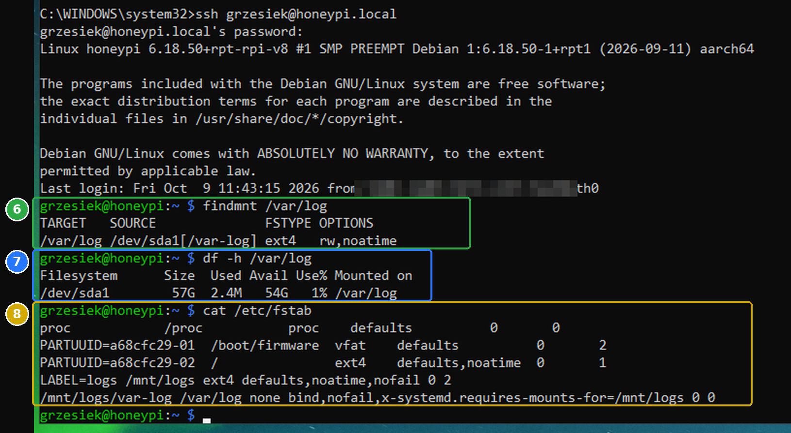

# 02b — Pendrive na logi

Czas: ~10 min. Wszystko przez SSH.

Honeypot i Suricata zapisują dużo logów. Karta microSD ma ograniczoną liczbę zapisów i przy ciągłym logowaniu szybko się zużywa, a na niej jest cały system. Dlatego logi trafią na osobny pendrive: jak się zużyje, wymieniasz pendrive za kilkadziesiąt złotych, a system zostaje nietknięty.

Efekt: pendrive sformatowany na **ext4**, z etykietą `logs`, widoczny jako folder **`/mnt/logs`** i montowany sam po każdym restarcie.

> ⚠️ **Formatowanie kasuje wszystko na pendrivie.** Zanim zaczniesz, sprawdź w kroku 1, która nazwa to pendrive, a która karta z systemem. Pomyłka i sformatowanie karty oznacza nagrywanie systemu od nowa.

## Komendy w skrócie

```bash
lsblk                                                                         # 1
sudo wipefs -a /dev/sda                                                       # 2
sudo parted /dev/sda --script mklabel gpt mkpart logs ext4 0% 100%            # 3
sudo mkfs.ext4 -L logs /dev/sda1                                              # 4
sudo mkdir -p /mnt/logs                                                       # 5
echo 'LABEL=logs /mnt/logs ext4 defaults,noatime,nofail 0 2' | sudo tee -a /etc/fstab   # 6
sudo systemctl daemon-reload                                                  # 7
sudo mount -a                                                                 # 8
df -h /mnt/logs                                                               # 9
```

Numery odpowiadają oznaczeniom na zrzutach poniżej.





## Co robi każda komenda

### 1 · `lsblk`: znajdź pendrive

Pokazuje wszystkie dyski i partycje. Rozpoznajesz je po rozmiarze i nazwie:

| Nazwa | Rozmiar | Co to jest |
|---|---|---|
| `mmcblk0` | 59,5 GB | **karta microSD z systemem**, tej nie ruszamy |
| `mmcblk0p1` | 512 MB | partycja startowa (`/boot/firmware`) |
| `mmcblk0p2` | 59 GB | system (`/`) |
| `sda` | 57,3 GB | **pendrive**, to go formatujemy |
| `sda1` | 57,3 GB | fabryczna partycja na pendrivie |
| `zram0`, `loop0` | 2 GB | pamięć wirtualna w RAM, nie dyski fizyczne |

Kolumna `RM` = `1` oznacza nośnik wyjmowany, czyli kolejną wskazówkę, że `sda` to pendrive.

### 2 · `sudo wipefs -a /dev/sda`: wyczyść stare oznaczenia

- `sudo`: uruchom jako administrator. Za pierwszym razem pyta o hasło.
- `wipefs`: usuwa „podpisy” systemów plików i tablicy partycji, czyli informacje, jak pendrive był sformatowany fabrycznie (u nas był to stary typ tablicy, `dos`).
- `-a`: usuń wszystkie znalezione podpisy.
- `/dev/sda`: cały pendrive, nie tylko jedna partycja.

Wynik `Success` znaczy, że system przeczytał pendrive na nowo i widzi go jako pusty.

### 3 · `sudo parted ... mklabel gpt mkpart logs ext4 0% 100%`: załóż partycję

- `parted /dev/sda`: program do dzielenia dysku na partycje.
- `--script`: nie zadawaj pytań, wykonaj od razu.
- `mklabel gpt`: nowa, pusta tablica partycji typu **GPT** (nowoczesny standard).
- `mkpart logs ext4 0% 100%`: jedna partycja o nazwie `logs`, od początku do końca dysku. Po tej komendzie pojawia się `/dev/sda1`.

Komenda nic nie wypisuje, gdy wszystko jest w porządku.

### 4 · `sudo mkfs.ext4 -L logs /dev/sda1`: sformatuj

- `mkfs.ext4`: tworzy system plików **ext4**, standardowy na Linuksie. Jest odporny na nagłe wyłączenie prądu dzięki dziennikowi (*journal*). Windows go nie odczyta, ale ten pendrive i tak zostaje w Raspberry.
- `-L logs`: etykieta (nazwa) systemu plików. Dzięki niej w kroku 6 odwołujemy się do pendrive'a po nazwie, a nie po `/dev/sda1`, które po podłączeniu innego dysku USB mogłoby się zmienić.
- `/dev/sda1`: partycja z kroku 3.

Linijki kończące się na `done` oznaczają sukces. *Superblock backups* to zapasowe kopie informacji o systemie plików, przydatne przy naprawie.

### 5 · `sudo mkdir -p /mnt/logs`: przygotuj folder

Tworzy pusty folder `/mnt/logs`. Na Linuksie dysk nie dostaje litery jak `D:`, tylko „wpina się” w wybrany folder (*punkt montowania*). Po zamontowaniu wszystko, co zapiszesz w `/mnt/logs`, ląduje na pendrivie.

- `-p`: nie zgłaszaj błędu, jeśli folder już istnieje.

### 6 · `echo '...' | sudo tee -a /etc/fstab`: montuj przy starcie

`/etc/fstab` to lista dysków, które system montuje sam przy uruchomieniu. Dopisujemy do niej jedną linijkę:

```
LABEL=logs  /mnt/logs  ext4  defaults,noatime,nofail  0  2
```

| Pole | Znaczenie |
|---|---|
| `LABEL=logs` | który dysk: ten z etykietą `logs` z kroku 4 |
| `/mnt/logs` | gdzie go wpiąć: folder z kroku 5 |
| `ext4` | jaki system plików |
| `defaults` | standardowe ustawienia |
| `noatime` | nie zapisuj czasu każdego odczytu pliku, czyli mniej zbędnych zapisów i dłuższe życie pendrive'a |
| `nofail` | **ważne:** jeśli pendrive zniknie, Raspberry i tak się uruchomi, zamiast stanąć w trybie awaryjnym |
| `0` | nie uwzględniaj w starym narzędziu do kopii zapasowych (`dump`) |
| `2` | sprawdzaj dysk przy starcie, po partycji systemowej |

Dlaczego `echo ... | sudo tee -a`, a nie zwykłe `>>`? Plik `/etc/fstab` może zmieniać tylko administrator. `echo` wypisuje tekst, `|` przekazuje go dalej, a `sudo tee -a` dopisuje go do pliku z uprawnieniami administratora (`-a` = dopisz na końcu, nie nadpisuj).

### 7 · `sudo systemctl daemon-reload`: odśwież ustawienia

System trzyma listę dysków z `fstab` w pamięci. Ta komenda każe mu przeczytać ją ponownie, żeby zauważył nową linijkę.

### 8 · `sudo mount -a`: zamontuj teraz

Montuje wszystko z `/etc/fstab`, co nie jest jeszcze zamontowane. Nie trzeba restartować Raspberry. Brak komunikatu = sukces. Jeśli w `fstab` byłby błąd, zobaczysz go tutaj, a nie dopiero przy następnym starcie, więc to dobry test.

### 9 · `df -h /mnt/logs`: sprawdź

Pokazuje zajęte i wolne miejsce. `-h` = w czytelnych jednostkach (GB zamiast bajtów).

```
Filesystem  Size  Used  Avail  Use%  Mounted on
/dev/sda1    57G  2.1M    54G    1%  /mnt/logs
```

Pendrive jest zamontowany w `/mnt/logs` i ma 54 GB wolnego. Brakujące ~3 GB to miejsce zarezerwowane przez ext4 dla administratora i na dane samego systemu plików.

## ❗ Wpadka: komenda rozdzielona przy wklejaniu

Na drugim zrzucie (czerwona ramka) komenda z kroku 6 wkleiła się w **dwóch kawałkach**:

1. `echo '...' | sudo tee -a`: bez nazwy pliku `tee` tylko wypisał tekst na ekran i **niczego nie zapisał**.
2. `/etc/fstab`: powłoka potraktowała to jako polecenie do uruchomienia i odpowiedziała `Permission denied`.

Poprawiona komenda (zielona ramka) zadziałała, a linijka trafiła do pliku tylko raz.

**Lekcja:** długie komendy wklejaj w całości i przed Enterem sprawdź, czy są w jednej linii. Po każdej zmianie w `/etc/fstab` warto zajrzeć do pliku:

```bash
cat /etc/fstab
```

Wpis `LABEL=logs ...` powinien być **dokładnie jeden**. Gdyby był podwójny, usuń zbędny w edytorze: `sudo nano /etc/fstab`.



U mnie jest dobrze: dwie pierwsze linijki z `PARTUUID` to partycje karty SD (dodane przez Imagera), ostatnia to pendrive. Wpis `logs` występuje raz.

## Test po restarcie (opcjonalnie)

```bash
sudo reboot
# po ponownym zalogowaniu:
df -h /mnt/logs
```

Jeśli pendrive znowu jest w `/mnt/logs`, montowanie przy starcie działa.

---

# Część 2: logi z `/var/log` na pendrive

Pendrive jest zamontowany, ale programy dalej piszą logi na kartę, do folderu **`/var/log`**. Tam domyślnie zapisuje system, a później także Suricata i ntopng. Zamiast przestawiać każdy program osobno, „podmieniamy” cały folder.

**Bind mount** sprawia, że folder z pendrive'a (`/mnt/logs/var-log`) pojawia się w miejscu `/var/log`. Programy dalej piszą do `/var/log` i niczego nie zauważają, a dane fizycznie lądują na pendrivie.

```
karta SD:  /var/log  ──(bind mount)──►  pendrive: /mnt/logs/var-log
```

## Komendy w skrócie

```bash
sudo mkdir -p /mnt/logs/var-log                                               # 1
sudo cp -a /var/log/. /mnt/logs/var-log/                                      # 2
echo '/mnt/logs/var-log /var/log none bind,nofail,x-systemd.requires-mounts-for=/mnt/logs 0 0' | sudo tee -a /etc/fstab   # 3
sudo systemctl daemon-reload                                                  # 4
sudo reboot                                                                   # 5
# po restarcie i ponownym zalogowaniu:
findmnt /var/log                                                              # 6
df -h /var/log                                                                # 7
cat /etc/fstab                                                                # 8
```





## Co robi każda komenda

### 1 · `sudo mkdir -p /mnt/logs/var-log`: folder na logi

Tworzy na pendrivie folder `var-log`, który zastąpi `/var/log`. Osobny podfolder zamiast całego `/mnt/logs` zostawia na pendrivie miejsce na inne rzeczy, np. późniejsze zapisy ruchu z Suricaty.

### 2 · `sudo cp -a /var/log/. /mnt/logs/var-log/`: przenieś obecne logi

- `cp`: kopiuj.
- `-a` (*archive*): zachowaj właścicieli, uprawnienia i daty plików. Bez tego część programów nie mogłaby potem pisać do swoich logów.
- `/var/log/.`: kropka na końcu znaczy „zawartość folderu, razem z ukrytymi plikami”, a nie sam folder.

Bez tej kopii po podmianie `/var/log` byłby pusty i straciłbyś dotychczasowe logi, w tym te potrzebne kilku usługom do startu.

### 3 · `echo '...' | sudo tee -a /etc/fstab`: podmiana przy każdym starcie

Dopisuje do `/etc/fstab` drugą linijkę:

```
/mnt/logs/var-log  /var/log  none  bind,nofail,x-systemd.requires-mounts-for=/mnt/logs  0  0
```

| Pole | Znaczenie |
|---|---|
| `/mnt/logs/var-log` | skąd: folder na pendrivie |
| `/var/log` | gdzie go pokazać |
| `none` | brak własnego systemu plików, to tylko „lustro” istniejącego folderu |
| `bind` | typ montowania: podmiana folderu |
| `nofail` | bez pendrive'a system i tak wystartuje, a logi pójdą wtedy po prostu na kartę |
| `x-systemd.requires-mounts-for=/mnt/logs` | **kolejność:** najpierw zamontuj pendrive, dopiero potem podmieniaj. Bez tego system mógłby próbować podmienić folder, którego jeszcze nie ma |
| `0 0` | bez kopii `dump` i bez sprawdzania przy starcie, bo to nie osobny dysk |

Ta komenda jest długa, więc wklej ją **w całości, w jednej linii** (patrz wpadka z `tee` wyżej).

### 4 · `sudo systemctl daemon-reload`: odśwież ustawienia

Jak w części 1: system czyta `/etc/fstab` ponownie i widzi nową regułę.

### 5 · `sudo reboot`: restart

Tym razem nie używamy `mount -a`. Programy, które już działają, mają otwarte pliki w starym `/var/log` na karcie i pisałyby do nich dalej. Po restarcie wszystkie startują od nowa i od razu piszą na pendrive.

Komunikat `client_loop: send disconnect: Connection reset` to normalne zerwanie SSH przy restarcie.

### 6 · `findmnt /var/log`: czy podmiana działa

Pokazuje, co jest zamontowane w `/var/log`:

```
TARGET    SOURCE              FSTYPE  OPTIONS
/var/log  /dev/sda1[/var-log] ext4    rw,noatime
```

`/dev/sda1[/var-log]` oznacza: folder `var-log` z pendrive'a (`sda1`). Gdyby podmiana nie zadziałała, `findmnt` nic by nie wypisał, bo `/var/log` byłby zwykłym folderem na karcie.

### 7 · `df -h /var/log`: na jakim dysku leżą logi

`/dev/sda1 … 54G … /var/log`, czyli ten sam pendrive co `/mnt/logs`. Zajęte 2,4 MB to skopiowane logi.

### 8 · `cat /etc/fstab`: kontrola wpisów

Powinny być dokładnie dwa nowe wpisy, każdy raz:

1. `LABEL=logs /mnt/logs ...`: montowanie pendrive'a (część 1),
2. `/mnt/logs/var-log /var/log none bind,...`: podmiana `/var/log` (część 2).

## Co z tego mamy

- Karta SD jest odciążona: cały „szum” logów idzie na pendrive, a na kartę trafia dużo mniej zapisów.
- Każdy przyszły program (OpenCanary, Suricata, ntopng), który pisze do `/var/log`, automatycznie trafi na pendrive. Nie trzeba niczego konfigurować osobno.
- Jak pendrive się zużyje albo zepsuje, Raspberry dalej wystartuje dzięki `nofail`, a logi wrócą na kartę do czasu wymiany.

➡️ Następnie: [03 — Obrońca](03-defender-raspberry.md)
