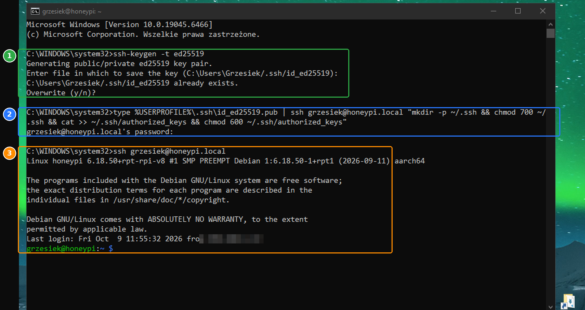
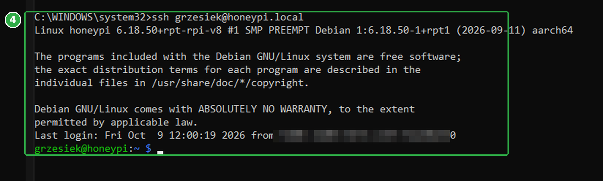
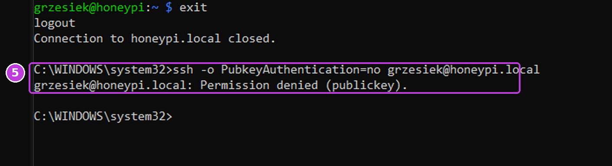
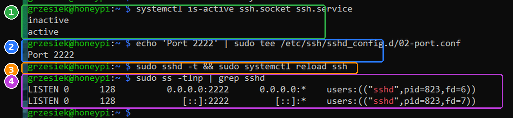
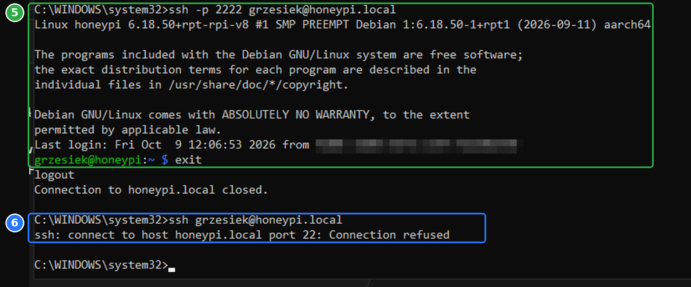
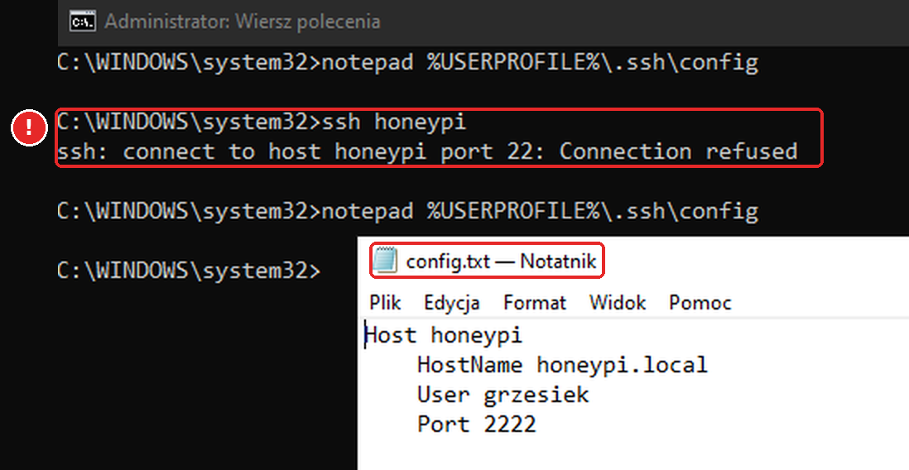
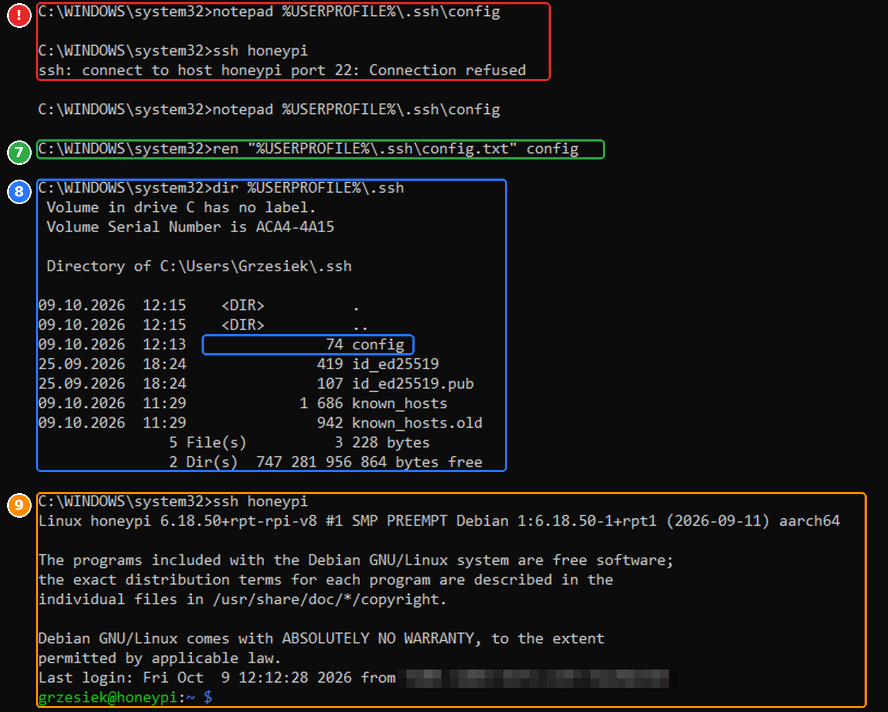
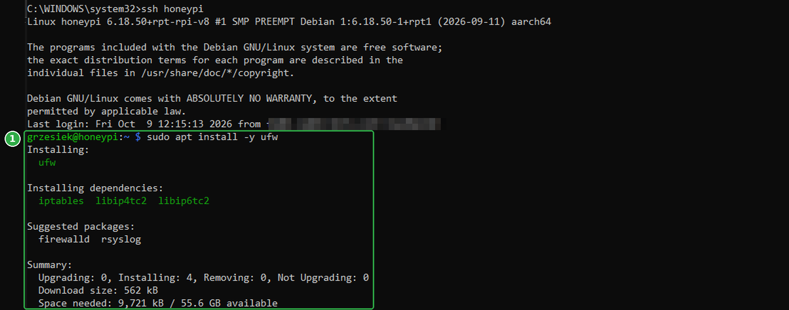
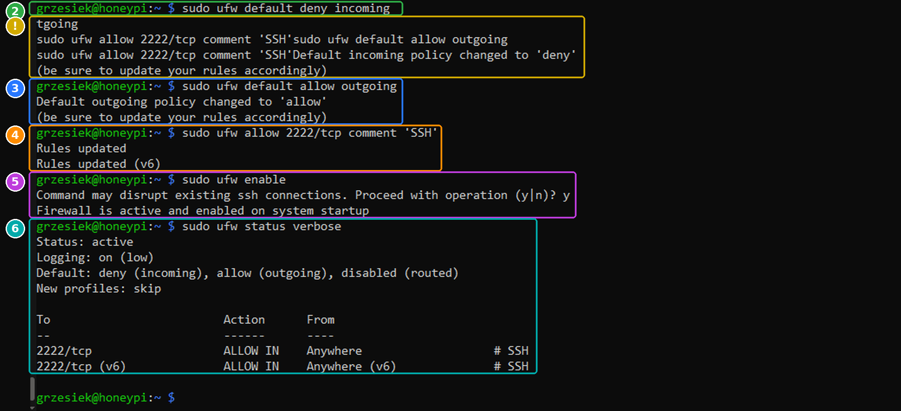
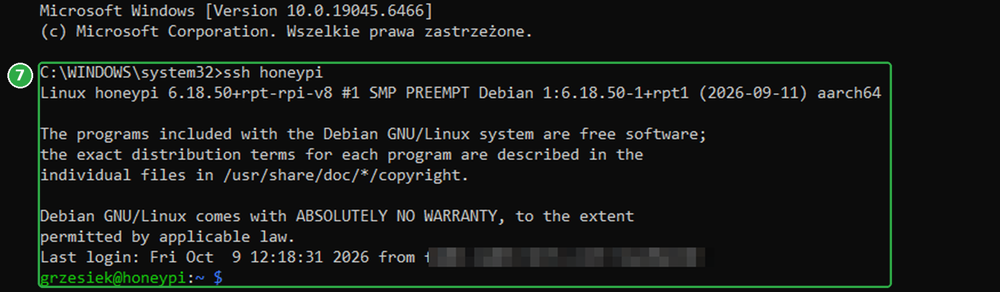

# 02c — Zabezpieczenie SSH

SSH to jedyne „drzwi” do Raspberry, więc zabezpieczamy je jako pierwsze. Kolejność ma znaczenie: każdy krok sprawdzamy, zanim zrobimy następny, żeby nie zablokować sobie dostępu.

1. **Logowanie kluczem** zamiast hasła ✅
2. Wyłączenie logowania hasłem ✅
3. Prawdziwy SSH na porcie 2222 (port 22 zostaje dla honeypota) ✅
4. Skrót `ssh honeypi` na PC ✅
5. Firewall ✅

---

## Część 1: logowanie kluczem SSH

### Jak to działa

Klucz SSH to para plików na komputerze, z którego się logujesz:

| Plik | Co to jest | Gdzie trafia |
|---|---|---|
| `id_ed25519` | **klucz prywatny**, jak klucz do drzwi | zostaje **tylko** na PC, nikomu go nie dajesz |
| `id_ed25519.pub` | **klucz publiczny**, jak zamek pasujący do klucza | kopiujesz na Raspberry, może go zobaczyć każdy |

Przy logowaniu Raspberry sprawdza, czy masz klucz prywatny pasujący do zapisanego zamka. Hasło w ogóle nie leci przez sieć, a klucza nie da się zgadnąć tak jak hasła.

### Komendy (na PC, w wierszu poleceń Windows)

```bat
:: 1. wygeneruj parę kluczy
ssh-keygen -t ed25519

:: 2. wyślij klucz publiczny na Raspberry (jedna linijka)
type %USERPROFILE%\.ssh\id_ed25519.pub | ssh grzesiek@honeypi.local "mkdir -p ~/.ssh && chmod 700 ~/.ssh && cat >> ~/.ssh/authorized_keys && chmod 600 ~/.ssh/authorized_keys"

:: 3. sprawdź logowanie
ssh grzesiek@honeypi.local
```



### 1 · `ssh-keygen -t ed25519`: wygeneruj klucz

- `ssh-keygen`: program do tworzenia kluczy, wbudowany w Windows 10/11.
- `-t ed25519`: typ klucza. **Ed25519** jest nowoczesny, krótki i bezpieczny; starsze RSA też działa, ale potrzebuje dużo dłuższego klucza.
- Pyta, gdzie zapisać (Enter = domyślnie `C:\Users\<Ty>\.ssh\id_ed25519`) i o **passphrase**, czyli hasło chroniące sam plik klucza.

**U mnie:** klucz już istniał (`already exists`, `Overwrite (y/n)?`). Nie potwierdziłem nadpisania, więc stary klucz został i to on poszedł na Raspberry. Dobrze, bo nadpisanie unieważniłoby ten klucz wszędzie, gdzie był wcześniej używany (np. na GitHubie).

> ⚠️ Na pytanie `Overwrite (y/n)?` odpowiadaj `y` tylko wtedy, gdy na pewno nigdzie nie używasz starego klucza.

### 2 · `type ... | ssh ... "..."`: wyślij klucz publiczny

Windows nie ma `ssh-copy-id`, więc robimy to ręcznie, w jednej linii:

- `type %USERPROFILE%\.ssh\id_ed25519.pub`: wypisuje zawartość klucza **publicznego** (`.pub`, nigdy prywatnego!).
- `|`: przekazuje ten tekst do następnej komendy.
- `ssh grzesiek@honeypi.local "..."`: loguje się na Raspberry (ostatni raz hasłem) i wykonuje tam komendy w cudzysłowie:
  - `mkdir -p ~/.ssh`: tworzy ukryty folder `.ssh` w katalogu domowym,
  - `chmod 700 ~/.ssh`: tylko Ty możesz do niego wejść,
  - `cat >> ~/.ssh/authorized_keys`: **dopisuje** klucz do listy dozwolonych kluczy (`>>` dopisuje, `>` by nadpisał),
  - `chmod 600 ~/.ssh/authorized_keys`: tylko Ty możesz czytać i zmieniać ten plik.

Uprawnienia są ważne: jeśli `authorized_keys` byłby dostępny dla innych, serwer SSH z ostrożności zignoruje klucz.

### 3 · `ssh grzesiek@honeypi.local`: test

Logowanie przeszło **bez pytania o hasło do Raspberry**, więc klucz działa. Gdyby klucz miał passphrase, pytałoby o nią (o hasło do klucza, nie do Raspberry).

### Passphrase do klucza (opcjonalnie)

Mój klucz nie ma passphrase. Wygodnie, ale jeśli ktoś skopiuje plik `id_ed25519` z mojego PC, zaloguje się bez przeszkód. Hasło do klucza można dodać później, bez generowania nowego:

```bat
ssh-keygen -p -f %USERPROFILE%\.ssh\id_ed25519
```

Uwaga: jeśli ten sam klucz służy np. do GitHuba, tam też zacznie pytać o passphrase.

---

## Część 2: wyłączenie logowania hasłem

Skoro klucz działa, hasło przez SSH nie jest już potrzebne. A to właśnie hasła zgadują boty i skanery, próbując tysięcy kombinacji (*brute force*). Bez logowania hasłem takie ataki tracą sens.

> ⚠️ **Zasada bezpieczeństwa:** okno, w którym jesteś zalogowany, zostaw otwarte do końca testu. Jeśli nowa konfiguracja coś zepsuje, przez nie wszystko cofniesz. Testuj zawsze w **nowym** oknie.

### Komendy

Na Raspberry:

```bash
ls /etc/ssh/sshd_config.d/                                                    # 1
printf 'PasswordAuthentication no\nKbdInteractiveAuthentication no\nPermitRootLogin no\n' | sudo tee /etc/ssh/sshd_config.d/01-hardening.conf   # 2
sudo sshd -t && sudo systemctl reload ssh                                     # 3
```

Test na PC, w nowym oknie:

```bat
:: 4. z kluczem: ma zalogować
ssh grzesiek@honeypi.local

:: 5. bez klucza: ma odmówić
ssh -o PubkeyAuthentication=no grzesiek@honeypi.local
```

> ℹ️ Zrzut z samego wyłączenia hasła (miał być nr 29) nie trafił do repo. Wynik widać na zrzutach 30 i 31 poniżej.





### 1 · `ls /etc/ssh/sshd_config.d/`: co już jest w ustawieniach

Serwer SSH czyta główny plik `/etc/ssh/sshd_config`, a przed nim wszystkie pliki `*.conf` z folderu `sshd_config.d/`, w kolejności alfabetycznej. **Wygrywa pierwsza znaleziona wartość** danego ustawienia.

U mnie był tam już `50-cloud-init.conf`, zostawiony przez Raspberry Pi Imager. Zwykle to on włącza logowanie hasłem (`PasswordAuthentication yes`), bo tak wybraliśmy w Imagerze.

### 2 · `printf '...' | sudo tee /etc/ssh/sshd_config.d/01-hardening.conf`: nowe reguły

Tworzy plik z trzema linijkami:

| Ustawienie | Znaczenie |
|---|---|
| `PasswordAuthentication no` | **zakaz logowania hasłem** |
| `KbdInteractiveAuthentication no` | zakaz drugiej, „klawiaturowej” metody podawania hasła. Bez tego hasło dałoby się wpisać tylnymi drzwiami |
| `PermitRootLogin no` | zakaz logowania jako `root` (administrator). Logujesz się jako `grzesiek`, a uprawnienia bierzesz przez `sudo`, więc atakujący musi znać i nazwę użytkownika, i mieć klucz |

- `printf`: wypisuje tekst, a `\n` to znak nowej linii (każde ustawienie w osobnej linijce).
- `sudo tee`: zapisuje do pliku z uprawnieniami administratora. Tu **bez** `-a`, bo tworzymy nowy plik, a nie dopisujemy.
- Nazwa **`01-`** jest celowa: `01` jest alfabetycznie przed `50`, więc nasze ustawienia są czytane pierwsze i wygrywają z `50-cloud-init.conf`. Pliku Imagera nie ruszamy.

### 3 · `sudo sshd -t && sudo systemctl reload ssh`: sprawdź i wczytaj

- `sshd -t` (*test*): sprawdza całą konfigurację SSH pod kątem błędów. Brak komunikatu = wszystko poprawne.
- `&&`: uruchom następną komendę **tylko**, jeśli poprzednia się udała. Błędna konfiguracja nie zostanie wczytana.
- `systemctl reload ssh`: wczytuje nowe ustawienia **bez zrywania** obecnych połączeń. Dlatego bezpieczniej użyć `reload` niż `restart`.

### 4 · `ssh grzesiek@honeypi.local`: test z kluczem

Zalogowało normalnie, kluczem. Dostęp mamy ✅

### 5 · `ssh -o PubkeyAuthentication=no ...`: test bez klucza

- `-o PubkeyAuthentication=no`: na czas tego jednego połączenia wyłącz klucz, czyli udawaj kogoś, kto go nie ma.

Wynik `Permission denied (publickey)` znaczy: serwer od razu odmówił i nawet nie zapytał o hasło. Jedyny przyjmowany sposób logowania to klucz ✅

### Gdyby coś poszło nie tak

W starym, wciąż otwartym oknie:

```bash
sudo rm /etc/ssh/sshd_config.d/01-hardening.conf && sudo systemctl reload ssh
```

Gdyby żadne okno nie było otwarte: wyjmij kartę SD, włóż ją do komputera i usuń plik `01-hardening.conf` z partycji systemowej. Na Windowsie wymaga to programu do odczytu ext4. Dlatego tak ważne jest, żeby testować z otwartym zapasowym oknem.

### Co to zmienia

- Na Raspberry wejdziesz **tylko z komputera, który ma klucz**. Żeby logować się z innego komputera, dodaj jego klucz publiczny tak samo jak w części 1, ale jeszcze z obecnego PC (bo nowy nie zaloguje się hasłem).
- Klucz prywatny `C:\Users\<Ty>\.ssh\id_ed25519` warto mieć w kopii zapasowej (np. w menedżerze haseł). Jego utrata oznacza utratę zdalnego dostępu.

---

## Część 3: prawdziwy SSH na porcie 2222

Honeypot (OpenCanary) będzie udawał serwer SSH na standardowym porcie **22**. Właśnie tam zaglądają skanery i boty, więc tam postawimy pułapkę. Prawdziwe SSH musi zwolnić to miejsce i przenieść się na **2222**.

```
port 22   → honeypot (później): każde połączenie = alert
port 2222 → prawdziwe SSH: tylko dla mnie, tylko z kluczem
```

To nie jest zabezpieczenie samo w sobie (skaner sprawdzający wszystkie porty i tak znajdzie 2222). Chodzi o to, żeby port 22 był wolny dla pułapki i żeby z logów od razu wynikało, co jest atakiem, a co mną.

### Komendy

Na Raspberry:

```bash
systemctl is-active ssh.socket ssh.service                                    # 1
echo 'Port 2222' | sudo tee /etc/ssh/sshd_config.d/02-port.conf               # 2
sudo sshd -t && sudo systemctl reload ssh                                     # 3
sudo ss -tlnp | grep sshd                                                     # 4
```

Test na PC, w nowym oknie:

```bat
:: 5. nowy port: ma zalogować
ssh -p 2222 grzesiek@honeypi.local

:: 6. stary port: ma odmówić
ssh grzesiek@honeypi.local
```





### 1 · `systemctl is-active ssh.socket ssh.service`: jak uruchamiane jest SSH

W nowszych systemach SSH może startować na dwa sposoby:

- **`ssh.service`**: klasycznie, serwer działa cały czas i sam wybiera port z konfiguracji,
- **`ssh.socket`**: system nasłuchuje na porcie i uruchamia SSH dopiero przy połączeniu. Wtedy port ustawia się w innym miejscu i sama linijka `Port` w konfiguracji SSH nie działa.

U mnie: `ssh.socket` = `inactive`, `ssh.service` = `active`, czyli klasycznie. Port ustawiamy w `sshd_config.d/`, tak jak w części 2.

### 2 · `echo 'Port 2222' | sudo tee .../02-port.conf`: nowy port

Osobny plik z jednym ustawieniem. Prefiks `02-` sprawia, że jest czytany zaraz po naszym `01-hardening.conf` i przed plikiem Imagera `50-cloud-init.conf`. Osobny plik łatwo znaleźć i w razie czego usunąć.

### 3 · `sudo sshd -t && sudo systemctl reload ssh`: sprawdź i wczytaj

Jak w części 2. `reload` sprawia, że SSH zaczyna nasłuchiwać na nowym porcie, a obecne połączenie zostaje.

### 4 · `sudo ss -tlnp | grep sshd`: na czym nasłuchuje SSH

- `ss`: pokazuje połączenia i otwarte porty.
- `-t` TCP, `-l` tylko nasłuchujące (*listening*), `-n` numery zamiast nazw, `-p` jaki program.
- `| grep sshd`: zostaw tylko linijki z SSH.

Wynik `0.0.0.0:2222` (IPv4) i `[::]:2222` (IPv6), bez `:22`, czyli SSH słucha już tylko na nowym porcie.

### 5 · `ssh -p 2222 ...`: test nowego portu

`-p 2222` = połącz na port 2222. Zalogowało kluczem ✅

### 6 · `ssh grzesiek@honeypi.local`: test starego portu

Bez `-p` klient łączy się na domyślny port 22. Odpowiedź `Connection refused` znaczy, że nic tam nie nasłuchuje ✅ Port czeka na honeypota.

---

## Część 4: skrót `ssh honeypi` (plik config na PC)

Żeby nie wpisywać za każdym razem `-p 2222 grzesiek@honeypi.local`, zapisujemy ustawienia w pliku `C:\Users\<Ty>\.ssh\config` na PC:

```
Host honeypi
    HostName honeypi.local
    User grzesiek
    Port 2222
```

| Linijka | Znaczenie |
|---|---|
| `Host honeypi` | skrót, który wpisujesz w `ssh honeypi` |
| `HostName honeypi.local` | prawdziwy adres Raspberry |
| `User grzesiek` | login |
| `Port 2222` | port SSH |

Od teraz wystarczy:

```bat
ssh honeypi
```

### ❗ Pułapka: Notatnik dopisuje `.txt`



Plik otwarty przez `notepad %USERPROFILE%\.ssh\config` Notatnik zapisał jako **`config.txt`** (widać to na pasku tytułu). SSH szuka pliku o nazwie dokładnie `config`, bez rozszerzenia, więc go nie widział i `ssh honeypi` próbowało domyślnego portu 22: `Connection refused`.

Poprawka, zmiana nazwy pliku:

```bat
:: 7. zmień nazwę config.txt na config
ren "%USERPROFILE%\.ssh\config.txt" config

:: 8. sprawdź zawartość folderu
dir %USERPROFILE%\.ssh

:: 9. test skrótu
ssh honeypi
```



- **7 · `ren`** (*rename*): zmienia nazwę pliku. Cudzysłów jest potrzebny, gdyby w ścieżce była spacja.
- **8 · `dir`**: lista plików w folderze `.ssh`. Ma być `config` **bez** `.txt` (niebieska ramka). Obok widać pozostałe pliki SSH:

  | Plik | Co to jest |
  |---|---|
  | `config` | ustawienia skrótów |
  | `id_ed25519` | klucz prywatny (nikomu go nie dawaj) |
  | `id_ed25519.pub` | klucz publiczny (ten jest na Raspberry) |
  | `known_hosts` | „odciski” serwerów, z którymi już się łączyłeś. Chroni przed podszyciem się pod Raspberry |
  | `known_hosts.old` | poprzednia wersja tej listy |

- **9 · `ssh honeypi`**: zalogowało od razu ✅

**Lekcja:** na Windowsie pliki bez rozszerzenia (`config`, `authorized_keys`) twórz i sprawdzaj przez `dir`. Eksplorator domyślnie ukrywa rozszerzenia, więc `config.txt` wygląda tam jak `config`.

---

## Część 5: firewall (`ufw`)

Firewall decyduje, które połączenia z zewnątrz w ogóle dotrą do Raspberry. Zasada: **wszystko zamknięte, otwieramy tylko to, czego potrzebujemy**. Na razie potrzebujemy tylko SSH na 2222. Porty honeypota (21, 22, 80) otworzymy w Etapie 2, gdy go postawimy. Pułapka, do której nikt nie może się dobić, nic nie złapie.

> ⚠️ Jak w poprzednich częściach: zostaw otwarte okno z sesją SSH i testuj w nowym. Ratunek, gdyby coś poszło nie tak: `sudo ufw disable` w starym oknie.

### Komendy

Na Raspberry:

```bash
sudo apt install -y ufw                                                       # 1
sudo ufw default deny incoming                                                # 2
sudo ufw default allow outgoing                                               # 3
sudo ufw allow 2222/tcp comment 'SSH'                                         # 4
sudo ufw enable                                                               # 5
sudo ufw status verbose                                                       # 6
```

Test na PC, w nowym oknie:

```bat
:: 7. czy SSH dalej działa przez firewall
ssh honeypi
```







### 1 · `sudo apt install -y ufw`: instalacja

**ufw** (*Uncomplicated Firewall*) to prosta nakładka na filtr pakietów wbudowany w jądro Linuksa. Zamiast pisać skomplikowane reguły `iptables`/`nftables`, piszesz zdania w stylu „zezwól na 2222/tcp”. Razem z nim instalują się `iptables` i biblioteki, przez które ufw rozmawia z jądrem.

`-y` = odpowiedz „tak” na pytanie o instalację.

### 2 · `sudo ufw default deny incoming`: zamknij wszystko z zewnątrz

Domyślna reguła dla połączeń **przychodzących**: odrzuć. Każde połączenie, dla którego nie ma wyjątku, zostanie zablokowane.

### 3 · `sudo ufw default allow outgoing`: wychodzące wolno

Raspberry może samo łączyć się na zewnątrz: pobierać aktualizacje (`apt`), reguły Suricaty, synchronizować czas. Odpowiedzi na te połączenia wracają bez przeszkód, bo firewall pamięta, kto zaczął rozmowę.

### 4 · `sudo ufw allow 2222/tcp comment 'SSH'`: wyjątek dla SSH

- `allow 2222/tcp`: przepuść połączenia na port 2222, protokół TCP (SSH zawsze używa TCP).
- `comment 'SSH'`: opis widoczny w `ufw status`. Przy kilkunastu regułach bardzo się przydaje.

`Rules updated` i `Rules updated (v6)` oznacza, że reguła działa i dla IPv4, i dla IPv6.

**Dlaczego bez ograniczenia do sieci domowej** (np. `from 192.168.1.0/24`)? Windows łączy się z `honeypi.local` przez **IPv6** (adres `fe80::...` widać w „Last login”). Reguła tylko dla adresów IPv4 z sieci domowej odcięłaby mnie od Raspberry. Przed internetem i tak chroni router: nie przekierowuje do Raspberry żadnych portów.

### 5 · `sudo ufw enable`: włącz

Ostrzega `Command may disrupt existing ssh connections`, bo gdyby SSH nie było na liście wyjątków, połączenie by się zerwało. Nasze jest (krok 4), więc `y`.

`Firewall is active and enabled on system startup`: działa teraz i startuje sam przy każdym uruchomieniu.

### 6 · `sudo ufw status verbose`: sprawdź

| Linijka | Znaczenie |
|---|---|
| `Status: active` | firewall działa |
| `Logging: on (low)` | zablokowane próby połączeń są zapisywane w logach (`/var/log/ufw.log`, czyli na pendrivie) |
| `Default: deny (incoming), allow (outgoing), disabled (routed)` | reguły domyślne z kroków 2–3. `routed` dotyczy przekazywania ruchu dalej, jak w routerze; Raspberry tego nie robi |
| `2222/tcp ALLOW IN Anywhere # SSH` | wyjątek z kroku 4, dla IPv4 i `(v6)` |

### 7 · `ssh honeypi`: test

Zalogowało w nowym oknie ✅ Firewall przepuszcza SSH.

### ❗ Uwaga: komendy wklejone w trakcie instalacji

Na drugim zrzucie (żółta ramka) widać pomieszany tekst: `tgoing`, `'SSH'sudo ufw default allow outgoing`. Komendy zostały wklejone, kiedy `apt` jeszcze się instalował. Terminal wyświetlił wpisany tekst od razu, w środku wyników instalacji, a wykonał go dopiero po jej zakończeniu.

Nic się nie zepsuło: każda komenda wykonała się po kolei i poprawnie (kroki 2–6 mają prawidłowe wyniki). Ale przy komendach, które o coś pytają, np. `ufw enable` z pytaniem `(y|n)`, wklejony z góry tekst mógłby zostać wzięty za odpowiedź.

**Lekcja:** wklejaj następną komendę dopiero, gdy widzisz znak zachęty `grzesiek@honeypi:~ $`.

---

## Podsumowanie

| Co | Stan |
|---|---|
| Logowanie | tylko kluczem, bez hasła, bez roota |
| Port SSH | 2222 (`ssh honeypi` z PC) |
| Port 22 | wolny, czeka na honeypota |
| Firewall | wszystko przychodzące zamknięte poza 2222 |

Pliki konfiguracji na Raspberry:

```
/etc/ssh/sshd_config.d/01-hardening.conf   # bez haseł i roota
/etc/ssh/sshd_config.d/02-port.conf        # port 2222
```

➡️ Następnie: [02d — Sieć: tylko kabel i stały adres IP](02d-network-basics.md)
