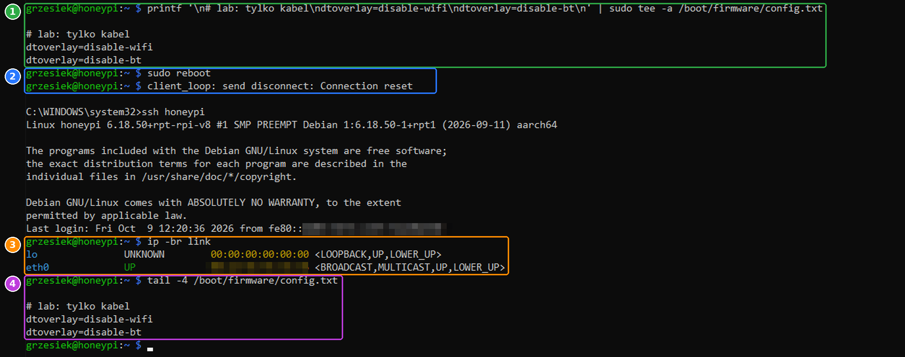

# 02d — Sieć: tylko kabel i stały adres IP

Ostatnie fundamenty przed honeypotem: Raspberry ma mieć **jedno wejście do sieci** (kabel) i **zawsze ten sam adres**.

1. Wyłączenie Wi-Fi i Bluetooth ✅
2. Stały adres IP (rezerwacja DHCP w routerze)

---

## Część 1: wyłączenie Wi-Fi i Bluetooth

Raspberry Pi 4 ma wbudowane Wi-Fi i Bluetooth. W labie są zbędne, bo Raspberry jest podłączone kablem. A każde włączone radio to:

- **dodatkowa droga do urządzenia**: kolejny interfejs, przez który ktoś w zasięgu mógłby próbować się połączyć,
- **szum w monitoringu**: Suricata i honeypot mają patrzeć na jeden, przewidywalny interfejs (`eth0`).

Mniej włączonych rzeczy = mniejsza *powierzchnia ataku* (ang. *attack surface*).

### Komendy

```bash
printf '\n# lab: tylko kabel\ndtoverlay=disable-wifi\ndtoverlay=disable-bt\n' | sudo tee -a /boot/firmware/config.txt   # 1
sudo reboot                                                                   # 2
# po restarcie: ssh honeypi
ip -br link                                                                   # 3
tail -4 /boot/firmware/config.txt                                             # 4
```



### 1 · `printf ... | sudo tee -a /boot/firmware/config.txt`: wyłącz radia przy starcie

`/boot/firmware/config.txt` to plik czytany przez Raspberry **przy włączaniu, zanim wystartuje system**. Ustawia się w nim sprzęt: ekran, taktowanie, wbudowane moduły.

Dopisujemy trzy linijki:

| Linijka | Znaczenie |
|---|---|
| `# lab: tylko kabel` | komentarz (`#`), żeby za pół roku wiedzieć, skąd to się wzięło |
| `dtoverlay=disable-wifi` | wyłącz moduł Wi-Fi |
| `dtoverlay=disable-bt` | wyłącz moduł Bluetooth |

`dtoverlay` (*device tree overlay*) zmienia opis sprzętu, który Raspberry przekazuje systemowi. Po tej zmianie system **w ogóle nie wie**, że Wi-Fi i Bluetooth istnieją. To pewniejsze niż wyłączanie ich programowo, bo nic ich przypadkiem nie włączy z powrotem.

- `\n` na początku: pusta linijka odstępu od poprzedniej zawartości pliku.
- `tee -a`: **dopisz** na końcu (`-a`). Bez `-a` nadpisałbyś cały plik startowy i Raspberry mogłoby się nie uruchomić.

### 2 · `sudo reboot`: restart

Plik startowy jest czytany tylko przy uruchomieniu, więc zmiana działa dopiero po restarcie.

### 3 · `ip -br link`: jakie karty sieciowe zostały

- `ip link`: lista interfejsów sieciowych.
- `-br` (*brief*): w skrócie, jedna linijka na interfejs.

| Interfejs | Co to jest |
|---|---|
| `lo` | *loopback*, wirtualna karta „do samego siebie” (`127.0.0.1`). Jest zawsze |
| `eth0` | port Ethernet, czyli kabel. `UP` = podłączony i działa |
| ~~`wlan0`~~ | Wi-Fi. **Zniknął** ✅ |

Kolumna z `xx:xx:xx:xx:xx:xx` to adres MAC karty, czyli jej sprzętowy identyfikator. Na zrzucie jest zamazany, bo identyfikuje konkretne urządzenie.

### 4 · `tail -4 /boot/firmware/config.txt`: kontrola wpisu

`tail -4` pokazuje cztery ostatnie linijki pliku. Wpis ma być dokładnie jeden. Gdyby był podwójny (np. po dwukrotnym wklejeniu), nic się nie stanie, ale warto posprzątać: `sudo nano /boot/firmware/config.txt`.

### Jak to cofnąć

Usuń te trzy linijki z `/boot/firmware/config.txt` i zrób restart. Gdyby Raspberry przez to nie miało sieci (np. bez kabla), plik można edytować na komputerze: partycja `bootfs` na karcie SD jest widoczna też w Windowsie.

---

## Część 2: stały adres IP

*W trakcie: rezerwacja DHCP w routerze Orange FunBox.*
