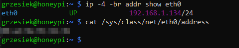
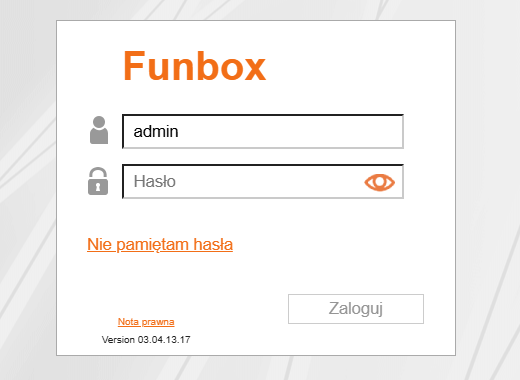
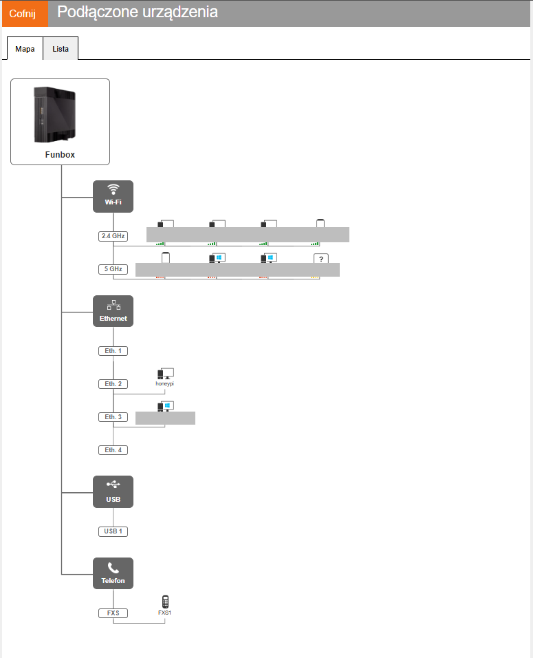
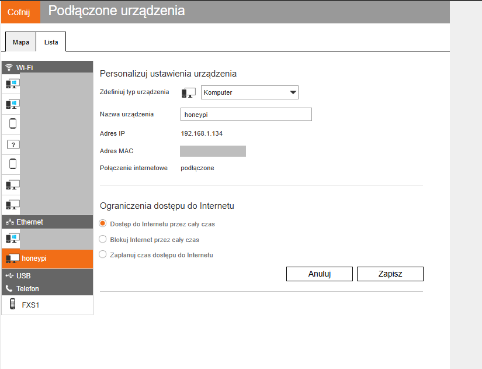
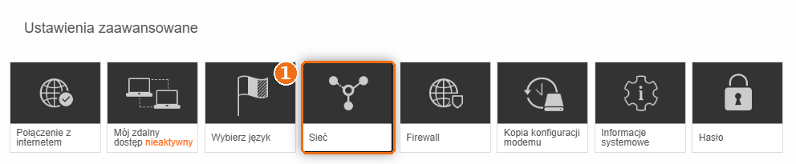
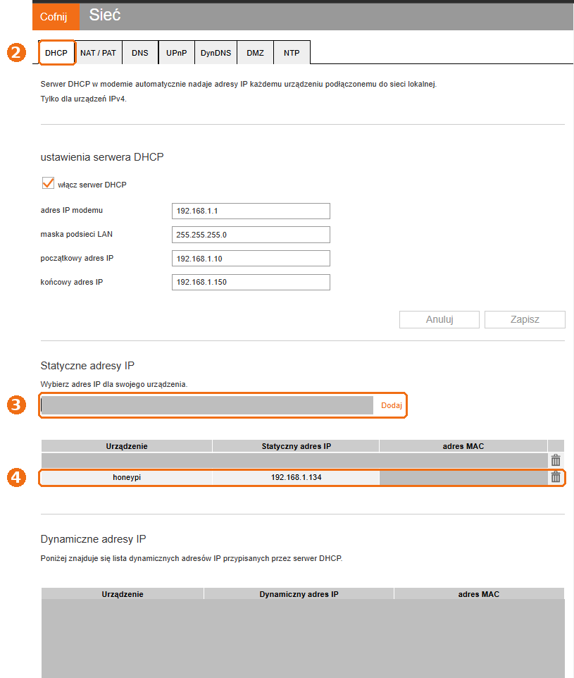

# 02d — Sieć: tylko kabel i stały adres IP

Ostatnie fundamenty przed honeypotem: Raspberry ma mieć **jedno wejście do sieci** (kabel) i **zawsze ten sam adres**.

1. Wyłączenie Wi-Fi i Bluetooth ✅
2. Stały adres IP (rezerwacja DHCP w routerze) ✅

---

## Część 1: wyłączenie Wi-Fi i Bluetooth

Raspberry Pi 4 ma wbudowane Wi-Fi i Bluetooth. W labie są zbędne, bo Raspberry jest podłączone kablem. A każde włączone radio to:

- **dodatkowa droga do urządzenia**: kolejny interfejs, przez który ktoś w zasięgu mógłby próbować się połączyć,
- **szum w monitoringu**: Suricata i honeypot mają patrzeć na jeden, przewidywalny interfejs (`eth0`).

Mniej włączonych rzeczy = mniejsza *powierzchnia ataku* (ang. *attack surface*).

### Komendy

```bash
printf '\n# lab: tylko kabel\ndtoverlay=disable-wifi\ndtoverlay=disable-bt\n' | sudo tee -a /boot/firmware/config.txt   # 1
sudo reboot                                                                   # 2
# po restarcie: ssh honeypi
ip -br link                                                                   # 3
tail -4 /boot/firmware/config.txt                                             # 4
```


### 1 · `printf ... | sudo tee -a /boot/firmware/config.txt`: wyłącz radia przy starcie

`/boot/firmware/config.txt` to plik czytany przez Raspberry **przy włączaniu, zanim wystartuje system**. Ustawia się w nim sprzęt: ekran, taktowanie, wbudowane moduły.

Dopisujemy trzy linijki:

| Linijka | Znaczenie |
|---|---|
| `# lab: tylko kabel` | komentarz (`#`), żeby za pół roku wiedzieć, skąd to się wzięło |
| `dtoverlay=disable-wifi` | wyłącz moduł Wi-Fi |
| `dtoverlay=disable-bt` | wyłącz moduł Bluetooth |

`dtoverlay` (*device tree overlay*) zmienia opis sprzętu, który Raspberry przekazuje systemowi. Po tej zmianie system **w ogóle nie wie**, że Wi-Fi i Bluetooth istnieją. To pewniejsze niż wyłączanie ich programowo, bo nic ich przypadkiem nie włączy z powrotem.

- `\n` na początku: pusta linijka odstępu od poprzedniej zawartości pliku.
- `tee -a`: **dopisz** na końcu (`-a`). Bez `-a` nadpisałbyś cały plik startowy i Raspberry mogłoby się nie uruchomić.

### 2 · `sudo reboot`: restart

Plik startowy jest czytany tylko przy uruchomieniu, więc zmiana działa dopiero po restarcie.

### 3 · `ip -br link`: jakie karty sieciowe zostały

- `ip link`: lista interfejsów sieciowych.
- `-br` (*brief*): w skrócie, jedna linijka na interfejs.

| Interfejs | Co to jest |
|---|---|
| `lo` | *loopback*, wirtualna karta „do samego siebie” (`127.0.0.1`). Jest zawsze |
| `eth0` | port Ethernet, czyli kabel. `UP` = podłączony i działa |
| ~~`wlan0`~~ | Wi-Fi. **Zniknął** ✅ |

Kolumna z `xx:xx:xx:xx:xx:xx` to adres MAC karty, czyli jej sprzętowy identyfikator. Na zrzucie jest zamazany, bo identyfikuje konkretne urządzenie.

### 4 · `tail -4 /boot/firmware/config.txt`: kontrola wpisu

`tail -4` pokazuje cztery ostatnie linijki pliku. Wpis ma być dokładnie jeden. Gdyby był podwójny (np. po dwukrotnym wklejeniu), nic się nie stanie, ale warto posprzątać: `sudo nano /boot/firmware/config.txt`.

### Jak to cofnąć

Usuń te trzy linijki z `/boot/firmware/config.txt` i zrób restart. Gdyby Raspberry przez to nie miało sieci (np. bez kabla), plik można edytować na komputerze: partycja `bootfs` na karcie SD jest widoczna też w Windowsie.

---

## Część 2: stały adres IP (rezerwacja DHCP w FunBoxie)

### Po co

Router rozdaje adresy urządzeniom w sieci przez **DHCP**: każde urządzenie przy podłączeniu prosi o adres i dostaje wolny z puli. U mnie pula to `192.168.1.10`–`192.168.1.150`. Adres jest „wypożyczony” i po restarcie routera albo dłuższej przerwie może się zmienić.

Dla obrońcy to problem: reguły firewalla, skany z Kali i konfiguracja honeypota odwołują się do adresu Raspberry. Gdyby się zmienił, ćwiczenia przestałyby działać.

**Rezerwacja DHCP** rozwiązuje to po stronie routera: FunBox rozpoznaje Raspberry po **adresie MAC** (sprzętowym identyfikatorze karty sieciowej) i zawsze daje mu ten sam adres. Na samym Raspberry nic nie zmieniamy.

### 1 · Adres i MAC Raspberry (na Raspberry)

```bash
ip -4 -br addr show eth0          # adres IPv4
cat /sys/class/net/eth0/address   # adres MAC
```



- `ip -4 -br addr show eth0`: tylko IPv4 (`-4`), w skrócie (`-br`), tylko karta kablowa (`eth0`). Wynik `192.168.1.134/24`: adres Raspberry, a `/24` znaczy, że sieć domowa to `192.168.1.0`–`192.168.1.255`.
- `cat /sys/class/net/eth0/address`: adres MAC karty. Na zrzucie zamazany.

### 2 · Logowanie do panelu FunBoxa

W przeglądarce: **http://192.168.1.1**. Login `admin`, hasło z naklejki na spodzie routera (hasło do panelu, nie do Wi-Fi).



Przeglądarka pokazuje „Niezabezpieczona”, bo panel działa po zwykłym HTTP, bez szyfrowania. W sieci domowej to normalne dla routerów.

### 3 · Sprawdzenie, że to na pewno Raspberry

**Podłączone urządzenia** pokazuje mapę sieci. `honeypi` jest na porcie **Eth. 2**, czyli podłączony kablem, tak jak powinien.



W zakładce **Lista** po kliknięciu `honeypi` widać jego adres IP i MAC. Ten sam MAC co w kroku 1 = to na pewno Raspberry.



### 4 · Rezerwacja

**Ustawienia zaawansowane → Sieć** (1):



Zakładka **DHCP** (2), sekcja **Statyczne adresy IP**:



- (3) z listy wybierz `honeypi`. FunBox sam uzupełni jego obecny adres i MAC. Kliknij **Dodaj**.
- (4) `honeypi` pojawia się w tabeli statycznych adresów: `192.168.1.134` na stałe przypisany do jego MAC ✅

Adres `.134` leży w puli DHCP (`.10`–`.150`), ale to nie przeszkadza: zarezerwowanego adresu router nie da nikomu innemu.

### Jak sprawdzić, że działa

Nic nie trzeba restartować. Przy następnym odnowieniu adresu Raspberry dostanie ten sam. Dla pewności, po dowolnym restarcie:

```bash
ip -4 -br addr show eth0
```

Ma być dalej `192.168.1.134`.

### Przy okazji: bezpieczeństwo routera

Na ekranie ustawień zaawansowanych widać **„Mój zdalny dostęp: nieaktywny”**. Tak ma zostać: zdalny dostęp do panelu routera z internetu to częsty cel ataków. Warto też zmienić domyślne hasło do panelu (kafelek **Hasło**), jeśli wciąż jest to hasło z naklejki.

---

## Podsumowanie

| Co | Stan |
|---|---|
| Wi-Fi, Bluetooth | wyłączone sprzętowo, tylko `eth0` |
| Adres IP | `192.168.1.134`, zarezerwowany w FunBoxie |
| Połączenie | kabel, port Eth. 2 w routerze |

➡️ Następnie: [03 — Obrońca](03-defender-raspberry.md)
