# 03 — Obrońca: honeypot i monitoring na Raspberry

Raspberry pełni rolę obrońcy: **udaje podatne urządzenie** (honeypot) i **monitoruje ruch**. W domowej sieci nikt uczciwy nie ma powodu łączyć się z udawanymi usługami, więc każde połączenie to sygnał, że ktoś (albo coś) skanuje sieć.

1. **Honeypot OpenCanary** ✅
   - instalacja ✅
   - konfiguracja pułapek i firewall ✅
   - pierwszy test i pierwsze alerty ✅
   - usługa startująca sama po restarcie ✅
2. Monitoring ruchu: Suricata
   - instalacja, reguły i test konfiguracji ✅
   - uruchomienie i pierwszy alert ✅
3. Podgląd ruchu: ntopng (opcjonalnie)

---

# Część 1: honeypot OpenCanary

**OpenCanary** (od firmy Thinkst) udaje typowe usługi sieciowe: serwer SSH, stronę logowania, serwer plików FTP. Nic za nimi nie stoi, ale wyglądają prawdziwie. Każde połączenie i każda próba logowania trafia do logu: skąd, kiedy, jakim programem i **jakim loginem i hasłem**.

U mnie udaje trzy usługi na portach, które Etap 1 zostawił wolne:

```
port 21  → FTP          (serwer plików)
port 22  → SSH          (prawdziwe SSH jest na 2222)
port 80  → strona WWW   (panel logowania „DiskStation”, jak domowy dysk sieciowy)
```

## Komendy w skrócie

```bash
# --- Krok 1: instalacja ---
sudo apt install -y python3-dev python3-pip python3-venv libssl-dev libpcap-dev     # 1
sudo python3 -m venv /opt/opencanary                                                 # 2
sudo /opt/opencanary/bin/pip install --upgrade pip                                   # 3
sudo /opt/opencanary/bin/pip install opencanary                                      # 4
/opt/opencanary/bin/pip show opencanary                                              # 5
sudo env PATH=/opt/opencanary/bin:$PATH opencanaryd --copyconfig                     # 6
ls -l /etc/opencanaryd/                                                              # 7

# --- Krok 2: konfiguracja pułapek i firewall ---
sudo useradd --system --no-create-home --shell /usr/sbin/nologin opencanary          # 8
sudo install -d -o opencanary -g opencanary -m 750 /var/log/opencanary               # 9
sudo /opt/opencanary/bin/python3 - <<'EOF'                                           # 10
import json
p = '/etc/opencanaryd/opencanary.conf'
c = json.load(open(p))
c.update({
    "device.node_id": "honeypi",
    "ssh.enabled": True,  "ssh.port": 22,  "ssh.version": "SSH-2.0-OpenSSH_9.2p1 Debian-2+deb12u3",
    "http.enabled": True, "http.port": 80, "http.banner": "Apache/2.4.62 (Debian)", "http.skin": "nasLogin",
    "ftp.enabled": True,  "ftp.port": 21,  "ftp.banner": "FTP server ready",
})
c["logger"]["kwargs"]["handlers"]["file"]["filename"] = "/var/log/opencanary/opencanary.log"
json.dump(c, open(p, "w"), indent=4)
print("OK: zapisano", p)
EOF
sudo grep -E '"(ssh|http|ftp)\.(enabled|port)"|node_id|filename' /etc/opencanaryd/opencanary.conf   # 11
sudo ufw allow 21/tcp comment 'honeypot FTP'                                         # 12
sudo ufw allow 22/tcp comment 'honeypot SSH'                                         # 12
sudo ufw allow 80/tcp comment 'honeypot HTTP'                                        # 12
sudo ufw status                                                                      # 12

# --- Krok 3: pierwszy test (okno 1) ---
sudo env PATH=/opt/opencanary/bin:$PATH opencanaryd --dev --uid=opencanary --gid=opencanary   # 13–14
# --- (okno 2) ---
sudo ss -tlnp | grep -E ':(21|22|80) '                                               # 15
sudo tail -f /var/log/opencanary/opencanary.log                                      # 16–18, 20–21
# --- (PC) ---
# przeglądarka: http://192.168.1.134 → dowolny login i hasło                        # 17–18
ssh test@192.168.1.134                                                               # 19

# --- Krok 4: usługa systemd ---
sudo tee /etc/systemd/system/opencanary.service > /dev/null <<'EOF'                  # 23
[Unit]
Description=OpenCanary honeypot
After=network-online.target
Wants=network-online.target
RequiresMountsFor=/var/log/opencanary

[Service]
Type=simple
Environment=PATH=/opt/opencanary/bin:/usr/local/bin:/usr/bin:/bin
ExecStart=/opt/opencanary/bin/opencanaryd --dev --uid=opencanary --gid=opencanary
Restart=on-failure
RestartSec=5

[Install]
WantedBy=multi-user.target
EOF
sudo systemctl daemon-reload                                                         # 24
sudo systemctl enable --now opencanary                                               # 25
systemctl status opencanary --no-pager                                               # 26
sudo reboot                                                                          # 27
systemctl is-active opencanary                                                       # 28
sudo ss -tlnp | grep -E ':(21|22|80) '                                               # 29
sudo tail -3 /var/log/opencanary/opencanary.log                                      # 30
```

Numery odpowiadają oznaczeniom na zrzutach poniżej. **Każdą komendę wklejaj osobno** i czekaj na znak zachęty `$` (wyjątek: bloki `<<'EOF' … EOF` wkleja się w całości, od pierwszej do ostatniej linijki).

---

## Krok 1: instalacja

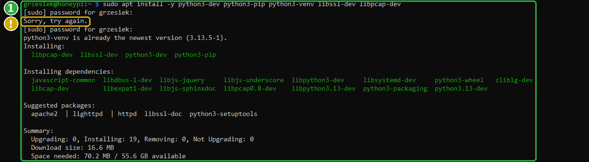

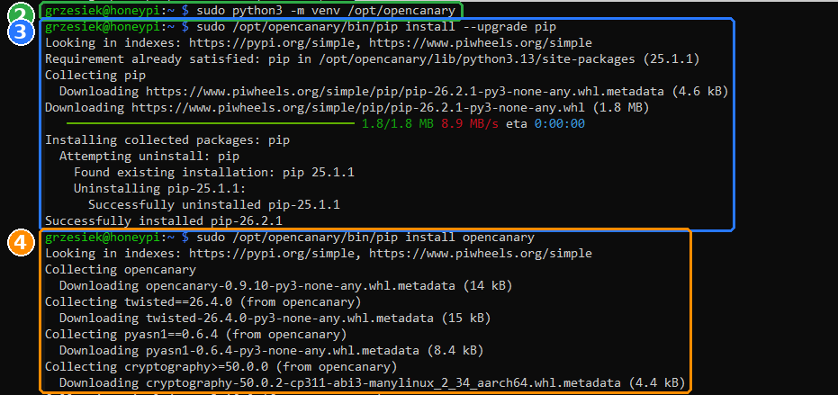

### 1 · `sudo apt install -y python3-dev python3-pip python3-venv libssl-dev libpcap-dev`: narzędzia do budowy

OpenCanary to program w Pythonie. Część jego bibliotek trzeba przy instalacji skompilować, do tego potrzebne są:

| Pakiet | Po co |
|---|---|
| `python3-dev` | nagłówki Pythona, potrzebne do kompilowania rozszerzeń |
| `python3-pip` | instalator bibliotek Pythona |
| `python3-venv` | tworzenie środowisk wirtualnych (krok 2) |
| `libssl-dev` | biblioteka szyfrowania (SSH, HTTPS) |
| `libpcap-dev` | biblioteka do przechwytywania pakietów sieciowych |

`Sorry, try again` na zrzucie (żółta ramka) to literówka w haśle przy `sudo`, nic groźnego.

### 2 · `sudo python3 -m venv /opt/opencanary`: osobny „pojemnik” na Pythona

**Środowisko wirtualne** (*venv*) to folder z własną kopią Pythona i własnymi bibliotekami, odizolowany od systemu. Debian **nie pozwala** instalować bibliotek przez `pip` prosto do systemu (*externally managed environment*), bo mogłoby to popsuć programy systemowe, które też są w Pythonie.

Dlaczego `/opt/opencanary`, a nie katalog domowy:
- `/opt` to standardowe miejsce na dodatkowe programy,
- honeypot będzie działał jako usługa systemowa, a jego pliki **należą do roota**. Nikt bez `sudo` nie podmieni kodu, który startuje z uprawnieniami administratora.

### 3 · `sudo /opt/opencanary/bin/pip install --upgrade pip`: świeży instalator

Pełna ścieżka `/opt/opencanary/bin/pip` = `pip` z naszego środowiska, nie systemowy. Nowszy `pip` lepiej radzi sobie z gotowymi paczkami (*wheels*) dla procesora ARM w Raspberry.

`Looking in indexes: …piwheels.org` to dodatkowe źródło paczek przygotowanych specjalnie pod Raspberry Pi, dzięki czemu mniej rzeczy trzeba kompilować.

### 4 · `sudo /opt/opencanary/bin/pip install opencanary`: instalacja honeypota

Instaluje OpenCanary i wszystko, czego potrzebuje, m.in. **Twisted** (silnik sieciowy, który obsługuje połączenia) i **cryptography** (szyfrowanie dla udawanego SSH).

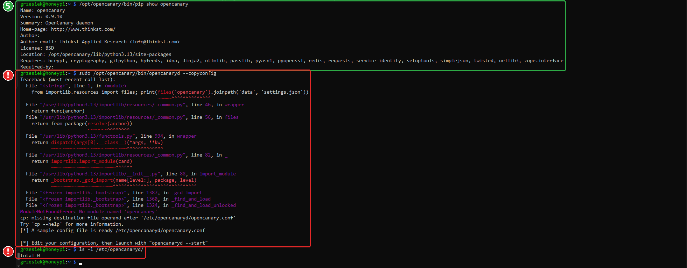

### 5 · `/opt/opencanary/bin/pip show opencanary`: czy się zainstalował

`Version: 0.9.10`, `Location: /opt/opencanary/...`, czyli jest w naszym środowisku ✅

### ❗ Wpadka: `--copyconfig` „udany”, a pliku brak

Pierwsza próba `sudo /opt/opencanary/bin/opencanaryd --copyconfig` (czerwone ramki):

- **Co było widać:** długi błąd kończący się `ModuleNotFoundError: No module named 'opencanary'`, potem `cp: missing destination file operand`, a na końcu… `[*] A sample config file is ready`. Mimo to `ls -l /etc/opencanaryd/` → `total 0`, folder pusty.
- **Przyczyna:** `opencanaryd` to krótki skrypt powłoki, który w środku woła `python3`. Szuka go w ścieżce `PATH`, a pod `sudo` `PATH` zawiera tylko katalogi systemowe. Skrypt uruchomił więc **systemowego** Pythona (`/usr/lib/python3.13/...` w błędzie), który o OpenCanary nic nie wie.
- **Mylący komunikat:** skrypt nie sprawdza, czy kopiowanie się udało, i zawsze wypisuje „ready”.
- **Lekcja:** komunikat „gotowe” to nie dowód. Zawsze sprawdź wynik, tak jak tu zrobił to `ls`.

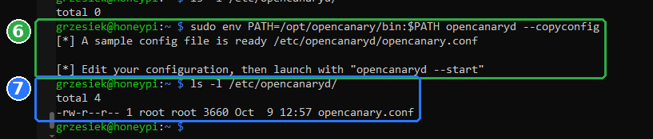

### 6 · `sudo env PATH=/opt/opencanary/bin:$PATH opencanaryd --copyconfig`: przykładowa konfiguracja

- `env PATH=/opt/opencanary/bin:$PATH`: uruchom komendę ze ścieżką, w której **najpierw** jest nasze środowisko. Wtedy `python3` w skrypcie to Python z OpenCanary.
- Samo `export PATH=...` przed `sudo` nie zadziała: `sudo` z bezpieczeństwa podmienia `PATH` na własną, stałą listę (`secure_path`). `env` ustawia ją już **po** przejściu przez `sudo`.
- `--copyconfig`: skopiuj przykładowy plik ustawień do `/etc/opencanaryd/opencanary.conf`. To pierwsze miejsce, w którym OpenCanary szuka konfiguracji.

### 7 · `ls -l /etc/opencanaryd/`: sprawdzenie

`-rw-r--r-- 1 root root 3660 … opencanary.conf`: plik jest, należy do roota i tylko root może go zmieniać (`rw-` dla właściciela, `r--` dla reszty). To ważne: konfiguracja jest czytana z uprawnieniami administratora, więc kto mógłby ją zmienić, mógłby przejąć system.

---

## Krok 2: konfiguracja pułapek i firewall

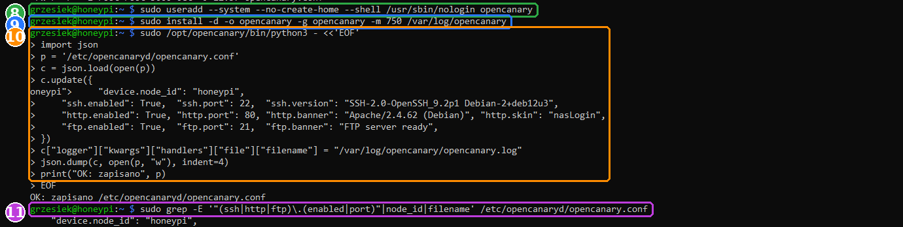

### 8 · `sudo useradd --system --no-create-home --shell /usr/sbin/nologin opencanary`: osobny użytkownik

| Opcja | Znaczenie |
|---|---|
| `--system` | konto systemowe (dla programu, nie dla człowieka) |
| `--no-create-home` | bez katalogu domowego |
| `--shell /usr/sbin/nologin` | nie da się na nie zalogować |

Honeypot potrzebuje roota tylko na chwilę: porty poniżej 1024 (21, 22, 80) może zająć wyłącznie administrator. Zaraz potem przełącza się na tego użytkownika (krok 13). Honeypot z definicji wystawia się na atak. Gdyby ktoś znalazł dziurę w samym OpenCanary, przejmie konto, które **nic nie może**, a nie roota.

### 9 · `sudo install -d -o opencanary -g opencanary -m 750 /var/log/opencanary`: folder na logi

- `install -d`: utwórz folder (`-d` = *directory*),
- `-o` / `-g`: właściciel i grupa: nasz użytkownik `opencanary`,
- `-m 750`: uprawnienia: właściciel wszystko, grupa odczyt, reszta nic.

`/var/log` jest od Etapu 1 na pendrivie, więc logi honeypota też tam lądują.

### 10 · `sudo /opt/opencanary/bin/python3 - <<'EOF' … EOF`: ustawienia pułapek

Zamiast ręcznie edytować plik JSON (jeden brakujący przecinek i honeypot nie wstanie), mały skrypt w Pythonie wczytuje plik, zmienia kilka ustawień i zapisuje resztę bez zmian.

- `python3 -`: wykonaj program podany na wejściu,
- `<<'EOF' … EOF`: *heredoc*: wszystko między tymi znacznikami trafia do programu jako tekst. Cudzysłów przy `'EOF'` sprawia, że powłoka niczego w środku nie podmienia.

| Ustawienie | Wartość | Po co |
|---|---|---|
| `device.node_id` | `honeypi` | nazwa czujnika w logach |
| `ssh.enabled` / `ssh.port` | `true` / `22` | udawany serwer SSH |
| `ssh.version` | `SSH-2.0-OpenSSH_9.2p1 Debian-2+deb12u3` | przedstawia się jak zwykły, aktualny Debian, czyli wiarygodnie |
| `http.enabled` / `http.port` | `true` / `80` | udawana strona WWW |
| `http.skin` | `nasLogin` | wygląd: panel logowania domowego dysku sieciowego |
| `http.banner` | `Apache/2.4.62 (Debian)` | tak przedstawia się serwer WWW w nagłówkach |
| `ftp.enabled` / `ftp.port` | `true` / `21` | udawany serwer FTP |
| `logger … filename` | `/var/log/opencanary/opencanary.log` | logi na pendrive zamiast do `/var/tmp` |

Linijki z `>` na zrzucie to znak kontynuacji: powłoka czeka na `EOF`. Na końcu `OK: zapisano …` ✅

### 11 · `sudo grep -E '…' /etc/opencanaryd/opencanary.conf`: kontrola

`grep -E` wypisuje tylko linijki pasujące do wzorca: pułapki `ssh`, `http`, `ftp` (`enabled` i `port`), `node_id` i `filename`. Widać trzy razy `true`, porty 21, 80, 22 i nową ścieżkę logu ✅

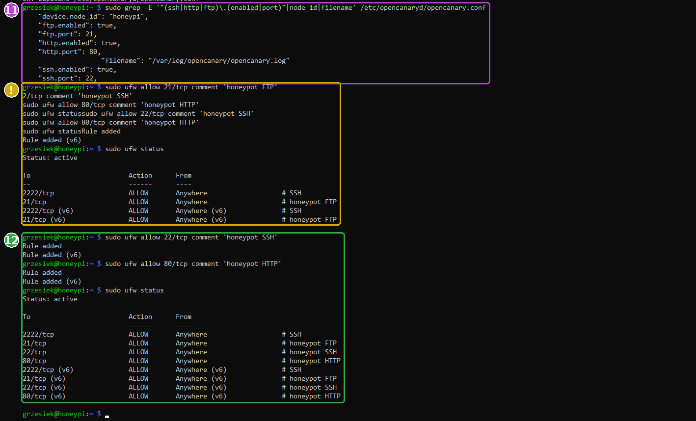

### 12 · `sudo ufw allow 21/tcp …`, `22/tcp`, `80/tcp`: otwarcie pułapek

Pułapka, do której firewall nikogo nie wpuści, nic nie złapie. Otwieramy więc porty udawanych usług, z opisami widocznymi w `ufw status`. Na końcu firewall wpuszcza: **2222** (moje SSH) oraz **21, 22, 80** (pułapki), dla IPv4 i IPv6.

### ❗ Wpadka: cztery komendy wklejone naraz

- **Co było widać (żółta ramka):** pomieszany tekst `2/tcp comment…`, `sudo ufw statussudo ufw allow 22…`, a pierwszy `ufw status` pokazał tylko 2222 i 21.
- **Przyczyna:** cztery komendy dostały się do terminala jednym wklejeniem. Wykonała się pierwsza (`allow 21`), a `ufw` w trakcie działania wczytał resztę wklejonego tekstu jako swoje wejście, więc pozostałe komendy przepadły.
- **Rozwiązanie:** `allow 22` i `allow 80` wpisane jeszcze raz, osobno, i `ufw status` z kompletem reguł (zielona ramka).
- **Lekcja:** jedna komenda = jedno wklejenie. Po każdej zmianie firewalla `ufw status`.

---

## Krok 3: pierwszy test i pierwsze alerty

Do testu potrzebne są **dwa okna SSH** na Raspberry i PC jako „atakujący”.

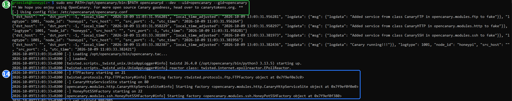

### 13–14 · `sudo env PATH=… opencanaryd --dev --uid=opencanary --gid=opencanary`: start na podglądzie (okno 1)

- `--dev`: uruchom „na wierzchu”, z wypisywaniem wszystkiego na ekran. Zatrzymanie: **Ctrl+C**. (Dla porównania `--start` uruchamia go w tle.)
- `--uid=opencanary --gid=opencanary`: po zajęciu portów przełącz się na użytkownika z kroku 8.

W wyniku (14): `FTPFactory starting on 21`, `CanaryHttpServiceSite starting on 80`, `HoneyPotSSHFactory starting on 22` i na końcu `set uid/gid 999/985`, czyli przełączenie na bezpiecznego użytkownika ✅ Linijki JSON z `"logtype": 1001` to komunikaty startowe samego honeypota („Added service…”, „Canary running!!!”).

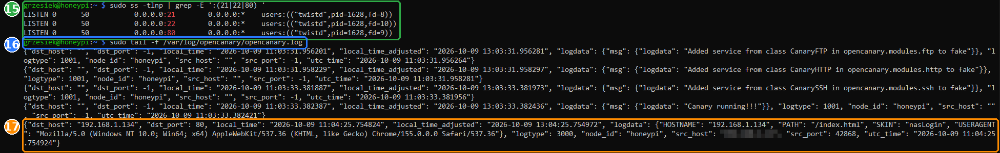

### 15 · `sudo ss -tlnp | grep -E ':(21|22|80) '`: czy pułapki nasłuchują (okno 2)

Trzy linijki `LISTEN` na `0.0.0.0:21`, `:22`, `:80`, wszystkie obsługiwane przez proces `twistd` (silnik Twisted, na którym działa OpenCanary) ✅

### 16 · `sudo tail -f /var/log/opencanary/opencanary.log`: log na żywo

`tail -f` (*follow*) pokazuje koniec pliku i dopisuje nowe linijki, gdy się pojawią. Zatrzymanie: **Ctrl+C**.

### 17–18 · Atak na stronę WWW (z PC)

W przeglądarce `http://192.168.1.134`:


Wygląda jak panel logowania dysku sieciowego Synology. Wpisałem dowolny login i hasło (`admin` / `admin132`):

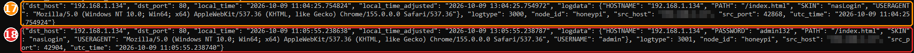

Każdy alert to jedna linijka JSON. Najważniejsze pola:

| Pole | Znaczenie |
|---|---|
| `src_host` | **skąd** przyszło połączenie (adres atakującego; na zrzutach zamazany, to mój PC) |
| `dst_port` | na który port (80 = strona WWW) |
| `logtype` | **co się stało** (tabela niżej) |
| `logdata` | szczegóły: przeglądarka (`USERAGENT`), ścieżka, login i hasło |
| `local_time_adjusted` | czas polski; `utc_time` to czas uniwersalny |

| `logtype` | Zdarzenie |
|---|---|
| `1001` | komunikat samego honeypota (start) |
| `3000` | (17) ktoś otworzył stronę WWW |
| `3001` | (18) **próba logowania na stronie**: `"USERNAME": "admin"`, `"PASSWORD": "admin132"` |
| `4000` | nowe połączenie SSH |
| `4001` | wersja programu klienta SSH |
| `4002` | **próba logowania przez SSH**: login i hasło |

Linijki `[twisted.python.log#info] … "GET /css/…"` w oknie 1 to zwykły dziennik serwera WWW (pobrane obrazki i style strony), a nie alerty. Alerty są w pliku logu.

### 19–21 · Atak na SSH (z PC)

```bat
ssh test@192.168.1.134
```

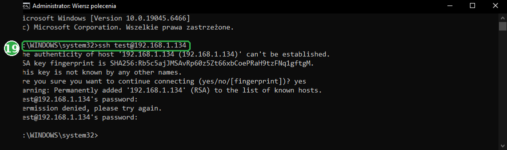

Odcisk klucza zaakceptowany (`yes`), hasło `haslo123`: `Permission denied`. Honeypot nigdy nikogo nie wpuszcza, ale wszystko zapisuje:

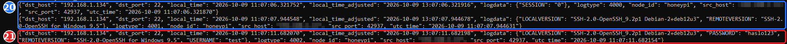

- (20) `4000`: nowe połączenie; `4001`: klient przedstawił się jako `SSH-2.0-OpenSSH_for_Windows_9.5`,
- (21) `4002`: **próba logowania**: `"USERNAME": "test"`, `"PASSWORD": "haslo123"`.

Prawdziwy atakujący zostawiłby dokładnie takie ślady: skąd przyszedł, czym się łączył i jakie hasła próbował.

**Dlaczego adres IP, a nie `honeypi.local`?** Patrz niżej.

### ❗ Ciekawostka: `REMOTE HOST IDENTIFICATION HAS CHANGED`

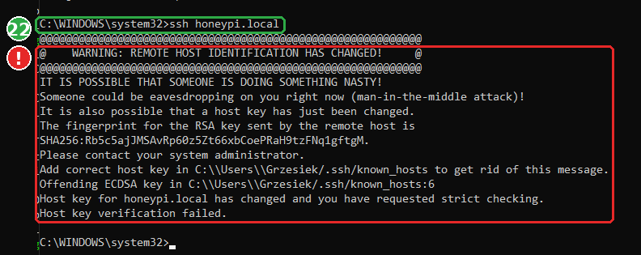

(22) `ssh honeypi.local` (bez portu, czyli na 22) zostało **zablokowane** przez klienta SSH na PC:

- **Przyczyna:** przy pierwszym logowaniu (Etap 0) PC zapisał w `known_hosts` klucz **prawdziwego** SSH z portu 22. Teraz na porcie 22 odpowiada honeypot z innym kluczem.
- **Co to oznacza:** dokładnie tak wyglądałby atak *man-in-the-middle*, czyli ktoś podszywający się pod serwer. SSH woli odmówić połączenia, niż wysłać hasło nie temu serwerowi.
- **Co z tym zrobić:** nic. **Nie usuwam** tego wpisu, niech pilnuje. Do Raspberry łączę się przez `ssh honeypi` (port 2222, osobny wpis w `known_hosts`), a testy honeypota robię po adresie IP.

---

## Krok 4: honeypot jako usługa

Test z `--dev` działa, dopóki okno jest otwarte. Teraz honeypot ma startować sam, przy każdym uruchomieniu Raspberry, i wstawać po awarii. Tym zajmuje się **systemd**, czyli zarządca usług w Linuksie.

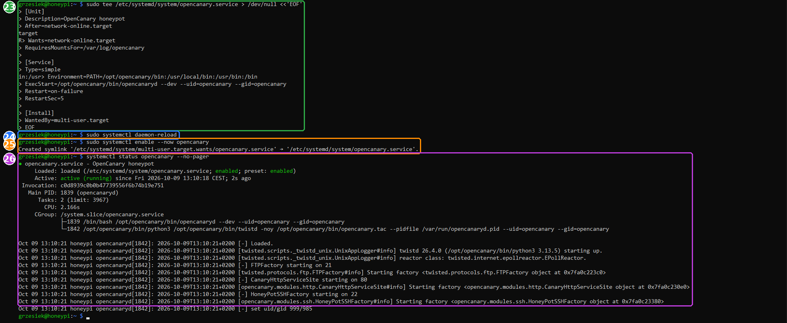

### 23 · `sudo tee /etc/systemd/system/opencanary.service > /dev/null <<'EOF' … EOF`: plik usługi

- `tee …`: zapisz tekst do pliku (z uprawnieniami roota),
- `> /dev/null`: nie wypisuj go dodatkowo na ekran.

| Linijka | Znaczenie |
|---|---|
| `Description=` | opis widoczny w `systemctl status` |
| `After=network-online.target`, `Wants=…` | startuj, gdy sieć już działa |
| `RequiresMountsFor=/var/log/opencanary` | startuj dopiero, gdy zamontowany jest pendrive z logami |
| `Type=simple` | program działa na wierzchu i to on jest usługą (stąd `--dev`) |
| `Environment=PATH=/opt/opencanary/bin:…` | to samo co `sudo env PATH=…` w testach: żeby skrypt znalazł Pythona ze środowiska |
| `ExecStart=…` | dokładnie ta komenda, którą testowałem |
| `Restart=on-failure`, `RestartSec=5` | jak się wywali, wstanie po 5 sekundach |
| `WantedBy=multi-user.target` | uruchamiaj przy normalnym starcie systemu |

Pomieszane fragmenty (`target`, `R>`, `in:/usr>`) na zrzucie to tylko artefakty wyświetlania przy wklejaniu długiego bloku. Plik zapisał się poprawnie, co potwierdza krok 26.

### 24 · `sudo systemctl daemon-reload`: wczytaj nowy plik

systemd trzyma listę usług w pamięci. Po dodaniu lub zmianie pliku trzeba mu kazać przeczytać je ponownie.

### 25 · `sudo systemctl enable --now opencanary`: włącz

- `enable`: startuj przy każdym uruchomieniu. `Created symlink …` to dowiązanie, którym systemd zapamiętuje, że usługa ma startować,
- `--now`: i uruchom od razu.

### 26 · `systemctl status opencanary --no-pager`: stan usługi

- `Loaded: … enabled`: będzie startować sama,
- `Active: active (running)`: działa,
- `CGroup:` procesy usługi: `opencanaryd` i `twistd` z `--uid=opencanary`,
- na dole ostatnie komunikaty: te same, co przy teście w kroku 14.

`--no-pager`: wypisz wszystko od razu, bez przewijania strzałkami.

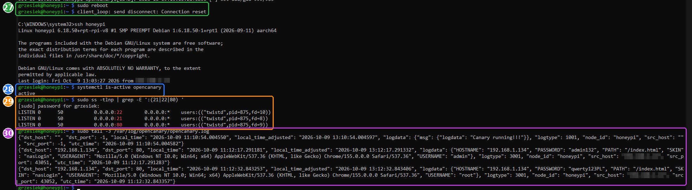

### 27–30 · Test po restarcie

- (27) `sudo reboot`: zerwane połączenie (`Connection reset`) jest normalne,
- (28) `systemctl is-active opencanary` → `active`: honeypot wstał sam ✅
- (29) `ss -tlnp` → porty 21, 22, 80 zajęte przez `twistd` ✅
- (30) `tail -3` (trzy ostatnie linijki logu) → start honeypota (`Canary running!!!`) i dwie nowe próby logowania na stronie: `admin` / `admin132` oraz `root` / `qwerty123PL` ✅

## Jak zatrzymać albo wyłączyć honeypota

```bash
sudo systemctl stop opencanary        # zatrzymaj teraz (do następnego restartu)
sudo systemctl disable opencanary     # nie startuj przy uruchomieniu
sudo systemctl restart opencanary     # po zmianie /etc/opencanaryd/opencanary.conf
journalctl -u opencanary -n 50        # ostatnie 50 komunikatów usługi
```

---

# Część 2: monitoring ruchu — Suricata

Honeypot widzi tylko to, co ktoś zrobi z jego udawanymi usługami. **Suricata** to *IDS* (*Intrusion Detection System*, system wykrywania włamań): patrzy na **cały ruch sieciowy** Raspberry, pakiet po pakiecie, i porównuje go z dziesiątkami tysięcy **reguł** opisujących znane ataki, skany i złośliwe programy.

```
honeypot:  „ktoś próbował się zalogować na udawany SSH jako admin/admin”
Suricata:  „ten ruch wygląda jak skan nmap / znany exploit / odpowiedź z uprawnieniami roota”
```

> ⚠️ **Zakres:** Suricata na Raspberry widzi tylko ruch **do i z samego Raspberry**. Ataki na cele w sieci wirtualnej komputera nie przechodzą przez Raspberry, patrz [network-topology.md](network-topology.md).

## Krok 1: instalacja, reguły i test konfiguracji

### Komendy w skrócie

```bash
sudo apt install -y suricata                                                         # 1
suricata -V                                                                          # 2
sudo grep -nE '^\s*- interface:|default-rule-path|HOME_NET:' /etc/suricata/suricata.yaml   # 3
sudo suricata-update                                                                 # 4
sudo suricata -T -c /etc/suricata/suricata.yaml                                      # 5
free -h                                                                              # 6
```

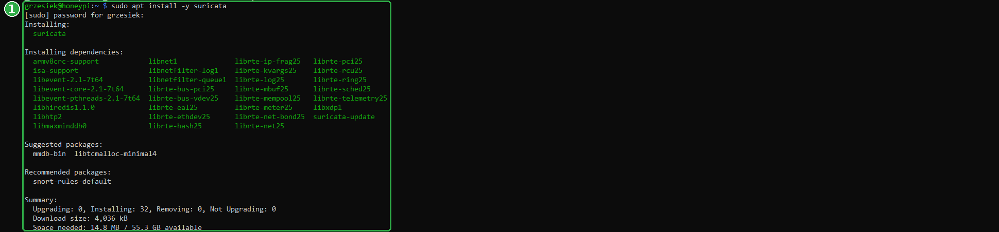

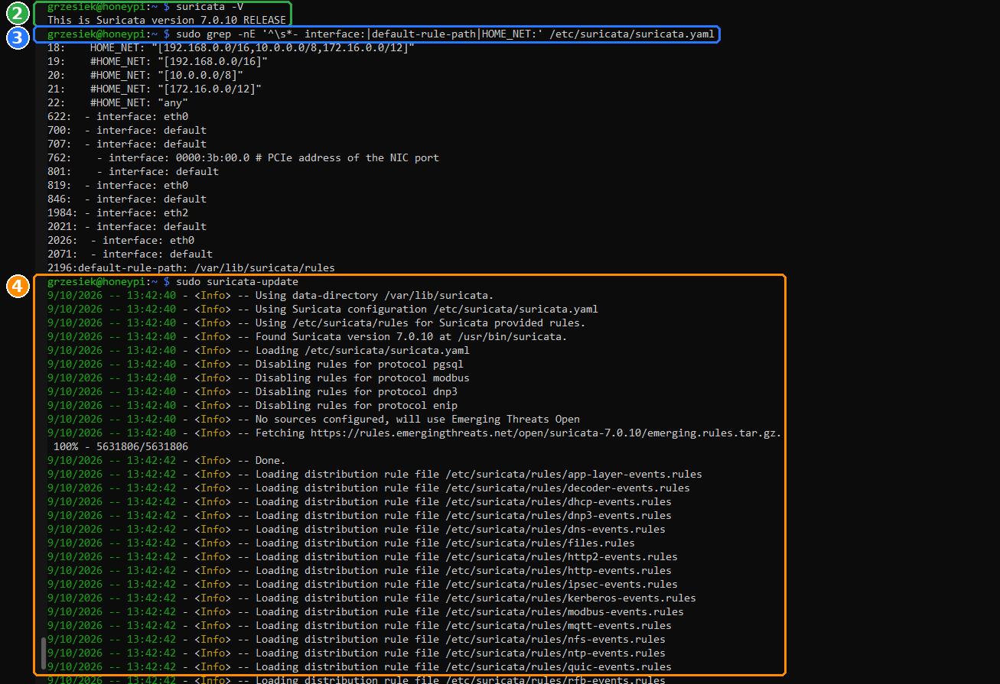

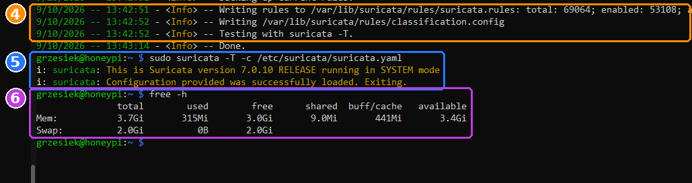

### 1 · `sudo apt install -y suricata`: instalacja

Suricata jest w repozytorium Debiana, razem z nią instaluje się m.in. `suricata-update` (narzędzie do pobierania reguł) i biblioteki do szybkiego przechwytywania pakietów (`librte-*`, `libnetfilter-*`, `libxdp`).

### 2 · `suricata -V`: wersja

`This is Suricata version 7.0.10 RELEASE`. Wersja ma znaczenie, bo reguły pobiera się pod konkretną wersję silnika (widać to w kroku 4: `…/open/suricata-7.0.10/…`).

### 3 · `sudo grep -nE '…' /etc/suricata/suricata.yaml`: trzy ustawienia do sprawdzenia

`/etc/suricata/suricata.yaml` to główny plik konfiguracji (ponad 2000 linijek). `grep -n` wypisuje pasujące linijki z ich numerami.

| Ustawienie | U mnie | Znaczenie |
|---|---|---|
| `HOME_NET` (linia 18) | `[192.168.0.0/16,10.0.0.0/8,172.16.0.0/12]` | „nasza” sieć. Obejmuje wszystkie typowe sieci domowe, w tym moją `192.168.1.x`. Linijki z `#` to wyłączone przykłady |
| `- interface: eth0` (linia 622) | `eth0` | na której karcie Suricata słucha. Pierwszy wpis to sekcja `af-packet`, czyli sposób przechwytywania pakietów, którego używa usługa. Pozostałe wpisy należą do innych trybów pracy i nie mają znaczenia |
| `default-rule-path` (linia 2196) | `/var/lib/suricata/rules` | gdzie Suricata szuka reguł. **Dokładnie tam** zapisuje je `suricata-update` (krok 4), więc nic nie trzeba zmieniać |

### 4 · `sudo suricata-update`: pobranie reguł

- `No sources configured, will use Emerging Threats Open`: domyślnie pobiera darmowy zestaw **ET Open** (Emerging Threats), utrzymywany przez społeczność i firmę Proofpoint,
- `Fetching …emerging.rules.tar.gz`: pobranie paczki (ok. 5,6 MB),
- `Loading distribution rule file /etc/suricata/rules/…`: dokłada reguły dostarczone z samą Suricatą (błędy protokołów, dekodera itp.),
- `Disabling rules for protocol pgsql/modbus/dnp3/enip`: wyłącza reguły dla protokołów, których obsługa jest w konfiguracji wyłączona,
- `Writing rules to /var/lib/suricata/rules/suricata.rules: total: 69064; enabled: 53108`: **wszystko trafia do jednego pliku**: 69 064 reguły, z czego 53 108 włączone,
- `Testing with suricata -T` → `Done`: na koniec sam sprawdza, czy Suricata te reguły przyjmie.

### 5 · `sudo suricata -T -c /etc/suricata/suricata.yaml`: test przed uruchomieniem

- `-T` (*test*): wczytaj konfigurację i wszystkie reguły, sprawdź je i zakończ, bez uruchamiania monitoringu,
- `-c …`: którego pliku konfiguracji użyć.

`Configuration provided was successfully loaded. Exiting.` ✅ Błąd w konfiguracji lepiej złapać tutaj niż w niedziałającej usłudze.

### 6 · `free -h`: pamięć

Suricata z pełnym zestawem reguł potrafi zająć kilkaset MB RAM. Raspberry ma 3,7 GB, z czego wolne 3,4 GB, zapasu jest dużo.

## Krok 2: „atakujący z domu”, uruchomienie i pierwszy alert

### Dlaczego trzeba zmienić `EXTERNAL_NET`

Większość reguł wykrywających skany i ataki ma postać: ruch **z zewnątrz** (`$EXTERNAL_NET`) **do naszej sieci** (`$HOME_NET`). Domyślnie:

```yaml
EXTERNAL_NET: "!$HOME_NET"     # „wszystko, co NIE jest siecią domową”
```

W prawdziwej firmie to ma sens: atak przychodzi z internetu. W moim labie **atakujący siedzi w sieci domowej**: dziś to mój PC, w Etapie 3 będzie to Kali. Jego adres należy do `HOME_NET`, więc z punktu widzenia reguł nie jest „z zewnątrz” i Suricata **zignorowałaby** jego skany. Dlatego:

```yaml
EXTERNAL_NET: "any"            # „dowolny adres, także z domu”
```

### Komendy w skrócie

```bash
sudo grep -n 'EXTERNAL_NET:' /etc/suricata/suricata.yaml                                  # 1
sudo sed -i 's/^\(\s*\)EXTERNAL_NET: "!\$HOME_NET"/\1EXTERNAL_NET: "any"/' /etc/suricata/suricata.yaml   # 2
sudo grep -n 'EXTERNAL_NET:' /etc/suricata/suricata.yaml                                  # 3
sudo suricata -T -c /etc/suricata/suricata.yaml                                           # 4
sudo systemctl enable suricata                                                            # 5
sudo systemctl restart suricata                                                           # 6
systemctl status suricata --no-pager                                                      # 7
sudo tail -n 5 /var/log/suricata/suricata.log                                             # 8
curl -i http://testmynids.org/uid/index.html                                              # 9 (!)
sudo ls -l /var/log/suricata/                                                             # 9
# na PC:
curl -A "Mozilla/5.0 (compatible; Nmap Scripting Engine; https://nmap.org/book/nse.html)" http://192.168.1.134/   # 10
# na Raspberry:
sudo tail -n 5 /var/log/suricata/fast.log                                                 # 11
```

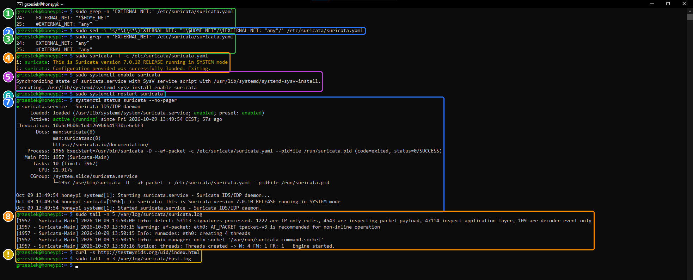

### 1–3 · `grep` i `sed`: zmiana `EXTERNAL_NET`

- (1) Linia 24 to aktywne ustawienie `EXTERNAL_NET: "!$HOME_NET"` (`!` = „nie”), linia 25 to wyłączony przykład z `#`.
- (2) `sed -i` (*stream editor*, `-i` = zmień plik na miejscu) podmienia tekst według wzorca `s/szukaj/zamień/`:
  - `^\(\s*\)`: początek linii i wcięcie, zapamiętane jako `\1`,
  - `EXTERNAL_NET: "!\$HOME_NET"`: dokładnie ta aktywna linijka (`\$`, bo `$` ma w wzorcach specjalne znaczenie),
  - `\1EXTERNAL_NET: "any"`: to samo wcięcie i nowa wartość. W YAML-u wcięcia są częścią składni, więc muszą zostać.
  - Linijka z `#` nie pasuje do wzorca (zaczyna się od `#`, nie od spacji), więc zostaje nietknięta.
- (3) Kontrola: linia 24 to teraz `EXTERNAL_NET: "any"` ✅

### 4 · `sudo suricata -T …`: test po zmianie

Każda zmiana w `suricata.yaml` = test przed restartem. `successfully loaded` ✅

### 5 · `sudo systemctl enable suricata`: start przy uruchomieniu

Komunikat `Synchronizing state of suricata.service with SysV service script` znaczy, że Debian ma dla Suricaty i plik usługi systemd, i stary skrypt startowy (SysV). `enable` ustawia oba. Debian uruchomił Suricatę już przy instalacji, ale bez reguł i ze starą konfiguracją.

### 6 · `sudo systemctl restart suricata`: uruchomienie od nowa

Teraz z regułami z kroku 1 i nowym `EXTERNAL_NET`.

### 7 · `systemctl status suricata --no-pager`: stan

- `Active: active (running)` ✅
- `Process: … ExecStart=/usr/bin/suricata -D --af-packet -c … (code=exited, status=0/SUCCESS)`: to **nie błąd**. `-D` (*daemon*) każe Suricacie przejść w tło: proces startowy kończy się sukcesem, a dalej działa `Main PID: 1957 (Suricata-Main)`.
- `--af-packet`: tryb przechwytywania pakietów przez mechanizm jądra Linuksa (AF_PACKET), na karcie z `suricata.yaml` (`eth0`).

### 8 · `sudo tail -n 5 /var/log/suricata/suricata.log`: dziennik samej Suricaty

| Linijka | Znaczenie |
|---|---|
| `53113 signatures processed` | wczytane reguły (53 108 z ET Open + reguły protokołów) |
| `Warning: af-packet: eth0: AF_PACKET tpacket-v3 is recommended for non-inline operation` | sugestia wydajnościowa dla dużego ruchu; przy ruchu domowym bez znaczenia |
| `runmodes: eth0: creating 4 threads` | 4 wątki, po jednym na rdzeń procesora Raspberry |
| `Engine started.` | **silnik działa i analizuje ruch** ✅ |

Wczytanie reguł trwa ok. 20 sekund (od `13:49:54` do `13:50:16`). Alerty zaczynają działać dopiero po `Engine started`.

### ❗ Wpadka: strona testowa nie istnieje

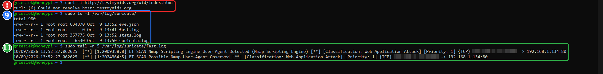

Popularny test IDS to `curl http://testmynids.org/uid/index.html`: strona odsyła tekst wyglądający jak wynik komendy `id` na przejętym serwerze (`uid=0(root)`), a reguła rozpoznaje go jako „odpowiedź z uprawnieniami roota”.

- **Co było widać (żółta ramka na zrzucie 65):** `curl -s …` nic nie wypisał, a `fast.log` był pusty.
- **Diagnoza (czerwona ramka):** bez `-s` (*silent*, które ukrywa też błędy) od razu widać przyczynę: `curl: (6) Could not resolve host: testmynids.org`. Nazwy tej strony **nie da się zamienić na adres IP**.
- **Przyczyna:** to nie problem z siecią Raspberry, bo chwilę wcześniej działały `apt` i `suricata-update`. Strona testowa najpewniej przestała istnieć. Nie było ruchu, więc nie było czego wykryć.
- **Lekcja:** `-s` przy diagnozowaniu tylko przeszkadza. Najpierw sprawdź, **czy ruch w ogóle był**, a dopiero potem, czy IDS go wykrył.

### 9 · `sudo ls -l /var/log/suricata/`: pliki Suricaty

| Plik | Co w nim jest |
|---|---|
| `fast.log` | **alerty**, jedna linijka na alert. Najwygodniejszy do czytania |
| `eve.json` | **wszystko** w formacie JSON: alerty, ale też każde połączenie, zapytanie DNS, żądanie HTTP. Rośnie najszybciej |
| `stats.log` | statystyki co kilka sekund: ile pakietów, ile odrzuconych, ile alertów |
| `suricata.log` | dziennik samej Suricaty (krok 8) |

Wszystkie są w `/var/log`, czyli na pendrivie (Etap 1).

### 10 · Test z PC: „skaner Nmap” w nagłówku

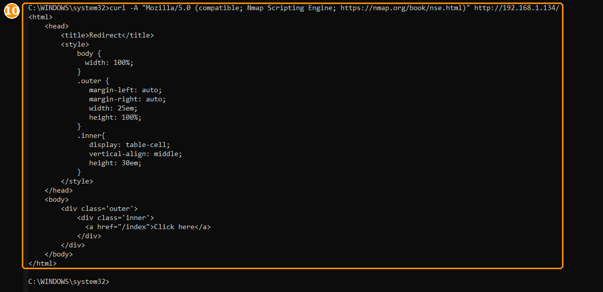

Test niezależny od internetu: zwykłe zapytanie do strony honeypota, ale z nagłówkiem `User-Agent` takim, jak wysyłają skrypty skanera **Nmap** (NSE, *Nmap Scripting Engine*), gdy badają strony WWW.

- `curl -A "…"`: `-A` ustawia `User-Agent`, czyli to, jak klient się przedstawia,
- odpowiedź to strona przekierowania honeypota (`<title>Redirect</title>`, link do `/index`).

### 11 · `sudo tail -n 5 /var/log/suricata/fast.log`: alerty ✅

```
[1:2009358:8] ET SCAN Nmap Scripting Engine User-Agent Detected (Nmap Scripting Engine) [Classification: Web Application Attack] [Priority: 1] {TCP} <PC>:43982 -> 192.168.1.134:80
[1:2024364:5] ET SCAN Possible Nmap User-Agent Observed                                  [Classification: Web Application Attack] [Priority: 1] {TCP} <PC>:43982 -> 192.168.1.134:80
```

Jak czytać linijkę alertu:

| Fragment | Znaczenie |
|---|---|
| `10/09/2026-13:52:27.062625` | kiedy |
| `[1:2009358:8]` | identyfikator reguły: `1` = źródło, `2009358` = numer reguły (*SID*), `8` = wersja reguły |
| `ET SCAN Nmap Scripting Engine…` | opis: `ET` = Emerging Threats, `SCAN` = kategoria „skanowanie” |
| `Classification: Web Application Attack` | rodzaj zagrożenia |
| `Priority: 1` | ważność: **1 = najwyższa**, 3 = najniższa |
| `{TCP}` | protokół |
| `<PC>:43982 -> 192.168.1.134:80` | **skąd → dokąd**: adres i port atakującego → Raspberry, port 80 |

Dwie reguły złapały to samo zdarzenie, bo różnią się szczegółami wzorca. To normalne. Bez zmiany `EXTERNAL_NET` na `any` nie byłoby żadnego alertu, bo mój PC jest w `HOME_NET`.

**Ograniczenie tego testu:** Suricata rozpoznała **podpis** skanera w zapytaniu WWW, a nie prawdziwy skan portów. Pełny skan `nmap` z Kali to Etap 4.

# Część 3: podgląd ruchu — ntopng (opcjonalnie)

*Do zrobienia.* Panel WWW pokazujący, które urządzenie z czym się łączy. Domyślnie `admin`/`admin`, więc hasło trzeba zmienić od razu, a port panelu otworzyć w `ufw`.

---

## Skrypty pomocnicze

- [`../config/scripts/check-logs.sh`](../config/scripts/check-logs.sh): podgląd alertów honeypota i Suricaty
- [`../config/opencanary/opencanary.conf.example`](../config/opencanary/opencanary.conf.example): najważniejsze ustawienia honeypota

➡️ Następnie: [04 — Atakujący](04-attacker-kali.md)
