# 04d — Docker, DVWA i Juice Shop na maszynie `cele`

**Data:** 2026-10-10 · **Czas:** ~1,5 godziny · **Gdzie:** maszyna `cele` (Ubuntu Server 26.04.1) w VirtualBoxie na PC z Windows 10

Ciąg dalszy [04c](04c-instalacja-kali-i-celow.md). Maszyna `cele` jest zainstalowana i ma internet przez NAT. W tym rozdziale:

1. instaluję Dockera z oficjalnego repozytorium,
2. uruchamiam dwie celowo dziurawe aplikacje: **DVWA** i **OWASP Juice Shop**,
3. odcinam `cele` od internetu i przełączam ją do zamkniętej sieci `labnet`, gdzie widzi ją tylko Kali.

Kolejność jest ważna: wszystko, co trzeba pobrać, pobieram **przed** przełączeniem karty. Po przełączeniu `cele` nie ma już skąd ściągać.

> ⚠️ DVWA i Juice Shop są dziurawe celowo. Nie mogą być widoczne ani w sieci domowej, ani w internecie, dlatego stoją na osobnej maszynie, w sieci, do której dostęp ma tylko Kali (art. 267 kk).

## Wynik w skrócie

| Co | Stan |
|---|---|
| Docker Engine 29.9.0 z repozytorium `download.docker.com` (wydanie `resolute`) | ✅ działa, test `hello-world` |
| DVWA + baza MariaDB 10 (`docker compose`), port 4280 | ✅ `HTTP/1.1 302 Found` |
| OWASP Juice Shop (`docker run`), port 3000 | ✅ `HTTP/1.1 200 OK` |
| Kontenery wstają same po restarcie (`restart: unless-stopped`) | ✅ |
| `cele` w `labnet` pod stałym adresem 10.10.10.10, bez internetu | ✅ `ping 8.8.8.8` → `Network is unreachable` |
| Snapshot „cele z Dockerem, przed labnet” | ✅ |
| Kali w `labnet` pod stałym adresem 10.10.10.5, widzi obie aplikacje | ✅ `nmap -p-`, Firefox |
| Baza DVWA utworzona, logowanie `admin` / `password` | ✅ `You have logged in as 'admin'` |
| Snapshot „cele czyste (DVWA z bazą)” | ✅ |

---

## Komendy w skrócie

Numery zgadzają się z ramkami na zrzutach w [`screenshots/2026-10-10-cele-docker/`](../screenshots/2026-10-10-cele-docker/). Krok 6 to klikanie w VirtualBoxie, kroki 29–31 to klikanie w przeglądarce; oba opisane niżej.

```bash
# --- w konsoli VirtualBoxa, na cele ---
# 1. aktualizacja całego systemu
sudo apt update && sudo apt full-upgrade -y

# 2. narzędzia potrzebne do dodania repozytorium
sudo apt install -y ca-certificates curl git

# 3. klucz, którym Docker podpisuje swoje pakiety
sudo install -m 0755 -d /etc/apt/keyrings
sudo curl -fsSL https://download.docker.com/linux/ubuntu/gpg -o /etc/apt/keyrings/docker.asc
sudo chmod a+r /etc/apt/keyrings/docker.asc
ls -l /etc/apt/keyrings/docker.asc

# 4. adres repozytorium Dockera (amd64 = procesor, resolute = Ubuntu 26.04)
echo "deb [arch=amd64 signed-by=/etc/apt/keyrings/docker.asc] https://download.docker.com/linux/ubuntu resolute stable" | sudo tee /etc/apt/sources.list.d/docker.list

# 5. odświeżenie list pakietów; szukam linijek z download.docker.com
sudo apt update
```

```powershell
# --- na PC, w PowerShellu (po kroku 6 w VirtualBoxie) ---
# 7. logowanie na cele przez przekierowany port; od teraz komendy można wklejać
ssh -p 2201 grzesiek@127.0.0.1
```

```bash
# --- na cele, przez SSH ---
# 8. Docker i jego dodatki
sudo apt install -y docker-ce docker-ce-cli containerd.io docker-buildx-plugin docker-compose-plugin

# 9. docker bez sudo; grupa działa dopiero po ponownym zalogowaniu
sudo usermod -aG docker grzesiek
exit
#    (na PC: ssh -p 2201 grzesiek@127.0.0.1)

# 10. test: Docker pobiera i uruchamia malutki obraz
docker run hello-world

# 11. DVWA: pobranie repozytorium z plikiem compose.yml
cd ~
git clone https://github.com/digininja/DVWA.git
cd DVWA

# 12. dwie zmiany w compose.yml i sprawdzenie
sed -i 's/pull_policy: always/pull_policy: missing/; s/127.0.0.1:4280:80/4280:80/' compose.yml
grep -n -E "pull_policy|4280" compose.yml

# 13. pobranie obrazów DVWA i bazy
docker compose pull

# 14. uruchomienie DVWA w tle
docker compose up -d

# 15. pobranie obrazu Juice Shop (powtarzać przy timeoucie)
docker pull bkimminich/juice-shop

# 16. uruchomienie Juice Shop w tle
docker run -d --name juice-shop --restart unless-stopped -p 3000:3000 bkimminich/juice-shop

# 17. lista działających kontenerów
docker ps

# 18. czy aplikacje odpowiadają
curl -sI http://localhost:4280 | head -1
curl -sI http://localhost:3000 | head -1
```

```bash
# --- przełączenie do labnet ---
# UWAGA: wklejaj po jednym poleceniu. Wklejony cały blok trafi w pytanie sudo o hasło (wpadka 19!)
# 19. cloud-init przestaje zarządzać siecią; stały adres 10.10.10.10 bez bramy
sudo tee /etc/cloud/cloud.cfg.d/99-disable-network-config.cfg <<'EOF'
network: {config: disabled}
EOF
sudo mkdir -p /root/netplan-backup
sudo mv /etc/netplan/*.yaml /root/netplan-backup/
sudo tee /etc/netplan/01-labnet.yaml <<'EOF'
network:
  version: 2
  ethernets:
    enp0s3:
      dhcp4: false
      addresses: [10.10.10.10/24]
EOF
sudo chmod 600 /etc/netplan/01-labnet.yaml
sudo netplan generate && echo KONFIG_OK

# 20. wyłączenie; potem w VirtualBoxie snapshot i karta 1 → labnet
sudo poweroff

# 21. po starcie, w konsoli VirtualBoxa: adres i brak internetu
ip -br a
ping -c 2 8.8.8.8
```

```bash
# --- w Kali ---
# 22. hasło do sudo podane z góry
sudo true

# 23. stały adres 10.10.10.5 na eth0 (karta w labnet), bez bramy; potem włączenie
sudo nmcli connection add type ethernet ifname eth0 con-name labnet ipv4.method manual ipv4.addresses 10.10.10.5/24 ipv6.method disabled connection.autoconnect-priority 10
sudo nmcli connection up labnet

# 24. adresy kart
ip -br a

# 25. czy Kali widzi cele
ping -c 3 10.10.10.10

# 26. skan 1000 najpopularniejszych portów (DVWA na 4280 się nie pokaże)
nmap -sV 10.10.10.10

# 27. skan wszystkich portów
nmap -sV -p- 10.10.10.10

# 28. SSH na cele; przed „yes” porównać odcisk klucza
ssh grzesiek@10.10.10.10

# 29. w Firefoksie: http://10.10.10.10:4280 (DVWA) i http://10.10.10.10:3000 (Juice Shop)
# 30. w Firefoksie: http://10.10.10.10:4280/setup.php → Create / Reset Database
# 31. logowanie admin / password; okno „Save password” → Not now
```

```bash
# --- w konsoli VirtualBoxa, na cele ---
# 32. (ostrzeżenia soft lockup pojawiły się same, bez komendy)
# 33. wyłączenie przed snapshotem „cele czyste (DVWA z bazą)”
sudo poweroff
```

---

## Część 1: Docker z oficjalnego repozytorium

**Dlaczego nie `apt install docker.io` z Ubuntu ani snap?** Wersja z Ubuntu bywa starsza. Autor DVWA wspiera tylko najnowszy Docker i pisze, że wersja z menedżera pakietów działa „w miarę możliwości”. Snapa świadomie pominąłem przy instalacji systemu ([04c, krok 19](04c-instalacja-kali-i-celow.md#19-instalator-ubuntu-server)).

### 1. Aktualizacja

Aktualizacja przeszła bez błędów. Ważna linijka: `Running kernel seems to be up-to-date`, czyli restart nie jest potrzebny. Komunikat `User sessions running outdated binaries` dotyczy tylko mojej bieżącej sesji i znika po ponownym zalogowaniu.

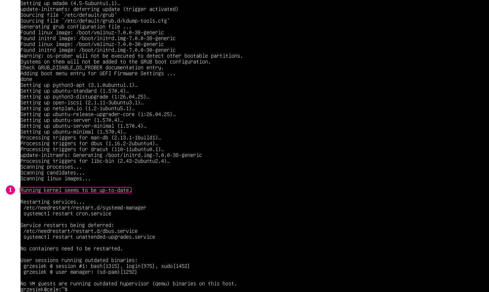

### 2–4. Klucz i adres repozytorium

Repozytorium to „sklep” z pakietami. Żeby `apt` ufał sklepowi Dockera, potrzebuje dwóch rzeczy:

- **klucza** (`docker.asc`), którym Docker podpisuje pakiety. `apt` sprawdza tym kluczem każdy pobrany plik; podrobiony pakiet nie przejdzie,
- **adresu** w pliku `/etc/apt/sources.list.d/docker.list`. Opcja `signed-by=` wiąże ten adres tylko z tym jednym kluczem.

Pierwsze podejście miało trzy literówki, opis w [❗ Wpadkach](#-wpadki). Na zrzucie 02 widać je w czerwonych ramkach.

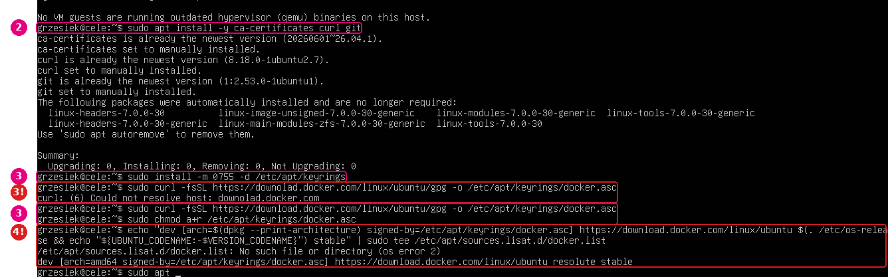

Za drugim razem wpisałem gotowe wartości zamiast `$(dpkg --print-architecture)` i nazwy wydania z `/etc/os-release`. Obie znałem już z pierwszej próby (`amd64`, `resolute`), a krótsza linijka to mniej miejsc na literówkę. Klucz ma 3817 bajtów, czyli pobrał się w całości.

### 5. `apt update`: czy Docker jest w sklepie

Bez pliku `docker.list` w wyniku są tylko serwery Ubuntu (zrzut 03). Po poprawce pojawiają się dwie nowe linijki (zielone ramki na zrzucie 04):

- `Get:2 https://download.docker.com/... resolute InRelease`: repozytorium istnieje i ma podpisany spis,
- `Get:6 ... resolute/stable amd64 Packages`: jest w nim lista pakietów dla mojego procesora.

To była realna niewiadoma: Ubuntu 26.04 jest nowe, a Docker mógł go jeszcze nie obsługiwać. Wtedy zamiast `Get` byłoby `Err` albo `does not have a Release file`.

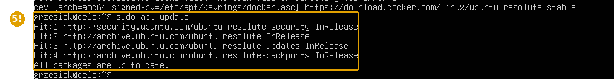
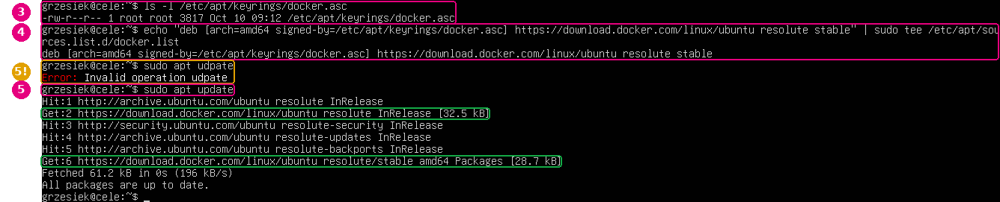

---

## Część 2: SSH z PC, żeby móc wklejać komendy

W konsoli VirtualBoxa nie da się wkleić tekstu ze schowka Windowsa (to wymaga dodatków *Guest Additions*, a Ubuntu Server ich nie ma). Przepisywanie długich linijek skończyło się literówkami, więc wchodzę na `cele` przez SSH z PowerShella, gdzie wklejanie działa.

### 6. Przekierowanie portu w NAT

Przy karcie NAT maszyna siedzi „za routerem” VirtualBoxa i z PC nie widać jej bezpośrednio. Przekierowanie portu otwiera jedną furtkę: połączenie na port 2201 w Windowsie VirtualBox przekazuje na port 22 (SSH) w `cele`.

**Ustawienia** maszyny `cele` → **Sieć** → **Karta 1** → **Zaawansowane** → **Przekierowanie portów** → zielony plus:

| Nazwa | Protokół | IP hosta | Port hosta | IP gościa | Port gościa |
|---|---|---|---|---|---|
| ssh | TCP | 127.0.0.1 | 2201 | (puste) | 22 |

- **IP hosta `127.0.0.1`**: furtka działa tylko z mojego PC. Puste pole oznaczałoby wszystkie karty Windowsa, więc do `cele` mógłby się dobijać każdy w sieci domowej.
- **Port 2201**, a nie 2222, żeby nie mylić z SSH na Raspberry.
- Reguła znika sama, gdy karta przestanie być w trybie NAT (krok 20).

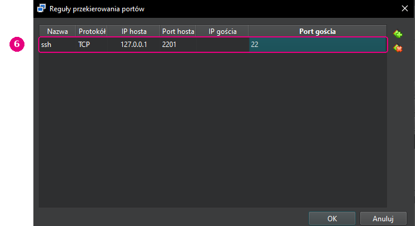

### 7. Pierwsze logowanie i odcisk klucza

Przy pierwszym połączeniu SSH pokazuje odcisk klucza serwera (ED25519) i pyta, czy mu ufam. Ten odcisk powinienem porównać z ekranem pierwszego startu `cele` ([04c, krok 22](04c-instalacja-kali-i-celow.md#22-pierwszy-start-klucze-ssh-serwera), zrzut 43). Zgodny odcisk dowodzi, że rozmawiam z moją maszyną. Na zrzucie odcisk i adres IPv6 są zamazane.

Dwie drobne wpadki (czerwona i żółta ramka 7!) opisuję w [❗ Wpadkach](#-wpadki).

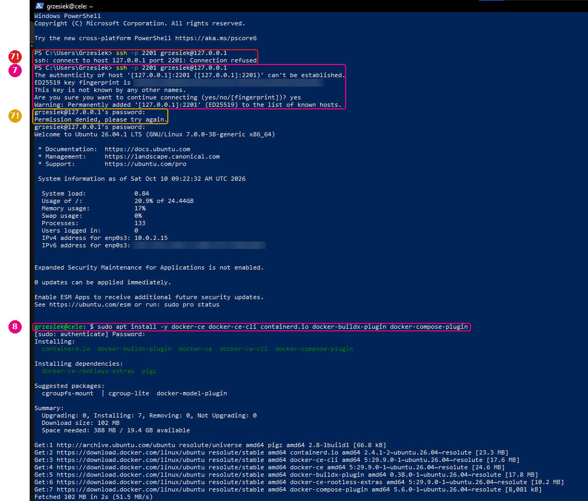

---

## Część 3: Docker

### 8. Instalacja

Pięć pakietów:

| Pakiet | Co to |
|---|---|
| `docker-ce` | silnik Dockera (usługa w tle, która uruchamia kontenery) |
| `docker-ce-cli` | polecenie `docker`, którym wydaję mu rozkazy |
| `containerd.io` | niższa warstwa, która faktycznie uruchamia procesy kontenerów |
| `docker-buildx-plugin` | budowanie obrazów (tu nieużywane, instalowane w zestawie) |
| `docker-compose-plugin` | `docker compose`: kilka kontenerów z jednego pliku |

Wersje: Docker 29.9.0, containerd 2.4.1, Compose 5.6.0. Wszystkie z dopiskiem `ubuntu.26.04~resolute`, czyli zbudowane pod mój system.

### 9. Grupa `docker` i ponowne logowanie

`usermod -aG docker grzesiek` dodaje mnie do grupy `docker`, więc mogę wydawać polecenia bez `sudo`. Grupa działa od następnego logowania, stąd `exit` i ponowne `ssh`.

> ⚠️ **Uczciwie o bezpieczeństwie:** członek grupy `docker` może uruchomić kontener z całym dyskiem maszyny podpiętym do środka, czyli w praktyce ma uprawnienia roota. Na `cele`, celowo słabej maszynie w zamkniętej sieci, to w porządku. Na Raspberry tak bym nie zrobił.

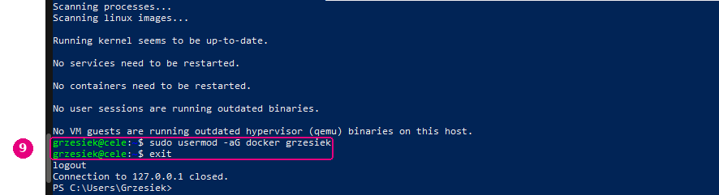

### 10. `hello-world`

Najmniejszy możliwy test: Docker sam pobiera obraz z Docker Hub, tworzy kontener i wypisuje `Hello from Docker!` (zielona ramka). Działa więc wszystko: usługa, polecenie bez `sudo` i pobieranie z internetu.

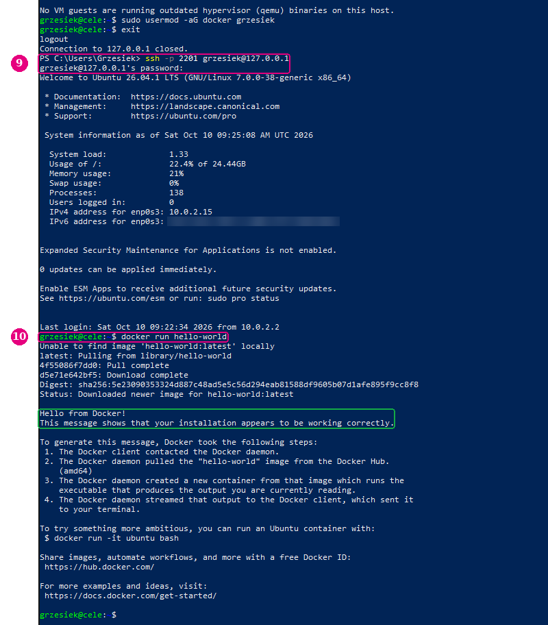

---

## Część 4: DVWA i Juice Shop

**Obraz** to gotowa, zamrożona paczka z programem i wszystkim, czego potrzebuje. **Kontener** to uruchomiona kopia obrazu. Dzięki temu nie instaluję na `cele` PHP, MariaDB ani Node.js: każda aplikacja przychodzi z własnym kompletem.

### 11–12. DVWA: repozytorium i dwie zmiany w `compose.yml`

Autor DVWA ([github.com/digininja/DVWA](https://github.com/digininja/DVWA)) dostarcza plik `compose.yml` z dwoma kontenerami: DVWA (strona w PHP) i MariaDB (baza). Dwie domyślne opcje nie pasują do mojego labu, więc zmieniam je jednym `sed`:

| W `compose.yml` | Było | Jest | Dlaczego |
|---|---|---|---|
| `ports:` | `127.0.0.1:4280:80` | `4280:80` | domyślnie DVWA odpowiada tylko z wnętrza `cele`, więc Kali by go nie zobaczył. Bez adresu nasłuchuje na wszystkich kartach. Po przełączeniu `cele` ma tylko jedną: `labnet` |
| `pull_policy:` | `always` | `missing` | `always` = przy każdym starcie pobierz najnowszą wersję z internetu. Bez internetu start by się nie udał. `missing` = pobierz tylko, gdy obrazu nie ma |

`grep` potwierdza obie zmiany (linie 14 i 25).

### 13–14. Pobranie i start DVWA

`docker compose pull` pobrał oba obrazy (`Pulled`). Polecenie `docker compose up -d` za pierwszym razem się nie wykonało, opis w [❗ Wpadkach](#-wpadki). Po uruchomieniu `up -d` tworzy sieć `dvwa_dvwa`, wolumen `dvwa_dvwa` (dysk bazy, który przetrwa usunięcie kontenera) i dwa kontenery.

### 15–16. Juice Shop

[OWASP Juice Shop](https://owasp.org/www-project-juice-shop/) to sklep internetowy z ponad setką celowych dziur. Jeden kontener, więc wystarczy `docker run` bez pliku compose. Pierwsze uruchomienie przerwał timeout przy pobieraniu (czerwone ramki 16! na zrzucie 09). Osobne `docker pull` dokończyło pobieranie; warstwy, które już przyszły, nie pobierały się drugi raz.

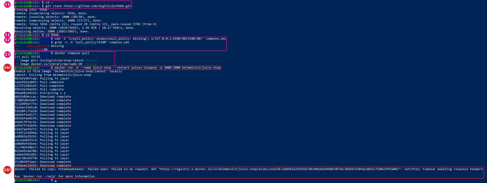

### 17–18. Sprawdzenie

`docker ps` pokazuje trzy kontenery w stanie `Up`:

| Kontener | Obraz | Port |
|---|---|---|
| `juice-shop` | `bkimminich/juice-shop` | `0.0.0.0:3000->3000/tcp` |
| `dvwa-dvwa-1` | `ghcr.io/digininja/dvwa:latest` | `0.0.0.0:4280->80/tcp` |
| `dvwa-db-1` | `mariadb:10` | `3306/tcp`, tylko wewnątrz sieci `dvwa_dvwa`, nie na zewnątrz |

`0.0.0.0` oznacza „wszystkie karty”, czyli efekt zmiany z kroku 12. Baza nie ma przekierowanego portu, więc z Kali da się do niej dobrać tylko przez dziury w DVWA, i o to chodzi w ćwiczeniach.

`curl` pyta same nagłówki odpowiedzi:

- DVWA: `HTTP/1.1 302 Found`, czyli przekierowanie na stronę logowania. Strona działa,
- Juice Shop: `HTTP/1.1 200 OK`.

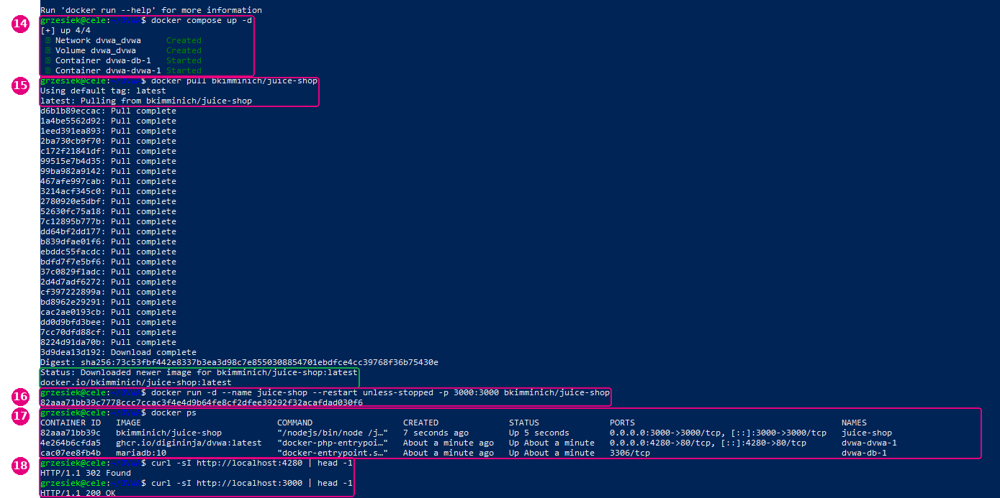

---

## Część 5: przełączenie do `labnet`

### 19. Stały adres bez bramy

Do tej pory adres dawał DHCP od NAT (`10.0.2.15`). W `labnet` nie ma żadnego serwera DHCP, więc adres trzeba wpisać na stałe.

**Pułapka cloud-init:** Ubuntu Server przy starcie odtwarza ustawienia sieci z pliku `50-cloud-init.yaml`. Gdybym tylko go edytował, przy którymś restarcie wróciłby DHCP. Dlatego najpierw wyłączam zarządzanie siecią przez cloud-init, przenoszę stare pliki do `/root/netplan-backup/` i zapisuję własny `01-labnet.yaml`.

W konfiguracji celowo **nie ma bramy** (`routes`/`gateway`): `cele` zna tylko sieć 10.10.10.0/24 i nie ma którędy wyjść do internetu. To druga warstwa zabezpieczenia, obok samej sieci wewnętrznej.

> ℹ️ **Później dopisane:** `optional: true` pod `dhcp4: false`. Bez tego start `cele` czekał 2 minuty na „gotową” sieć, która bez bramy nigdy taka nie jest ([04e, część 3](04e-zabezpieczenie-kali-i-stabilnosc.md#część-3-start-cele-bez-czekania-na-sieć)).

`netplan generate` sprawdza plik bez stosowania zmian i odpowiada `KONFIG_OK` (zielona ramka). `netplan apply` od razu zerwałby połączenie SSH, więc nowy adres zadziała po restarcie.

Pierwsza próba się nie udała: wkleiłem cały blok naraz, a `sudo` zapytało o hasło w połowie wklejania. Opis w [❗ Wpadkach](#-wpadki) (czerwone ramki 19!). Druga próba, polecenie po poleceniu, przeszła czysto.

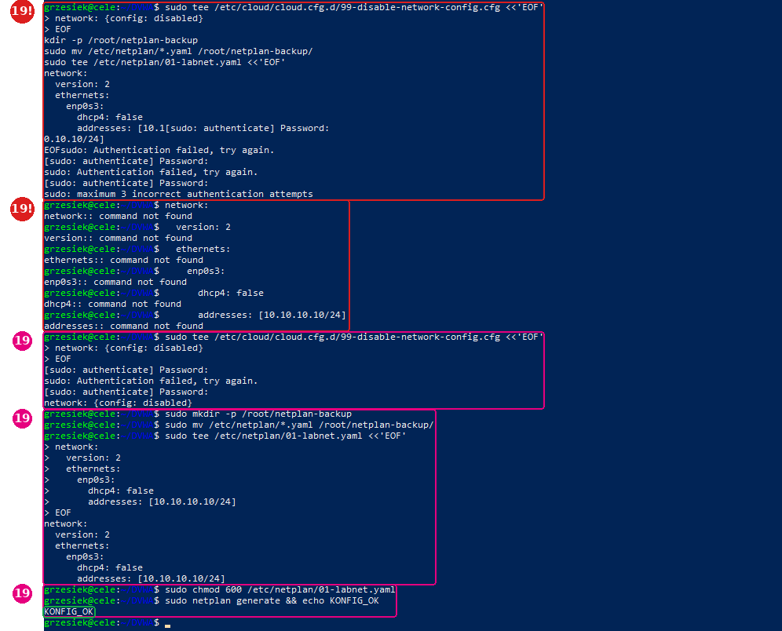

### 20. Snapshot i zmiana karty

Przy wyłączonej `cele`:

1. **Migawki** → **Zrób** → snapshot „cele z Dockerem, przed labnet” (punkt powrotu),
2. **Ustawienia** → **Sieć** → **Karta 1** → *Podłączona do:* **Sieć wewnętrzna**, nazwa **`labnet`** wybrana z listy, nie wpisana ręcznie. Ta sama nazwa co karta 1 w Kali, więc obie maszyny są „w jednym kablu”. Adres MAC na zrzucie zamazany.

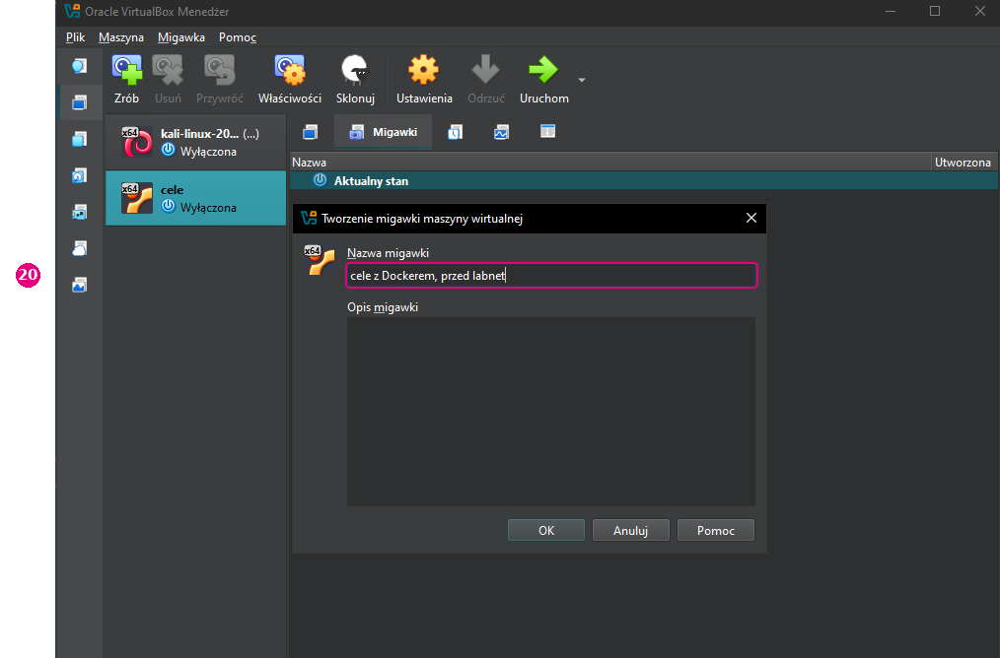
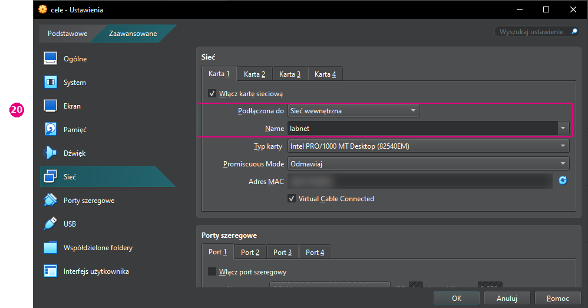

Po przełączeniu `ssh -p 2201` z PowerShella kończy się `Connection refused`. To dobry znak: przekierowanie portu należało do karty NAT i zniknęło razem z nią. Z PC nie da się już dostać do `cele`.


### 21. Sprawdzenie

W konsoli VirtualBoxa:

- `ip -br a`: `enp0s3 UP 10.10.10.10/24` (zielona ramka). Adres z pliku netplan zadziałał i cloud-init go nie nadpisał,
- `ping -c 2 8.8.8.8`: `Network is unreachable`. System nie zna żadnej drogi poza 10.10.10.0/24, więc nawet nie próbuje wysłać pakietu. **Cele są odcięte od internetu.**

Obok `enp0s3` widać karty, które stworzył Docker. Wszystkie żyją tylko wewnątrz `cele`:

| Karta | Adres | Co to |
|---|---|---|
| `docker0` | 172.17.0.1/16 | domyślna sieć Dockera, tu nieużywana (Juice Shop z `docker run` też tu jest podpięty) |
| `br-57035d39ba6d` | 172.18.0.1/16 | sieć `dvwa_dvwa` z `compose.yml`, w której DVWA rozmawia z bazą |
| `veth…@if2` (3 sztuki) | brak | „wirtualne kable”, po jednym na kontener |

Adresy IPv6 (`fe80::…`) na zrzucie zamazane. Literówkę `ipa` opisuję w wpadkach (żółta ramka 21!).

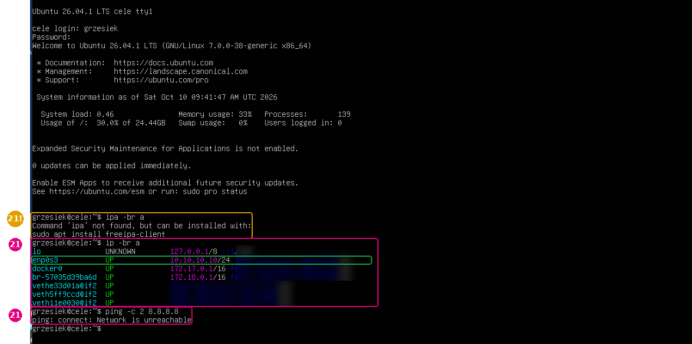

---

## Część 6: pierwszy kontakt z Kali

Teraz z Kali sprawdzam, że cele faktycznie widać w `labnet` i że obie dziurawe aplikacje odpowiadają. To domyka testy z Etapu 3; samymi dziurami zajmę się w kolejnych ćwiczeniach.

### 22–25. Stały adres Kali w `labnet`

Kali ma dwie karty: `eth0` w `labnet` (do celów) i `eth1` mostkowana (do internetu i aktualizacji). `eth0` dostaje stały adres **10.10.10.5**, w tej samej sieci co `cele` (10.10.10.10).

```bash
sudo nmcli connection add type ethernet ifname eth0 con-name labnet ipv4.method manual ipv4.addresses 10.10.10.5/24 ipv6.method disabled connection.autoconnect-priority 10
```

Tu **celowo nie podaję bramy** (`ipv4.gateway`). Gdyby `eth0` miała bramę, Kali mógłby próbować wychodzić do internetu przez `labnet`, gdzie nic nie ma. Internet zostaje na `eth1`. `nmcli` sam zapisuje połączenie na stałe, więc nie ma tu pułapki cloud-init jak na `cele`.

`ip -br a` potwierdza: `eth0 UP 10.10.10.5/24`, `eth1` dalej z adresem domowym (na zrzucie zamazany, tak jak IPv6). `ping -c 3 10.10.10.10` dostaje 3 odpowiedzi w około 1 ms (zielona ramka): Kali i `cele` są w jednym, zamkniętym kablu.

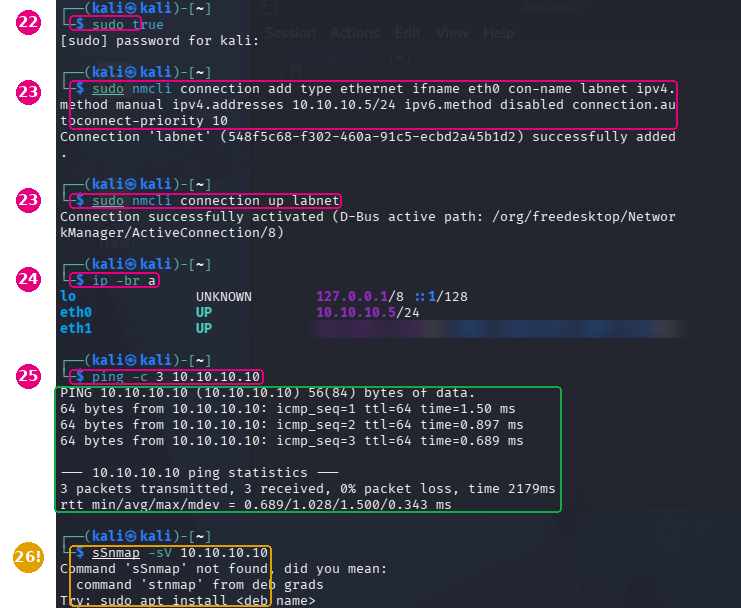

### 26–27. Skan portów i lekcja o domyślnym zakresie

Pierwsze podejście to literówka `sSnmap` zamiast `nmap -sV` (żółta ramka 26!), opis w [❗ Wpadkach](#-wpadki). Poprawny `nmap -sV 10.10.10.10` daje wynik, który na początku wygląda na błąd:

```bash
nmap -sV 10.10.10.10
```

- `Not shown: 998 closed tcp ports`: nmap domyślnie sprawdza **1000 najpopularniejszych** portów, nie wszystkie 65 535,
- widać tylko `22/tcp ssh` i `3000/tcp` — **DVWA na porcie 4280 się nie pojawia**, bo 4280 nie jest w tej domyślnej tysiątce.

To ważna lekcja: domyślny skan nie widzi wszystkiego. Pełny skan `-p-` sprawdza każdy port:

```bash
nmap -sV -p- 10.10.10.10
```

Teraz `Not shown: 65532 closed` i komplet trzech usług, w tym `4280/tcp http Apache httpd 2.4.68` (DVWA). Portu bazy `3306` dalej nie widać z Kali — baza nie ma przekierowanego portu i siedzi w sieci Dockera. To potwierdza założenie z kroku 17: na zewnątrz wystawione są tylko aplikacje, nie baza.

Mała ciekawostka: `3000/tcp` nmap opisuje jako `ppp?`, bo nie rozpoznał usługi z nazwy. Ale w surowej odpowiedzi (linie `SF:` poniżej) widać `<title>OWASP Juice Shop` — aplikacja odpowiada, tylko nmap jej nie zna.

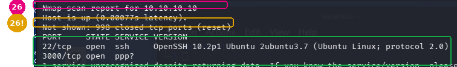
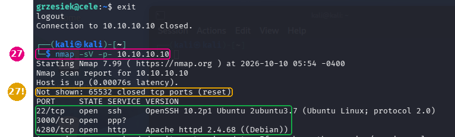

### 28. SSH z porównaniem odcisku

Tym razem robię to, czego nie zrobiłem rano: porównuję odcisk klucza przed wpisaniem `yes`.

```bash
ssh grzesiek@10.10.10.10
```

Odcisk z Kali (zielona ramka): `SHA256:ByR4pOhu4JKVvVvtorD/LbEYG57pxayXKdVcSmp3SbQ`. To ten sam odcisk, który zaakceptowałem rano z PowerShella ([część 2, krok 7](#7-pierwsze-logowanie-i-odcisk-klucza)). Odcisk klucza serwera jest jawny z założenia (służy właśnie do porównywania), więc tu go nie zamazuję.

> ℹ️ **Poprawka po przeglądzie: z czym naprawdę porównywać.** Rano odcisku nie sprawdziłem (to jest w wpadkach), więc porównałem dwa odczyty, które oba przyszły **przez sieć**. Ich zgodność mówi tylko, że klucz się w ciągu dnia nie zmienił. Nie dowodzi, że od początku rozmawiałem z prawdziwą `cele`. Wzorzec musi pochodzić z drogi, której nikt w sieci nie może podmienić: z **konsoli** maszyny. Są dwa takie wzorce:
>
> - ekran pierwszego startu ([04c, krok 22](04c-instalacja-kali-i-celow.md#22-pierwszy-start-klucze-ssh-serwera), zrzut 43: oryginał bez zamazania),
> - komenda w konsoli VirtualBoxa na `cele`: `ssh-keygen -lf /etc/ssh/ssh_host_ed25519_key.pub`.
>
> W tym labie ryzyko podmiany jest znikome (zamknięta sieć wewnętrzna, przekierowanie tylko z `127.0.0.1`), ale nawyk jest ważny: **wzorzec bierzemy z konsoli, nie z sieci**.

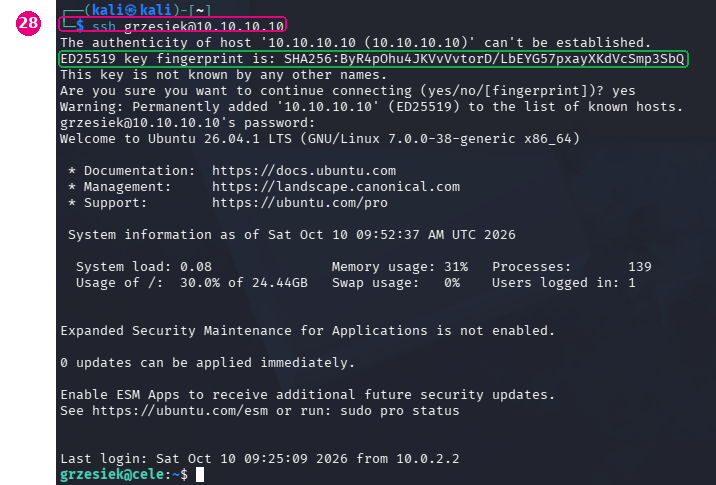

### 29. Obie aplikacje w przeglądarce Kali

W Firefoksie na Kali:

- **`http://10.10.10.10:4280`** — strona logowania DVWA. Zanim da się zalogować, trzeba utworzyć bazę ([część 7](#część-7-baza-dvwa-i-snapshot-cele-czyste)).
- **`http://10.10.10.10:3000`** — OWASP Juice Shop, sklep z sokami. Okno powitalne zamykam przyciskiem **Dismiss**.

Obie strony ładują się z `cele` przez `labnet`. Pasek przeglądarki pokazuje `Not Secure` i `http://`, bo to lab bez certyfikatu — w zamkniętej sieci to w porządku.

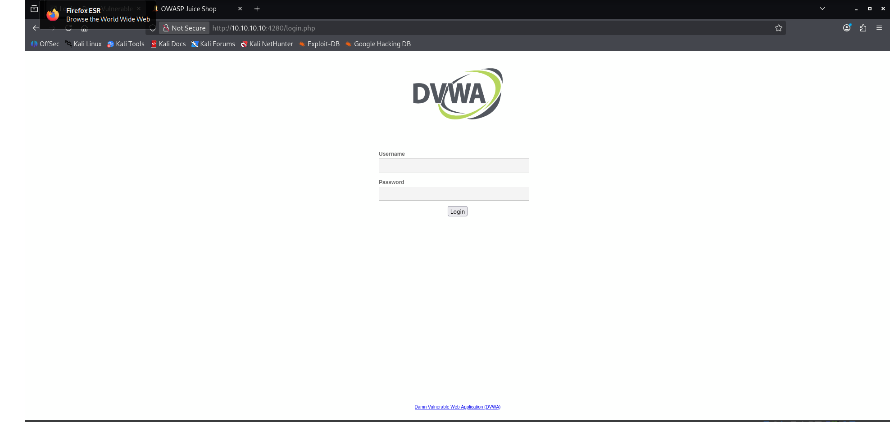
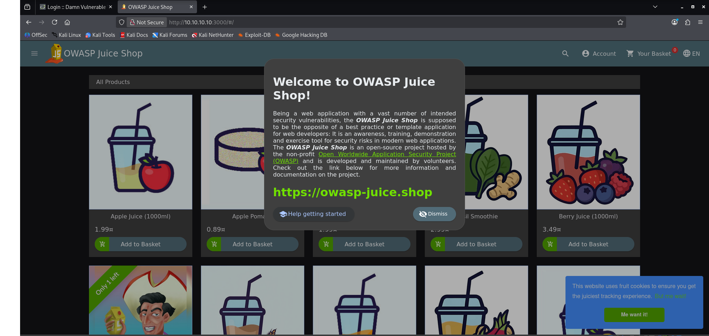

---

## Część 7: baza DVWA i snapshot „cele czyste”

DVWA to strona w PHP, która wszystkie dane trzyma w bazie MariaDB: użytkowników, hasła, wpisy z ćwiczeń. Kontener z bazą działa od kroku 14, ale baza jest **pusta**: nie ma w niej ani jednej tabeli. Dlatego logowanie jeszcze nie działa. Bazę tworzy się raz, jednym przyciskiem.

### 30. Strona Setup i przycisk „Create / Reset Database”

W Firefoksie na Kali: `http://10.10.10.10:4280/setup.php`. Strona najpierw sprawdza, czy wszystko jest gotowe (**Setup Check**), a na dole ma przycisk **Create / Reset Database** (ramka 30). Kliknięcie tworzy tabele i konto `admin` z hasłem `password`, potem przenosi na stronę logowania.

Co warto przeczytać w Setup Check, zanim się kliknie:

| Pozycja | U mnie | Co znaczy |
|---|---|---|
| `Writable folder …/uploads/` i `…/config` | Yes | DVWA może zapisywać pliki; potrzebne w ćwiczeniu *File Upload* |
| PHP version | 8.5.11 | PHP jest w obrazie Dockera, na `cele` go nie instalowałem |
| `allow_url_include`, `allow_url_fopen` | Enabled (zielona ramka) | PHP może dołączać pliki z innych adresów. W normalnym serwerze to groźne i wyłączone; tu jest włączone celowo, do ćwiczenia *File Inclusion* |
| Database host / port | `db` / `3306` | DVWA szuka bazy pod nazwą `db`, czyli pod nazwą drugiego kontenera z `compose.yml`. Docker sam zamienia tę nazwę na adres w sieci `dvwa_dvwa` |
| reCAPTCHA key | **Missing** (żółta ramka 30!) | brak klucza Google reCAPTCHA. Psuje tylko jedno ćwiczenie: *Insecure CAPTCHA*. Resztę można robić bez niego, a klucz można dodać później |
| DVWA version | Unknown | obraz Dockera nie zapisuje numeru wersji; bez znaczenia |

Napis na stronie mówi wprost: na czerwono jest to, co popsuje *niektóre* moduły. Czerwone nie znaczy „nie działa nic”.

> ⚠️ **„Reset” kasuje wszystko.** Kliknięcie tego samego przycisku później wyczyści bazę: przepadną wpisy z ćwiczeń, a hasło `admin` wróci do `password`. To przydatne, gdy coś w ćwiczeniu „zepsuję”, ale trzeba o tym pamiętać.

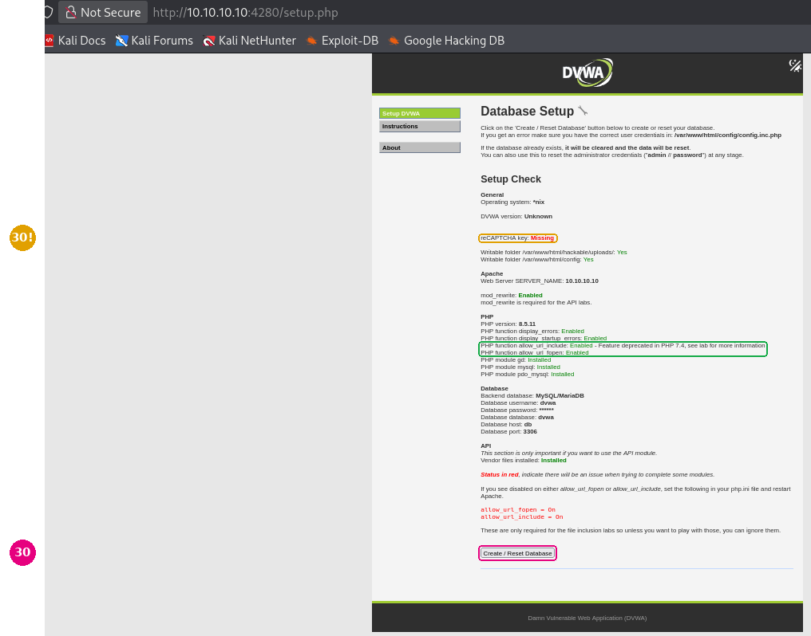

### 31. Pierwsze logowanie

Logowanie `admin` / `password`. Dowód, że baza powstała: na dole strony `You have logged in as 'admin'` (zielona ramka 31). Bez bazy logowanie by się nie udało, bo nie byłoby gdzie sprawdzić hasła.

Firefox od razu zapytał, czy zapamiętać hasło (żółta ramka 31!). Klikam **Not now** (albo z listy obok *Never save*). Hasło `password` jest jawne i znane całemu światu, ale nawyk jest prosty: w przeglądarce maszyny do ataków nie zapisuję żadnych haseł. Gdyby ktoś przejął Kali ([04b](04b-sieci-virtualbox.md#-jak-ktoś-z-sieci-domowej-mógłby-przejąć-kali-z-hasłem-kalikali)), zapisane hasła byłyby pierwszą rzeczą, po którą by sięgnął.

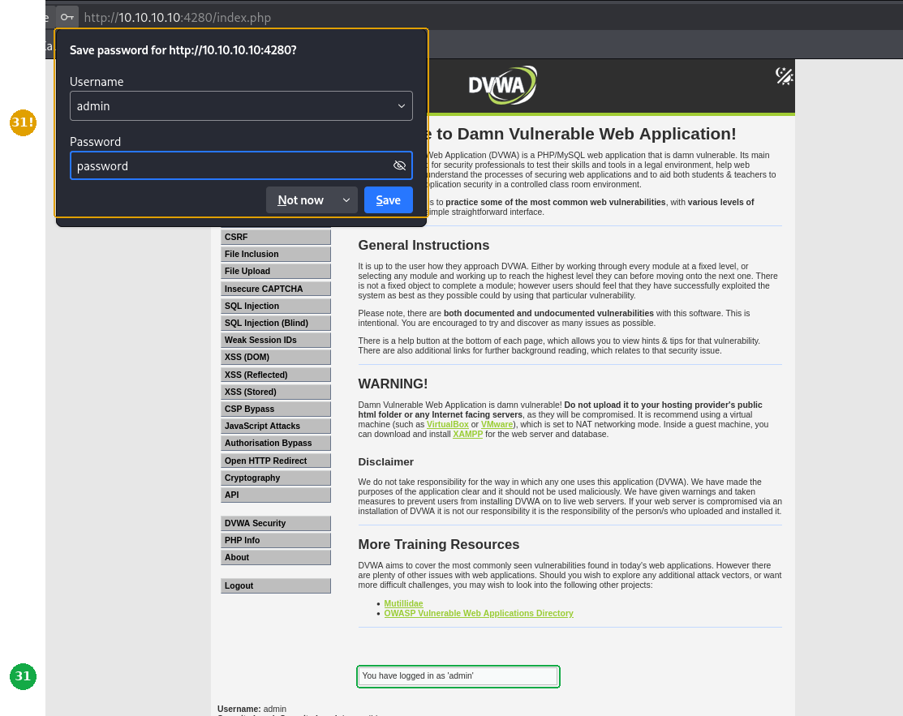

> ℹ️ **Poziom trudności sprawdzam przy pierwszym ćwiczeniu.** W menu **DVWA Security** wybiera się poziom: *low*, *medium*, *high*, *impossible*. W nowszych wersjach DVWA domyślny bywa *impossible* (zabezpieczony kod), więc na start trzeba przestawić na **low**. Poziom zapisuje się w ciasteczku przeglądarki, nie w bazie, więc snapshot go nie obejmuje.

### 32. Ostrzeżenia „soft lockup” na `cele`

Kiedy pracowałem w Kali, w konsoli `cele` (włączonej od rana) pojawiło się sześć ostrzeżeń jądra (żółta ramka 32!). To ten sam komunikat co rano przy instalacji ([04c, krok 20](04c-instalacja-kali-i-celow.md#20-ostrzeżenie-soft-lockup)), tylko dużo dłuższy: rano 26 s, teraz 21–377 s, a dwa ostatnie po **490 s** (czerwona ramka).

**Co to znaczy, prostymi słowami.** Jądro Linuksa ma „strażnika” (*watchdog*). Co kilka sekund sprawdza, czy każdy procesor robi postęp. Jeśli przez ponad 20 s któryś procesor nie ruszył, strażnik zapisuje ostrzeżenie. W maszynie wirtualnej procesory są udawane: dostają czas od prawdziwego procesora komputera tylko wtedy, gdy Windows go przydzieli.

**Najważniejsza wskazówka na zrzucie:** dwa ostatnie wpisy mają ten sam czas (`2054.57`), dotyczą **obu** procesorów (`CPU#0` i `CPU#1`) i mówią o tych samych 490 s. Czyli przez ponad 8 minut **cała maszyna** stała w miejscu. To nie był jeden zawieszony program w `cele`, tylko komputer, który przestał dawać maszynie czas.

Możliwe przyczyny, od najbardziej prawdopodobnej:

| Przyczyna | Jak sprawdzić | Groźne? |
|---|---|---|
| PC zasnął albo stał bezczynnie z zablokowanym ekranem; VirtualBox wstrzymał wtedy maszyny | czy w tym czasie była przerwa od komputera | nie: po wybudzeniu jądro tylko „zauważa” brakujący czas |
| VirtualBox działa przez warstwę Hyper-V (tryb wolny) | **zielony żółw** w prawym dolnym rogu okna maszyny zamiast niebieskiego „V”. Włącza go nie tylko Hyper-V, ale też Izolacja rdzenia / Integralność pamięci, WSL2 i Platforma maszyny wirtualnej | spowalnia; przy długich przestojach warto to wyłączyć |
| za dużo naraz: Kali i `cele` po 2 procesory, do tego Firefox i `nmap -p-` | Menedżer zadań Windows → zakładka Wydajność w trakcie pracy | krótkie przestoje (20–40 s) tak tłumaczy; 490 s już nie |

Na razie `cele` działa poprawnie: aplikacje odpowiadały, baza się utworzyła. Obserwuję, czy lockupy pojawią się **w trakcie** pracy przy komputerze. Jeśli tak, sprawdzam żółwia.

### 33. Wyłączenie i snapshot „cele czyste (DVWA z bazą)”

`sudo poweroff` w konsoli `cele` (różowa ramka 33), potem w VirtualBoxie: **Migawki** → **Zrób** → „cele czyste (DVWA z bazą)”.

**Po co właśnie teraz:** to stan „gotowe do ćwiczeń”: Docker, obie aplikacje, utworzona baza, sieć `labnet`, brak internetu. Baza DVWA leży w wolumenie Dockera, czyli na wirtualnym dysku `cele.vdi`, więc snapshot ją obejmuje. Jeśli w ćwiczeniach coś zepsuję, wracam tu jednym kliknięciem, zamiast powtarzać cały rozdział.

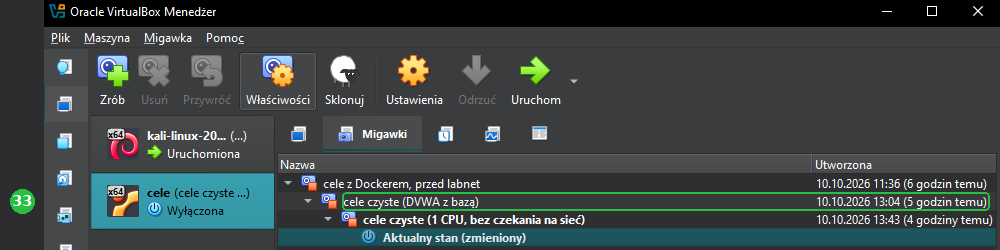

Zrzut drzewka zrobiony później, dlatego pod „cele czyste (DVWA z bazą)” (13:04, ramka 33) widać już kolejny snapshot z [04e, krok 29](04e-zabezpieczenie-kali-i-stabilnosc.md#29-snapshot-cele-czyste-1-cpu-bez-czekania-na-sieć).

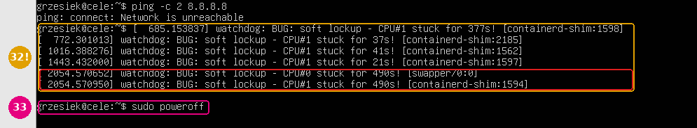

> ℹ️ **Dlaczego na zrzucie nie ma wyniku `ip -br a`.** Przyciąłem go, bo pokazywał adresy IPv6 `fe80::…`. Taki adres jest często zbudowany z adresu MAC karty: `fe80::a00:27ff:fe…` to MAC `08:00:27:…` z wstawionym w środek `ff:fe` (metoda EUI-64). Dlatego w repo zamazuję IPv6 tak samo jak MAC.

---

## Co robi każda komenda

| Komenda | Co robi |
|---|---|
| `sudo apt update && sudo apt full-upgrade -y` | pobiera listy pakietów, potem instaluje nowsze wersje wszystkiego. `&&` = drugie tylko, gdy pierwsze się udało; `-y` = „tak” na pytania |
| `apt install -y ca-certificates curl git` | `ca-certificates`: lista zaufanych urzędów certyfikacji do połączeń `https`; `curl`: pobieranie z sieci; `git`: pobieranie repozytoriów kodu |
| `install -m 0755 -d /etc/apt/keyrings` | tworzy folder (`-d`) z prawami `0755`: właściciel pisze, wszyscy czytają |
| `curl -fsSL URL -o PLIK` | pobiera plik. `-f` = błąd zamiast strony błędu, `-s` = cicho, `-S` = ale pokaż błędy, `-L` = idź za przekierowaniami, `-o` = zapisz pod tą nazwą |
| `chmod a+r PLIK` | daje wszystkim (`a`) prawo odczytu (`+r`), żeby `apt` mógł przeczytać klucz |
| `ls -l PLIK` | szczegóły pliku: prawa, właściciel, rozmiar w bajtach, data |
| `echo "..." \| sudo tee PLIK` | `echo` wypisuje tekst, `\|` przekazuje go dalej, `sudo tee` zapisuje do pliku z prawami roota. Samo `sudo echo > plik` by nie zadziałało, bo przekierowanie `>` robi powłoka bez roota |
| `deb [arch=amd64 signed-by=…] URL resolute stable` | wpis repozytorium: pakiety binarne (`deb`) dla procesora `amd64`, sprawdzane tym kluczem, wydanie `resolute` (Ubuntu 26.04), gałąź `stable` |
| `ssh -p 2201 grzesiek@127.0.0.1` | połączenie SSH na port 2201 mojego PC, który VirtualBox przekazuje do `cele`. `-p` = port |
| `apt install -y docker-ce …` | instaluje Dockera; pakiety opisane w kroku 8 |
| `usermod -aG docker grzesiek` | `-G docker` = grupa, `-a` = **dopisz** do obecnych grup. Bez `-a` użytkownik wypadłby z innych grup, np. `sudo` |
| `exit` | wylogowanie i zamknięcie połączenia SSH |
| `docker run hello-world` | pobiera obraz `hello-world` (jeśli go nie ma) i uruchamia z niego kontener |
| `git clone URL` | pobiera całe repozytorium do nowego folderu |
| `sed -i 's/A/B/; s/C/D/' PLIK` | edytor strumieniowy: zamienia tekst A na B i C na D. `-i` = zmień plik na miejscu |
| `grep -n -E "a\|b" PLIK` | pokazuje linie z `a` albo `b`. `-n` = z numerami linii, `-E` = rozszerzone wyrażenia (działa `\|` jako „lub”) |
| `docker compose pull` | pobiera wszystkie obrazy wymienione w `compose.yml` |
| `docker compose up -d` | tworzy i uruchamia wszystko z `compose.yml`. `-d` = w tle (*detached*), terminal wraca od razu |
| `docker pull OBRAZ` | tylko pobiera obraz, niczego nie uruchamia |
| `docker run -d --name juice-shop --restart unless-stopped -p 3000:3000 OBRAZ` | `-d` = w tle, `--name` = nazwa kontenera, `--restart unless-stopped` = wstawaj po restarcie maszyny, chyba że ręcznie zatrzymam, `-p 3000:3000` = port 3000 maszyny → port 3000 kontenera |
| `docker ps` | lista działających kontenerów: obraz, stan, porty, nazwa |
| `curl -sI URL \| head -1` | `-I` = pobierz tylko nagłówki odpowiedzi, `head -1` = pokaż pierwszą linię (kod HTTP) |
| `sudo tee PLIK <<'EOF' … EOF` | *heredoc*: wszystko do linii `EOF` trafia do pliku. Apostrofy w `'EOF'` wyłączają podmienianie `$zmiennych` w środku |
| `mv /etc/netplan/*.yaml /root/netplan-backup/` | przenosi wszystkie stare pliki sieci do kopii zapasowej (`*` = dowolna nazwa) |
| `chmod 600 PLIK` | czytać i pisać może tylko właściciel (root); `netplan` ostrzega przy luźniejszych prawach |
| `netplan generate` | sprawdza konfigurację sieci i przygotowuje ją na następny start, ale nie zmienia działającej sieci |
| `sudo poweroff` | wyłącza maszynę |
| `sudo true` | nic nie robi, ale zmusza `sudo` do zapytania o hasło. Przez kilka minut kolejne `sudo` już nie pytają |
| `ip -br a` | krótka (`-br` = *brief*) lista kart: nazwa, stan, adresy |
| `ping -c 2 8.8.8.8` | 2 pakiety do publicznego serwera DNS Google; tu ma się **nie** udać |
| `nmcli connection add type ethernet ifname eth0 con-name labnet ipv4.method manual ipv4.addresses 10.10.10.5/24 …` | tworzy stałe połączenie sieciowe: `ifname` = której karty dotyczy, `con-name` = nazwa, `ipv4.method manual` = adres z ręki (nie DHCP), `autoconnect-priority 10` = włączaj je w pierwszej kolejności |
| `nmcli connection up NAZWA` | włącza (aktywuje) zapisane połączenie |
| `nmap -sV ADRES` | skanuje 1000 najpopularniejszych portów i próbuje rozpoznać wersję usługi (`-sV` = *service/version*) |
| `nmap -sV -p- ADRES` | `-p-` = skanuj **wszystkie** 65535 portów, nie tylko domyślną tysiąc |
| `ssh UŻYTKOWNIK@ADRES` | logowanie SSH; przy pierwszym razie pokazuje odcisk klucza serwera do porównania |
| `ssh-keygen -lf PLIK.pub` | wypisuje odcisk (*fingerprint*) klucza z pliku. `-l` = pokaż odcisk, `-f` = z tego pliku. W konsoli serwera daje wzorzec do porównania z tym, co pokazuje `ssh` |

---

## ❗ Wpadki

| Problem | Co było widać | Przyczyna | Rozwiązanie | Lekcja |
|---|---|---|---|---|
| Literówka w adresie (krok 3) | `curl: (6) Could not resolve host: downolad.docker.com` (zrzut 02, ramka 3!) | ręcznie przepisany adres, `downolad` zamiast `download` | to samo polecenie poprawnie | błąd (6) to brak takiej nazwy w DNS; najpierw czytam adres litera po literze |
| Plik repozytorium się nie zapisał (krok 4) | `/etc/apt/sources.lisat.d/docker.list: No such file or directory` (zrzut 02, ramka 4!) | dwie literówki: `dev` zamiast `deb` i `lisat.d` zamiast `list.d`. Folder `sources.lisat.d` nie istnieje | krótsza linijka z gotowymi wartościami `amd64` i `resolute` | „No such file or directory” przy zapisie zwykle znaczy zły folder, nie zły plik |
| `apt update` bez Dockera (krok 5) | same serwery `ubuntu.com` (zrzut 03) | skutek poprzedniej wpadki: brak pliku `docker.list` | poprawny krok 4 | brak błędu nie znaczy sukcesu; szukam linijki, której się spodziewam |
| `Invalid operation udpate` (krok 5) | czerwone `Error:` (zrzut 04, ramka 5!) | literówka w poleceniu | `sudo apt update` | apt zna tylko swoje polecenia i nie zgaduje |
| Nie da się wkleić komend do konsoli VirtualBoxa | wszystko trzeba przepisywać, stąd literówki wyżej | schowek Windowsa nie sięga do konsoli maszyny bez *Guest Additions* | przekierowanie portu i SSH z PowerShella (kroki 6–7) | długie komendy zawsze wklejam, a nie przepisuję |
| `Connection refused` przy pierwszym `ssh` (krok 7) | `ssh: connect to host 127.0.0.1 port 2201: Connection refused` (zrzut 06, czerwona ramka 7!) | nic nie nasłuchiwało na porcie 2201. Najpewniej reguła nie była jeszcze zatwierdzona w ustawieniach; po chwili drugie podejście przeszło | zatwierdzić oba okna (reguły i ustawień) przyciskiem OK | „refused” = nikt nie słucha na tym porcie; sprawdzam, czy ustawienie się zapisało |
| Złe hasło przy logowaniu (krok 7) | `Permission denied, please try again.` (zrzut 06, żółta ramka 7!) | literówka w haśle (znaków nie widać) | ponowne wpisanie | SSH daje kilka prób; po nich zamyka połączenie |
| Odcisk klucza zaakceptowany bez porównania (krok 7) | `yes` od razu po pytaniu o odcisk | pośpiech | porównać odcisk ze zrzutem 43 z [04c](04c-instalacja-kali-i-celow.md#22-pierwszy-start-klucze-ssh-serwera) | to jedyny moment, w którym SSH chroni przed podszyciem; przy kolejnym razie najpierw porównuję |
| Pomieszany ekran przy instalacji Dockera (krok 8) | białe paski i `^[[B` w wyniku | pasek postępu `apt` źle rysuje się w PowerShellu przez SSH | nic; instalacja przeszła | wygląd terminala to nie stan systemu; liczy się wynik końcowy |
| DVWA pobrany, ale nie uruchomiony (krok 14) | po `docker compose pull` od razu `docker run` dla Juice Shop | wklejona paczka komend „zgubiła” linijkę `docker compose up -d` | `docker compose up -d` osobno | po wklejeniu kilku linijek sprawdzam, czy każda się wykonała |
| Wklejony blok „zjedzony” przez `sudo` (krok 19) | `[sudo: authenticate] Password:` w środku wklejanego tekstu, 3 × `Authentication failed`, potem `network:: command not found` i podobne (zrzut 11, czerwone ramki 19!) | `sudo` zapytało o hasło (minął czas zapamiętania hasła). Wklejane linijki trafiły do pola hasła, a reszta wykonała się jako zwykłe komendy | wpisać hasło przy pierwszym `sudo`, potem wklejać po jednym poleceniu | przed wklejeniem bloku z `sudo` najpierw jedno krótkie `sudo true`, żeby hasło było już podane. Nic się nie zepsuło: bez hasła żadne `sudo` się nie wykonało |
| Złe hasło przy ponownym `sudo` (krok 19) | jedno `Authentication failed`, za drugim razem przeszło (zrzut 11) | literówka w haśle | ponowne wpisanie | hasła przy `sudo` nie widać, więc łatwo o literówkę |
| `Command 'ipa' not found` (krok 21) | Ubuntu proponuje instalację `freeipa-client` (zrzut 15, żółta ramka 21!) | literówka: `ipa` zamiast `ip` | `ip -br a` | podpowiedź „can be installed with” to nie znaczy, że trzeba coś instalować; najpierw sprawdzam pisownię |
| `Command 'sSnmap' not found` (krok 26) | Kali proponuje `stnmap` z `deb grads` (zrzut 16, żółta ramka 26!) | literówka: `sSnmap` zamiast `nmap -sV` (zlały się dwa kawałki komendy) | `nmap -sV 10.10.10.10` | to samo co wyżej: podpowiedź instalacji nie znaczy, że brakuje narzędzia |
| Okno „Save password” w Firefoksie (krok 31) | pytanie o zapisanie `admin` / `password` (zrzut 23, żółta ramka 31!) | Firefox domyślnie proponuje zapamiętanie każdego hasła | **Not now** | w przeglądarce maszyny do ataków nie zapisuję haseł; przejęty Kali oddałby je od razu |
| Soft lockupy na `cele`, do 490 s (krok 32) | sześć ostrzeżeń `watchdog: BUG: soft lockup`, dwa ostatnie: oba procesory po 490 s naraz (zrzut 24, ramki 32!) | cała maszyna przez ponad 8 minut nie dostała czasu od Windowsa. Najpewniej uśpiony lub bezczynny PC, możliwe też VirtualBox przez warstwę Hyper-V (zielony żółw) | nic na razie; obserwować, czy wraca w trakcie pracy, i sprawdzić ikonę żółwia | patrzę, **ile** procesorów i **kiedy**: jeden proces = problem w maszynie, wszystkie naraz = problem po stronie komputera |
| Timeout przy pobieraniu Juice Shop (krok 16) | `failed to copy: httpReadSeeker … timeout awaiting response headers` (zrzut 09, ramki 16!) | Docker Hub nie odpowiedział na czas przy jednej z warstw dużego obrazu (ponad 20 warstw pobieranych naraz) | `docker pull bkimminich/juice-shop`, potem `docker run` | timeout to zwykle chwilowy problem z siecią; pobieranie wznawia się od miejsca przerwania |

---

## Co dalej w tym etapie

- [x] Kroki 19–21: `cele` w `labnet` pod adresem 10.10.10.10, bez internetu
- [x] Kali: stały adres 10.10.10.5 na `eth0` (karta w `labnet`) — część 6
- [x] Testy z Kali: ping, `nmap` (z lekcją o `-p-`), DVWA i Juice Shop w przeglądarce, `ssh` z porównaniem odcisku klucza — część 6
- [x] Baza DVWA utworzona, logowanie `admin` / `password` — część 7
- [x] Snapshot „cele czyste (DVWA z bazą)” — część 7, krok 33
- [x] Zabezpieczenie Kali, koniec zawieszania `cele`, start bez czekania na sieć → [04e](04e-zabezpieczenie-kali-i-stabilnosc.md)
- [x] [Podsumowanie Etapu 3](etap-3-podsumowanie.md)

➡️ Następnie: [04e — Zabezpieczenie Kali i stabilność labu](04e-zabezpieczenie-kali-i-stabilnosc.md)
