# 06 — Forensics na starych kartach microSD

Czas: ~2 godziny (większość to czekanie na kopiowanie i kasowanie). Wszystko na **MacBooku**, Raspberry nie jest potrzebne.

> 🚧 **Status: w trakcie.** Części 1 (obraz karty), 2 (odzyskiwanie) i 3 (kontrolowany eksperyment) są wykonane, ich wyniki są niżej. Części 4–5 mają komendy gotowe, a „Wyniki” wypełniam po przejściu ćwiczenia na prawdziwej karcie. Nic tu nie jest wymyślone na zapas.

Mam dwie stare karty microSD po 16 GB: **SanDisk (klasa 10)** i kartę **bez marki (klasa 4)**. Nie nadają się na system dla obrońcy (do tego jest SanDisk Extreme 64 GB), ale świetnie nadają się do nauki **informatyki śledczej** (*forensics*): jak wygląda dysk „od środka”, co naprawdę znaczy „usunąłem plik” i czy da się go odzyskać.

Po drodze okazało się, że **tylko jedna z kart czyta się wiarygodnie**. SanDisk przy każdym odczycie zwracał trochę inne dane, więc stał się osobną lekcją (patrz wpadka w części 1), a ćwiczenie robię na karcie bez marki.

Co po drodze zrobimy:

1. sprawdzimy, czy karta czyta się **powtarzalnie**, zrobimy **obraz karty**, czyli bit-w-bit kopię, i udowodnimy sumami kontrolnymi, że jest wierna,
2. odzyskamy z obrazu usunięte pliki dwiema metodami (**TestDisk** i **PhotoRec**) i zobaczymy, czym się różnią,
3. zrobimy **kontrolowany eksperyment** na plikach, które sami zapiszemy i usuniemy, żeby wiedzieć, ile powinno wrócić,
4. **bezpiecznie skasujemy** kartę i udowodnimy, że po kasowaniu nic już nie wraca,
5. sprawdzimy kartę bez marki testem autentyczności (**f3**), bo takie karty często kłamią co do pojemności.

## ⚠️ Zasady przed startem

- **Tylko własne karty.** Odzyskiwanie danych z cudzego nośnika bez zgody to ten sam rodzaj problemu co skanowanie cudzej sieci (art. 267 kk).
- **Repo jest publiczne, a stare karty mogą zawierać prywatne rzeczy** (zdjęcia, dokumenty, też Twoje albo kogoś z rodziny). Zasady:
  - obrazy kart (`*.img`) i odzyskane pliki trzymamy **poza repo**, w `~/forensics`,
  - na zrzutach nie pokazujemy **zawartości** odzyskanych plików ani ich nazw, tylko liczby i typy,
  - zrzuty przycinamy do okna terminala, jak w całym repo.
- **Większość komend poniżej kasuje albo czyta cały dysk.** Pomyłka w numerze dysku (`diskN`) oznacza utratę danych na MacBooku. Przed każdą komendą z `sudo` sprawdź numer dysku według kroku 1–2.
- Pracujemy na **obrazie**, nie na samej karcie, wszędzie tam, gdzie to możliwe. Obraz można psuć i powtarzać do woli, a karta zostaje taka, jaka była.

## Przygotowanie

```bash
brew install testdisk f3                  # P1  testdisk = TestDisk + PhotoRec, f3 = test pojemności
mkdir -p ~/forensics/obrazy ~/forensics/odzysk   # P2
which photorec testdisk f3write f3read    # P3  sprawdzenie: czy programy są zainstalowane
```

Wszystko ląduje w `~/forensics`, **nie** w folderze repo.

`which` pokazuje, gdzie leży program o danej nazwie. Jeśli wypisze cztery ścieżki w `/opt/homebrew/bin/`, instalacja się udała. Brak linii przy którejś nazwie znaczy, że tego programu nie ma.

> **Jak czytać zrzuty:** ramki z numerem w kółku to komendy z „Komend w skrócie” (ten sam numer co w dokumencie). Czerwone „!” to wpadka, żółte „!” to ostrzeżenie, a zielone „✓” to poprawka albo dobry wynik. Cienkie żółte ramki bez numeru wskazują, na co patrzeć w wyniku. Małe litery (a, b, c…) to pomocnicze komendy z opisu wpadki. Linia przerywana oznacza wycięty fragment wyniku.

`brew` to **Homebrew**, menedżer programów dla macOS. Jeśli Terminal odpowie `zsh: command not found: brew`, nie jest jeszcze zainstalowany (patrz wpadka poniżej).

## ❗ Wpadka: `command not found: brew`

| | |
|---|---|
| **Co było widać** | `zsh: command not found: brew` po wpisaniu `brew install testdisk f3` |
| **Przyczyna** | Homebrew nie jest domyślnie w macOS. Trzeba go zainstalować jednorazowo |
| **Rozwiązanie** | instalator ze strony [brew.sh](https://brew.sh): `/bin/bash -c "$(curl -fsSL https://raw.githubusercontent.com/Homebrew/install/HEAD/install.sh)"`. Zapyta o hasło do Maca i może doinstalować narzędzia programistyczne Apple. Na końcu wypisze „Next steps”, czyli dwie linijki do wklejenia, które dodają `brew` do ścieżki. Bez nich `brew` dalej nie będzie znaleziony |
| **Lekcja** | komenda „nie znaleziona” zwykle znaczy „nie zainstalowana albo nie w `PATH`”, a nie „zepsuta”. Po instalacji otwórz nowe okno Terminala i sprawdź `brew --version` |

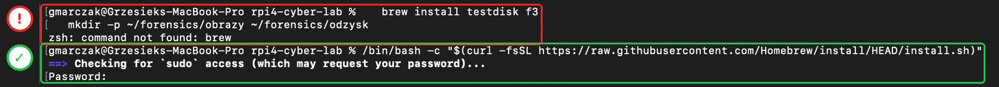

**!** `brew install testdisk f3` (wklejone razem z `mkdir` z następnej linii) kończy się `zsh: command not found: brew`. **✓** Instalator Homebrew ze strony brew.sh. Pyta o hasło do Maca (`Password:`), a znaki hasła się nie wyświetlają.

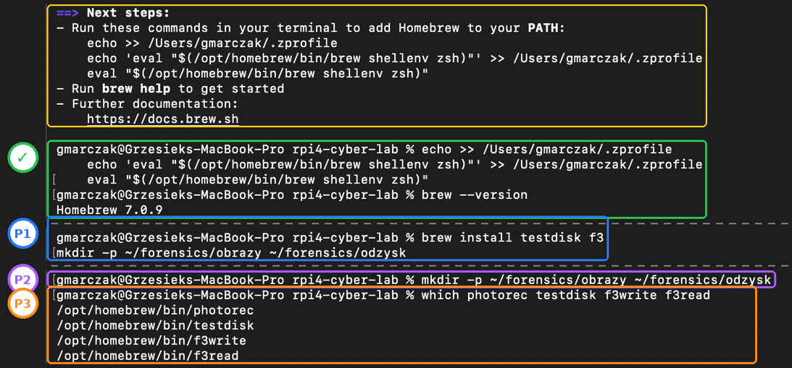

- Żółta ramka: „Next steps” na końcu instalatora, czyli trzy linie, które trzeba wkleić samemu.
- **✓** Wklejone linie dopisują Homebrew do `~/.zprofile` (ustawienia powłoki czytane przy starcie) i od razu do bieżącego okna. `brew --version` odpowiada `Homebrew 7.0.9`, więc działa.
- **P1** instalacja `testdisk` i `f3` (dalszy wynik wycięty, kończy się `Pouring f3…`).
- **P2** foldery na obrazy i odzyskane pliki.
- **P3** `which` znajduje wszystkie cztery programy.

**Blokada zapisu.** Pełnowymiarowy adapter SD ma z boku mały suwak **LOCK**. Przesuń go w stronę oznaczenia LOCK, zanim włożysz kartę do MacBooka. To prosty, sprzętowy *write blocker*: system widzi kartę jako tylko do odczytu, więc nie może jej przypadkiem zmienić. Bez blokady macOS po włożeniu karty sam ją montuje i może dopisać ukryte pliki (`.Spotlight-V100`, `.fseventsd`), czyli zmienić „dowód”. Gdy adapter nie ma suwaka, od razu po włożeniu zrób krok 3 (`unmountDisk`).

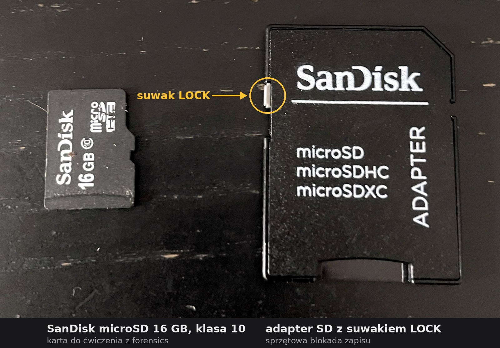

Na zdjęciu suwak jest na lewej krawędzi adaptera (żółte kółko). To, czy blokada naprawdę działa, sprawdzisz w kroku 2: `diskutil info` pokaże `Read-Only Media: Yes`.

Obie karty wkładamy **po kolei**, nie jednocześnie. Dzięki temu numer dysku jest oczywisty.

---

# Część 1: obraz karty

## Komendy w skrócie

```bash
D=$HOME/forensics/obrazy                                             # 0  (skrót do folderu z obrazami)
diskutil list                                                        # 1
diskutil info /dev/diskN                                             # 2
diskutil unmountDisk /dev/diskN                                      # 3
stab /dev/rdiskN                                                     # 3a (funkcja `stab` z opisu niżej)
caffeinate -i sudo dd if=/dev/rdiskN bs=3m | tee $D/karta.img | shasum -a 256 | tee $D/karta.card1.sha256   # 4
ls -l $D/karta.img                                                   # 4a (rozmiar = Disk Size z kroku 2?)
shasum -a 256 $D/karta.img | tee $D/karta.img.sha256                 # 5
caffeinate -i sudo dd if=/dev/rdiskN bs=3m | shasum -a 256 | tee $D/karta.card2.sha256                      # 6
```

`N` to numer dysku z kroku 1, np. `disk4`. **Nie wklejaj komend z literą `N`**, wstaw prawdziwy numer. `karta` to nazwa, którą nadajesz obrazowi (u mnie `noname` dla karty bez marki i `sandisk16` dla SanDiska).

## Co robi każda komenda

### 1 · `diskutil list`: znajdź kartę

Pokazuje wszystkie dyski. Kartę rozpoznasz po **rozmiarze** (ok. 15,9 GB lub 16,0 GB) i po nazwie woluminu, jeśli ma ją nadaną. Dysk MacBooka ma setki GB (u mnie `disk0` 500 GB i `disk3` z woluminami APFS), więc się nie pomylisz. Uwaga: przy **wbudowanym** czytniku SD karta też jest opisana jako `internal, physical`, tak jak dysk systemowy, więc słowo `internal` niczego nie rozstrzyga. Liczy się rozmiar. Zapisz sobie nazwę dysku karty, np. `/dev/disk4`. Partycje (`disk4s1`) to część tego dysku, my pracujemy na **całym dysku** `disk4`.

Wersja `diskutil list external physical` jest krótsza, ale u mnie **nic nie wypisała** (patrz wpadka niżej), więc używamy pełnej listy.

Jeśli widzisz kilka dysków i nie jesteś pewien, **wyjmij kartę i uruchom komendę jeszcze raz**. Ten, który zniknął, to karta.

### 2 · `diskutil info /dev/diskN`: potwierdź

W wyniku sprawdź trzy pola:

| Pole | Czego oczekujesz |
|---|---|
| `Device Location` | `Internal` (wbudowany czytnik) albo `External` (czytnik USB) |
| `Disk Size` | ok. 16 GB |
| `Protocol` | `Secure Digital` (przez czytnik USB zobaczysz `USB`) |

Jeśli którekolwiek się nie zgadza, **stop**. Zobacz też `Read-Only Media`: przy włączonym suwaku LOCK powinno być `Yes`.

### 3 · `diskutil unmountDisk /dev/diskN`: odmontuj, ale nie wyjmuj

Odłącza system plików karty od Findera, a samo urządzenie zostaje dostępne. To ważne: do kopiowania cały dysk musi być **odmontowany**, inaczej system może w trakcie coś na nim zmieniać.

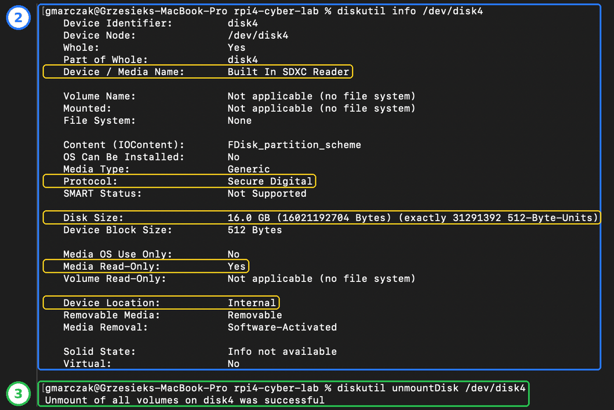

**2** `diskutil info /dev/disk4` dla karty SanDisk. Żółte ramki to pola do sprawdzenia: `Built In SDXC Reader` (wbudowany czytnik), `Protocol: Secure Digital`, `Disk Size: 16.0 GB (16021192704 Bytes)`, `Media Read-Only: Yes` (suwak LOCK działa) i `Device Location: Internal`. **3** `unmountDisk` odpowiada `Unmount of all volumes on disk4 was successful`.

### 3a · `stab`: czy karta czyta się powtarzalnie

**To krok, który powinien być pierwszy przy każdej karcie**, a który u mnie dodałem dopiero po wpadce z SanDiskiem (patrz niżej). Obraz ma sens tylko wtedy, gdy ta sama karta zwraca za każdym razem te same dane. Test jest tani (ok. pół minuty) i wystarczy go zrobić raz, przed godziną kopiowania.

Definicja funkcji (wklej raz w oknie Terminala, zniknie po jego zamknięciu):

```bash
stab() {
  dev=$1
  for off in 0 48 1000 8000; do
    echo "== offset ${off} MiB"
    for i in 1 2 3; do
      sudo dd if=$dev bs=1m skip=$off count=12 2>/dev/null | shasum -a 256 | cut -c1-12
    done | sort | uniq -c
  done
}
```

Użycie: `stab /dev/rdiskN`.

- Funkcja czyta **12 MiB z czterech miejsc karty** (od 0, 48, 1000 i 8000 MiB), każde miejsce **trzy razy**, i liczy skrót każdego odczytu (`shasum`, `cut -c1-12` skraca go do 12 znaków dla czytelności).
- `sort | uniq -c` zlicza, ile razy wyszedł który skrót.
- **Jedna linia z `3`** przy danym miejscu = stabilny odczyt. **Trzy linie po `1`** = każdy odczyt dał inne dane, **karta jest niewiarygodna** i obrazu z niej nie robimy.
- `bs=1m` i `count=12` to 12 porcji po 1 MiB. Zapis `skip=$off` pomija tyle porcji, więc `off` jest w MiB.

### 4 · `caffeinate -i sudo dd if=/dev/rdiskN bs=3m | tee ... | shasum ...`: kopia bit-w-bit z sumą w locie

- `dd`: kopiuje dane bajt po bajcie, bez „rozumienia”, co jest w środku.
- `if=` (*input file*): skąd czytamy, czyli **karta**. Bez `of=` wynik idzie na standardowe wyjście, do potoku (`|`).
- `/dev/rdiskN`: surowa (*raw*) wersja urządzenia. Z literą `r` kopiowanie jest dużo szybsze niż z `/dev/diskN`, bo omija bufor systemu.
- `bs=3m`: kopiuj porcjami po 3 MiB. Na macOS piszemy **małe `m`** (na Linuksie byłoby `3M`). Rozmiar bloku wybieramy tak, żeby **rozmiar karty dzielił się przez niego bez reszty** (u mnie 15 476 981 760 B = dokładnie 4920 bloków), bo na niepełnym ostatnim bloku czytnik się zawieszał (patrz wpadka niżej). Sprawdzenie: `echo $((ROZMIAR % 3145728))` ma dać `0`.
- `tee $D/karta.img`: zapisuje strumień do pliku obrazu i jednocześnie przepuszcza go dalej.
- `shasum -a 256`: liczy sumę kontrolną tego, co **faktycznie przeczytano z karty**. Dostajemy obraz i sumę z jednego przejścia (obraz nie musi być czytany drugi raz tylko po to, żeby dostać sumę karty).
- `tee $D/karta.card1.sha256`: zapisuje tę sumę do pliku, żeby ją potem porównać.
- `caffeinate -i`: nie pozwala Macowi zasnąć na czas kopiowania (wygaszenie ekranu nie szkodzi, uśpienie przerywa odczyt).

Na końcu `dd` wypisuje liczbę skopiowanych bloków i bajtów. Powinny odpowiadać rozmiarowi karty. **Sprawdź to** (krok 4a niżej), bo `dd` potrafi skończyć z błędem i zostawić plik za krótki.

W tym potoku **nie ma podglądu postępu**: **Ctrl+T** pokaże tylko linię programu `caffeinate`, a nie `dd`. Przy zwykłym `dd ... of=plik` Ctrl+T wypisuje, ile bajtów już przekopiowano. Parametr `status=progress` z Linuksa na macOS nie działa. 15 GB kopiuje się od kilkunastu do kilkudziesięciu minut zależnie od karty (u mnie 12 minut na karcie bez marki, a 38 na SanDisku).

> ⚠️ Wersja bez potoku (`dd if=... of=plik`) też jest poprawna. **Nie zamieniaj w niej `if` z `of`:** odwrócona komenda zapisuje plik na kartę, a nie kartę do pliku.

### 4a · `ls -l plik.img`: czy obraz ma pełny rozmiar

`ls -l` pokazuje rozmiar pliku w bajtach (piąta kolumna). Musi być **identyczny** z `Disk Size` z kroku 2 (u mnie 15476981760 dla karty bez marki). Jeśli jest mniejszy, `dd` nie doczytał końca karty, patrz wpadka niżej. Dokończenie ogona małym blokiem (to był ratunek przy SanDisku):

```bash
sudo dd if=/dev/rdiskN of=$D/karta.img bs=512 skip=LICZBA seek=LICZBA conv=notrunc
```

`LICZBA` to rozmiar dotychczasowego pliku podzielony przez 512 (liczba sektorów, które już mamy). `skip` pomija tyle sektorów na wejściu, `seek` zaczyna zapis w pliku od tego samego miejsca, a `conv=notrunc` oznacza „nie obcinaj pliku, tylko dopisz”.

### 5 · `shasum -a 256 plik.img`: odcisk pliku obrazu

`shasum -a 256` liczy **sumę kontrolną SHA-256**: ciąg 64 znaków, który jest „odciskiem palca” danych. Zmiana jednego bita w pliku daje zupełnie inny odcisk. Porównujemy ją z sumą z kroku 4 (`karta.card1.sha256`). Zgodność dowodzi, że **zapis na dysk Maca niczego nie zmienił**: to, co przeczytano z karty, leży w pliku bez różnic.

### 6 · drugi, niezależny odczyt karty

To samo co krok 4, ale bez zapisu pliku: czytamy kartę **jeszcze raz** i liczymy sumę (`karta.card2.sha256`). Trzy sumy (z kroku 4, z pliku z kroku 5 i z drugiego odczytu) muszą być **identyczne**. Dopiero to jest dowód, że obraz jest wierną kopią i że karta zwraca za każdym razem te same dane. W prawdziwym śledztwie bez takiego dowodu kopia nie ma wartości. Drugi odczyt trwa tyle co kopiowanie.

Porównanie trzech sum jedną komendą (funkcja `f` wycina z pliku samą sumę, bez nazwy pliku):

```bash
f() { cut -d' ' -f1 "$D/$1"; }
[ "$(f karta.card1.sha256)" = "$(f karta.img.sha256)" ] && [ "$(f karta.card1.sha256)" = "$(f karta.card2.sha256)" ] && echo ZGODNE || echo ROZNE
```

Po wszystkim: `diskutil eject /dev/diskN` i wyjmij kartę.

## ❗ Wpadka: `diskutil list external physical` nic nie pokazało

| | |
|---|---|
| **Co było widać** | pusty wynik (dwa razy), mimo że w Finderze karta była widoczna z plikami `.mp3` |
| **Przyczyna** | karta we **wbudowanym czytniku SD** MacBooka jest dla macOS dyskiem `internal, physical`, tak samo jak dysk systemowy. Filtr `external` ją więc odrzucił. Przez czytnik USB byłaby `external` |
| **Rozwiązanie** | pełne `diskutil list` i rozpoznanie karty po rozmiarze |
| **Lekcja** | filtr w komendzie to założenie. Gdy wynik jest pusty, usuń filtr i zobacz całość, zanim uznasz, że karta „nie działa”. Przy wbudowanym czytniku słowo `internal` nie odróżnia karty od dysku MacBooka, odróżnia ją **rozmiar** |

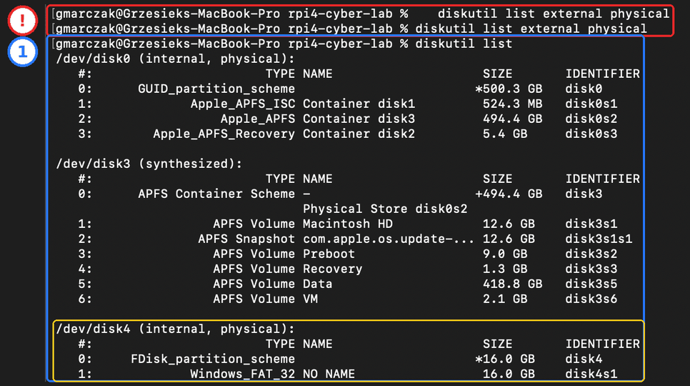

**!** Dwa razy `diskutil list external physical` i dwa razy pusto. **1** Pełne `diskutil list`: `disk0` (500 GB) i `disk3` to dysk MacBooka. Żółta ramka to karta: `/dev/disk4`, 16,0 GB, opisana jako `internal, physical`, czyli tak samo jak dysk systemowy.

## ❗ Wpadka: `dd` przerwał na ostatnim bloku (`Operation timed out`)

Dotyczy karty **SanDisk**, pierwszej, na której zaczynałem.

| | |
|---|---|
| **Co było widać** | `dd: /dev/rdisk4: Operation timed out`, a potem `16018046976 bytes transferred` zamiast 16021192704. Obraz był krótszy o **3 145 728 bajtów (3 MiB)** |
| **Przyczyna** | na pierwszy rzut oka: karta ma 3819,75 bloków po 4 MiB, `dd` przeczytał 3819 pełnych i zawiesił się na niepełnym. **To tłumaczenie okazało się niepełne**: ten sam punkt (bajt 16 018 046 976) zawiesił później także odczyt z `bs=3m`, który kończy się pełnym blokiem. Wiemy tylko tyle, że odczyt końcówki karty dużymi porcjami zawodzi, a małym (`bs=512`) przechodzi. Prawdziwy powód to prawdopodobnie ogólna niewiarygodność tej karty (patrz następna wpadka) |
| **Rozwiązanie** | doczytanie samego ogona: `sudo dd if=/dev/rdisk4 of=...sandisk16.img bs=512 skip=31285248 seek=31285248 conv=notrunc` (6144 sektory, 3 MiB, 5,5 s). Potem `ls -l` pokazał dokładnie **16021192704** bajtów |
| **Lekcja** | zakończenie komendy bez błędu w terminalu to nie dowód. Zawsze porównaj rozmiar obrazu z rozmiarem karty (krok 4a) i dopiero potem licz sumy kontrolne. A pierwsze, wygodne wytłumaczenie błędu traktuj jak hipotezę: ja uznałem ją za wyjaśnienie i myliłem się |

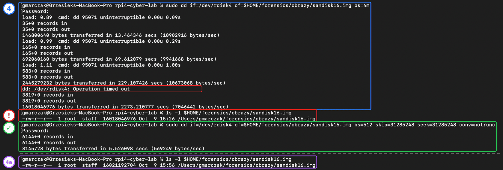

- **4** Pierwsza kopia SanDiska, jeszcze w starej wersji `dd ... of=plik bs=4m`. Linie `load: … cmd: dd` to podgląd postępu po **Ctrl+T**: po 13 s było 35 bloków, po 229 s 583. Czerwona ramka: po 2273 s (38 min) `dd` kończy z `Operation timed out`, po 3819 blokach.
- **!** `ls -l` pokazuje 16018046976 B, czyli o 3 MiB mniej niż `Disk Size` z kroku 2.
- **✓** Doczytanie ogona po 512 B (`skip`/`seek`/`conv=notrunc`): 6144 sektory w 5,5 s.
- **4a** Teraz `ls -l` pokazuje dokładnie 16021192704 B. Pliki obrazu należą do `root`, bo zapisało je `dd` uruchomione przez `sudo`.

## ❗ Wpadka: trzy odczyty tej samej karty, trzy różne sumy (SanDisk)

To najważniejsza lekcja tego ćwiczenia. Wyglądało niewinnie: miałem tylko porównać sumę obrazu z sumą karty.

| | |
|---|---|
| **Co było widać** | suma obrazu (pliku) różniła się od sumy odczytu karty, a po trzecim, niezależnym odczycie okazało się, że **każdy odczyt daje inną sumę** (tabela niżej). `cmp` pokazał pierwszą różnicę na bajcie 19 777 540 (ok. 18,9 MiB), a w sumie **48 450 246 różniących się bajtów** (ok. 0,3% pierwszych 15 276 MiB) rozrzuconych po **5775 MiB**. Pierwsze 18 MiB (tablica partycji, początek FAT) było identyczne we wszystkich odczytach |
| **Przyczyna** | **karta (albo jej adapter) zwraca przy odczycie niepowtarzalne dane, bez żadnego komunikatu o błędzie.** Wbudowany czytnik MacBooka jest sprawny: druga karta w tym samym czytniku daje we wszystkich próbach identyczne sumy. Nie umiem rozstrzygnąć, czy zużyła się sama pamięć flash, czy zawodzi łączność karty z adapterem. Dla ćwiczenia to bez znaczenia: nośnik jest niewiarygodny |
| **Rozwiązanie** | **zmiana nośnika.** Ćwiczenie robię na karcie bez marki, a SanDisk zostaje w rozdziale jako przykład. Naprawy odczytu nie ma: dane, których nie da się odczytać dwa razy tak samo, nie dają wiarygodnego obrazu |
| **Lekcja** | `dd` bez błędu to nie dowód, a **jeden odczyt to nie dowód**. Wiarygodny obraz wymaga zgodnych sum z co najmniej dwóch niezależnych odczytów, a przed godziną kopiowania warto zrobić szybki test powtarzalności (krok 3a). Błąd, który nie krzyczy, jest groźniejszy od tego, który wyskakuje czerwonym tekstem |

Przebieg, z liczbami (sumy skrócone do pierwszych 8 i ostatnich 6 znaków):

| Odczyt | Co | Suma |
|---|---|---|
| obraz, pierwszy raz (`bs=4m`) | pierwsze 16 018 046 976 B (plik) | `a83d0784…18c145` |
| karta, przez potok (`bs=3m`, przerwał `timed out`) | te same 16 018 046 976 B | `1a37ea1c…3a42f8` |
| karta, drugi raz (`bs=3m count=5092`) | te same 16 018 046 976 B | `c34d455d…ed6510` |
| ostatnie 3 MiB (`bs=512`) | karta i obraz | `bbd05cf6…f621e5`, **zgodne** |

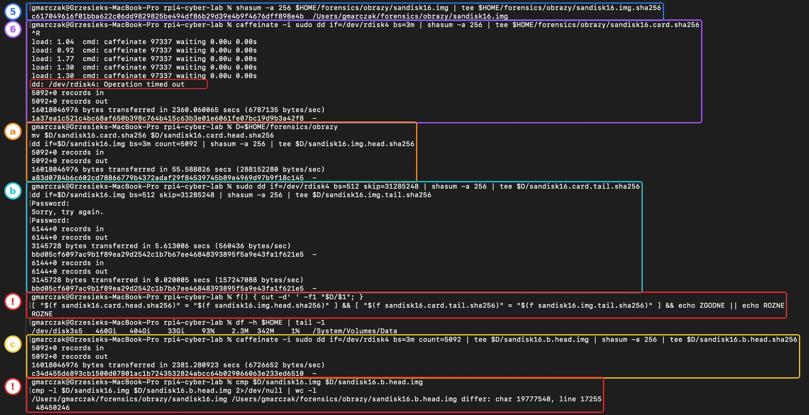

- **5** Suma całego pliku obrazu (`c617…`).
- **6** Ponowny odczyt karty z sumą w locie. Znów `Operation timed out` w tym samym miejscu (czerwona ramka), po 5092 blokach: suma `1a37…`. Linie `load: … caffeinate` to Ctrl+T, które w potoku pokazuje tylko `caffeinate`.
- **a** Żeby porównać to samo, liczę sumę **pierwszych** 5092 bloków obrazu (`a83d…`). Odczyt z pliku trwa 56 s zamiast 40 minut.
- **b** Ostatnie 3 MiB karty i obrazu po 512 B: obie sumy `bbd0…`, zgodne. (`Sorry, try again.` to literówka w haśle, bez znaczenia.)
- **!** Porównanie: `ROZNE`, bo `1a37…` ≠ `a83d…`.
- **c** Trzeci odczyt tych samych 5092 bloków, tym razem z zapisem do pliku: `c34d…`, znów inna suma.
- **!** `cmp` porównuje bajt po bajcie: pierwsza różnica na bajcie 19777540, a `wc -l` liczy **48450246** różniących się bajtów.

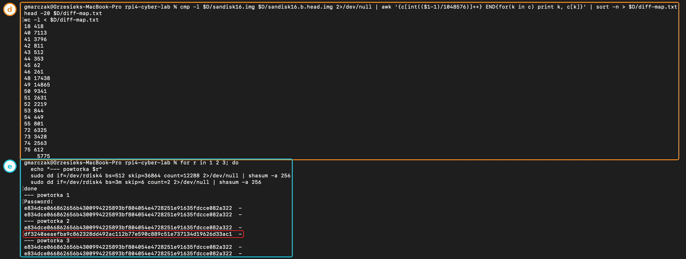

- **d** `cmp -l` wypisuje każdą różnicę, a `awk` grupuje je po megabajtach (`int((pozycja-1)/1048576)`). Wynik: numer MiB i liczba różnych bajtów w nim. Różnice zaczynają się od 18. MiB, a `wc -l` mówi, że dotyczą 5775 różnych MiB.
- **e** Ten sam obszar karty czytany 3 razy na dwa sposoby. W powtórce 2 jeden odczyt daje inną sumę (`df32…`, czerwona ramka) niż pozostałe pięć.

**Moja pierwsza hipoteza była błędna.** Zauważyłem, że różnice dotyczą odczytów dużymi blokami, i uznałem, że winne są duże bloki (a mały `bs=512` jest bezpieczny). Test zaprzeczył: ten sam obszar (12 MiB od 48. MiB) czytany po 6 razy każdym rozmiarem bloku dał **6 różnych sum przy każdym rozmiarze, także przy `bs=512`**:

| `bs` | Czas 6 odczytów (12 MiB) | Różnych sum z 6 |
|---|---|---|
| 512 | 305 s | 6 |
| 4096 | 51 s | 6 |
| 64 KiB | 16 s | 6 |
| 1 MiB | 13 s | 6 |
| 3 MiB | 12 s | 6 |

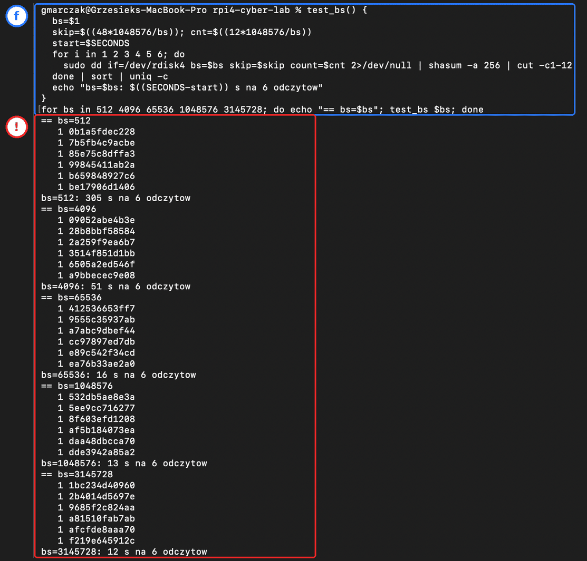

**f** Funkcja `test_bs` czyta te same 12 MiB (od 48. MiB) 6 razy blokami podanego rozmiaru i zlicza różne sumy, a pętla `for bs in …` uruchamia ją dla pięciu rozmiarów. **!** Przy każdym rozmiarze sześć linii z `1`: sześć odczytów, sześć różnych sum.

(Dla porównania w obszarze 18–24 MiB, gdzie różnic prawie nie było, 5 z 6 odczytów było identycznych, a odstawał jeden odczyt `bs=3m`.) Przy okazji widać, że `bs=512` jest ok. 25 razy wolniejsze od `bs=3m` i niczego nie naprawia.

Test stabilności (krok 3a) na obu kartach:

| Miejsce na karcie | SanDisk | Karta bez marki |
|---|---|---|
| 0 MiB | stabilnie (3 × ta sama suma) | stabilnie |
| 48 MiB | 3 różne sumy | stabilnie |
| 1000 MiB | 3 różne sumy | stabilnie |
| 8000 MiB | 3 różne sumy | stabilnie |

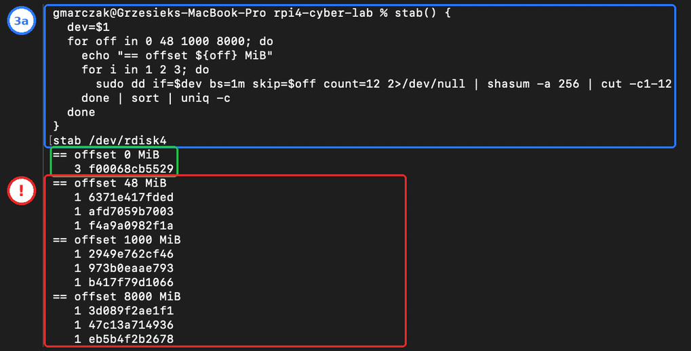

**3a** Definicja funkcji `stab` i jej wywołanie na SanDisku. Zielona ramka: od 0 MiB `3` przy jednej sumie, czyli stabilnie. **!** Od 48, 1000 i 8000 MiB po trzy linie z `1`: każdy odczyt inny.

Początek karty (tablica partycji, spis FAT) czytał się powtarzalnie nawet na SanDisku. Prawdopodobnie dlatego `diskutil` i Finder „widziały” kartę i pliki `.mp3` bez problemu, a kłopoty zaczęły się dopiero przy czytaniu całych danych.

## Wyniki

**Karta bez marki (klasa 4)**, na której zrobiłem obraz: `/dev/disk4`, 15,5 GB (15 476 981 760 bajtów = 30 228 480 sektorów po 512 B = dokładnie 4920 bloków po 3 MiB), tablica partycji MBR, jedna partycja FAT32 `NO NAME`. Blokada zapisu działała: `Media Read-Only: Yes`. Test stabilności (krok 3a): we wszystkich czterech miejscach identyczne sumy.

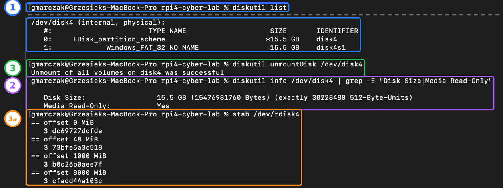

**1** W `diskutil list` karta to `disk4` o rozmiarze 15,5 GB (fragment z dyskiem MacBooka wycięty). **3** odmontowanie. **2** Z `diskutil info` filtrem `grep -E` wybrane tylko dwa pola: rozmiar w bajtach i `Media Read-Only: Yes`. **3a** `stab`: w każdym z czterech miejsc `3` przy jednej sumie, czyli karta czyta się powtarzalnie.

Kopiowanie `caffeinate -i sudo dd bs=3m | tee ... | shasum`: **4920+0 records in/out, 15 476 981 760 bajtów w 735 s (12 minut), średnio 21 MB/s, bez żadnego błędu.** Karta bez marki czyta się trzy razy szybciej niż SanDisk (7 MB/s), mimo niższej klasy na opakowaniu.

**Sumy SHA-256 (kroki 4, 5 i 6) są identyczne we wszystkich trzech miejscach:** odczyt z kopiowania, plik obrazu i drugi, niezależny odczyt karty (4920+0 bloków w 729 s, 21,2 MB/s). Komenda porównująca wypisała `ZGODNE`.

```
7a90d2cfbcf729be5b5299cb56a89443b6637c2dda164105fc55fdb54b777edf
```

To jest dowód, że `noname.img` jest wierną kopią karty i że karta zwraca za każdym razem te same dane. Od tej chwili pracujemy na obrazie.

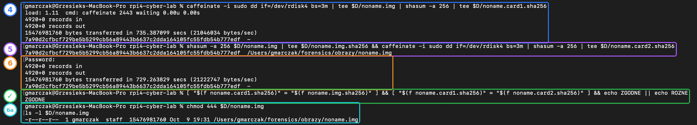

- **4** Kopiowanie z sumą w locie: `4920+0 records`, 735 s, suma `7a90d2cf…7edf`. Linia `load:` to jedno Ctrl+T.
- **5** Suma pliku obrazu: ta sama. W tej samej linii po `&&` od razu rusza krok 6.
- **6** Drugi, niezależny odczyt karty (729 s): znów ta sama suma.
- **✓** Porównanie trzech sum: `ZGODNE`.
- **6a** `chmod 444` i kontrola `ls -l`: `-r--r--r--`, obraz tylko do odczytu, rozmiar 15476981760 B.

**SanDisk (klasa 10)**: `/dev/disk4`, 16,0 GB (16 021 192 704 bajtów = 31 291 392 sektorów), MBR, FAT32 `NO NAME`, na karcie pliki `.mp3`. Kopiowanie `dd bs=4m`: 3819 bloków w 2273 s (38 minut, 7,0 MB/s), ogon 3 MiB doczytany osobno. Obrazu z tej karty **nie uznaję za wiarygodny** (patrz wpadka wyżej), więc nie wykorzystuję go do dalszych części.

---

# Część 2: co jest na karcie? Dwie metody odzysku

Karta mogła być wcześniej w telefonie, aparacie albo czytniku. „Usunięcie” pliku zwykle **nie kasuje danych**: system tylko zapisuje, że to miejsce jest znów wolne. Dopóki nic go nie nadpisze, plik leży na karcie nietknięty. Dwa narzędzia podchodzą do tego na dwa różne sposoby.

| | **TestDisk** (*undelete*) | **PhotoRec** (*carving*) |
|---|---|---|
| Jak działa | czyta spis plików systemu (FAT, NTFS, ext…) i znajduje wpisy oznaczone jako usunięte | ignoruje spis, przeszukuje surowe dane i rozpoznaje pliki po „sygnaturze” na początku (np. JPEG zaczyna się od `FF D8 FF`) |
| Nazwy plików i foldery | **zachowuje** | **gubi**, pliki dostają numery typu `f123456.jpg` |
| Pliki bez znanej sygnatury | odzyska, jeśli wpis w spisie jeszcze jest | **nie rozpozna** |
| Gdy spis plików jest uszkodzony lub karta sformatowana | zwykle bezradny | nadal działa |

## Komendy w skrócie

```bash
chmod 444 $HOME/forensics/obrazy/noname.img                                      # 6a
mkdir -p $HOME/forensics/odzysk/noname && cd $HOME/forensics/odzysk               # 6b
testdisk $HOME/forensics/obrazy/noname.img                                       # 7
photorec /log /d $HOME/forensics/odzysk/noname/ $HOME/forensics/obrazy/noname.img   # 8
find $HOME/forensics/odzysk/noname -path '*/recup_dir.*' -type f ! -name report.xml | sed 's/.*\.//' | sort | uniq -c | sort -rn   # 9
```

Obie komendy działają na **obrazie**, więc nie potrzebują `sudo` i nie mogą uszkodzić karty.

## Co robi każda komenda

### 6a · `chmod 444 obraz.img`: obraz tylko do odczytu

`chmod` zmienia uprawnienia pliku. `444` oznacza „każdy może tylko czytać” (cyfra 4 to prawo odczytu dla właściciela, grupy i reszty, bez prawa zapisu). Dzięki temu żaden program, w tym nasze narzędzia odzyskiwania i nasza własna pomyłka, nie zmieni obrazu, a jego suma SHA-256 zostaje ważna. To odpowiednik programowego *write blockera* dla pliku. Kontrola: `ls -l` pokaże `-r--r--r--`.

### 6b · `mkdir -p ... && cd ...`: folder na wyniki i praca poza repo

- `mkdir -p folder`: tworzy folder na odzyskane pliki. `-p` tworzy też brakujące foldery nadrzędne i nie zgłasza błędu, jeśli folder już jest. **PhotoRec sam go nie utworzy** (patrz wpadka niżej).
- `&&`: wykonaj drugą komendę tylko, jeśli pierwsza się udała.
- `cd $HOME/forensics/odzysk`: przejdź do folderu roboczego. TestDisk i PhotoRec zapisują swoje logi (`testdisk.log`, `photorec.log`) **w bieżącym folderze**, a te logi zawierają nazwy plików z karty. Uruchomione w folderze repo zostawiłyby je obok publicznej dokumentacji.

### 7 · `testdisk obraz.img`: usunięte pliki ze spisu

TestDisk ma menu tekstowe, obsługiwane strzałkami i Enterem:

1. `[ Proceed ]`: wybierz obraz.
2. Typ tablicy partycji: zwykle podpowiada sam (`Intel/PC` dla kart z MBR). Zatwierdź Enterem.
3. `[ Advanced ]`: wybierz partycję, potem `[ Undelete ]`.
4. Lista plików: **na czerwono** są usunięte. Podpowiedź klawiszy jest na dole ekranu (zaznaczanie, kopiowanie do wybranego folderu). Kopiuj do `~/forensics/odzysk/noname-testdisk/`.

Jeśli TestDisk nie widzi żadnej partycji albo spis jest pusty, to też wynik: karta mogła być sformatowana, a wtedy zostaje PhotoRec.

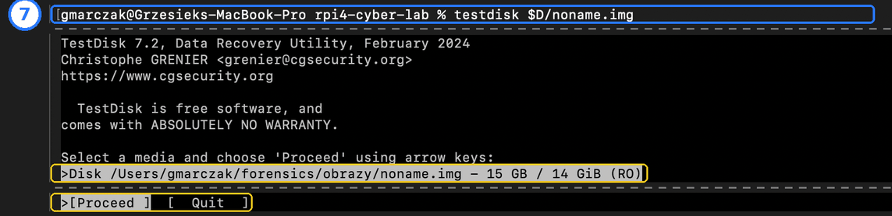

**7** Uruchomienie na obrazie. Na pierwszym ekranie jest jeden nośnik, nasz obraz, z dopiskiem `(RO)` (*read-only*, tylko do odczytu). Wybór: `[Proceed]` (fragment środka ekranu wycięty).

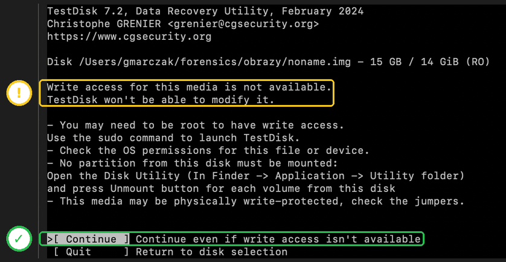

**!** (żółte) TestDisk ostrzega: `Write access for this media is not available`. To **dobra** wiadomość: tak działa `chmod 444` z kroku 6a, więc TestDisk nie może zmienić obrazu. Do odzyskiwania zapis nie jest potrzebny. **✓** `[ Continue ]`.

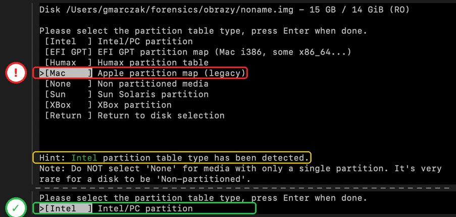

**!** Kursor stał na `[Mac]`, mimo że niżej TestDisk sam pisze `Hint: Intel partition table type has been detected` (żółta ramka). **✓** Strzałkami wybrane `[Intel]` (patrz wpadka niżej).

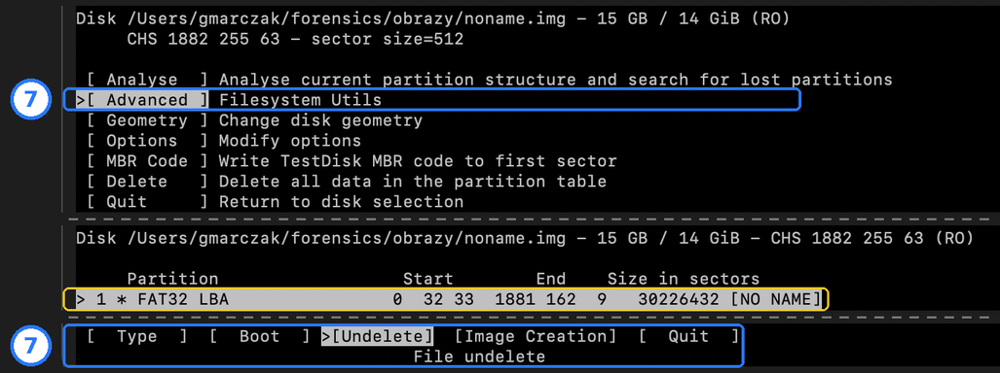

**7** Menu główne: `[ Advanced ]` (narzędzia systemu plików). Na liście jedna partycja `FAT32 LBA [NO NAME]` (żółta ramka), a w dolnym menu **7** `[Undelete]`.

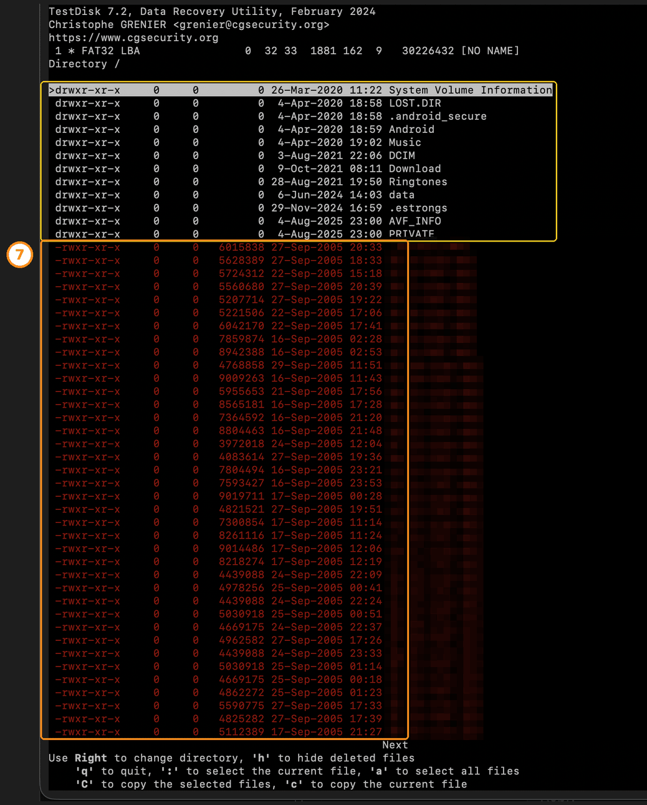

Zawartość katalogu głównego karty. Żółta ramka: foldery, które nadal istnieją. Daty i nazwy (`Android`, `DCIM`, `.android_secure`, `LOST.DIR`) pokazują, że karta była w telefonie z Androidem. **7** Na czerwono pliki usunięte: rozmiar 4–9 MB, daty z 2005 roku. **Nazwy usuniętych plików zamazałem**, bo to cudze dane. Wszystkie kończyły się na `.mp3`, a jeden zaczynał się od `_`, bo FAT przy usuwaniu nadpisuje pierwszy znak nazwy.

### 8 · `photorec /log /d folder/ obraz.img`: wyciąganie po sygnaturach

- `/log`: zapisz przebieg do pliku `photorec.log` (przyda się do wniosków).
- `/d folder/`: gdzie zapisać odzyskane pliki. PhotoRec tworzy w nim podfoldery `recup_dir.1`, `recup_dir.2`…
- Ostatni argument to obraz.

Dalej menu tekstowe:

1. `[ Proceed ]`, potem wybór partycji (albo całego dysku).
2. `[ File Opt ]` (opcjonalnie): ogranicz typy plików, np. tylko `jpg`, `png`, `pdf`. Domyślnie szuka wszystkiego.
3. `[ Search ]`, potem typ systemu plików: **`Other`** dla FAT/exFAT/NTFS (karty z telefonów i aparatów), `ext2/ext3` dla Linuksa.
4. **`Free`** albo **`Whole`**: `Free` szuka tylko w miejscu oznaczonym jako wolne, czyli wśród usuniętych plików. `Whole` przeszukuje wszystko, także pliki, które nadal są na karcie. Na pierwszy raz wybierz `Free`.
5. Wskaż folder docelowy i potwierdź klawiszem `C`.

Zapisz wynik wyświetlany na końcu: ile plików odzyskano.

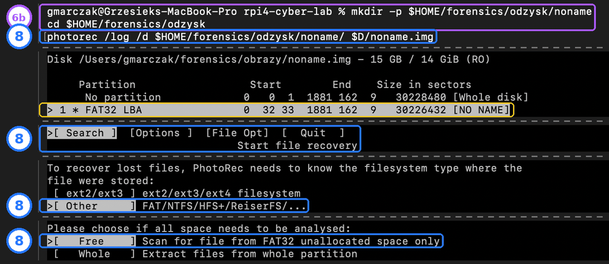

- **6b** Folder na wyniki i przejście do folderu roboczego (ta wersja jest już po wpadce opisanej niżej).
- **8** Uruchomienie PhotoRec i kolejne ekrany: wybór partycji **FAT32** (żółta ramka; wiersz `No partition … [Whole disk]` to cały obraz razem z obszarem przed partycją), potem `[ Search ]`, typ systemu plików **`Other`** i tryb **`Free`** (tylko wolne miejsce, czyli usunięte pliki).

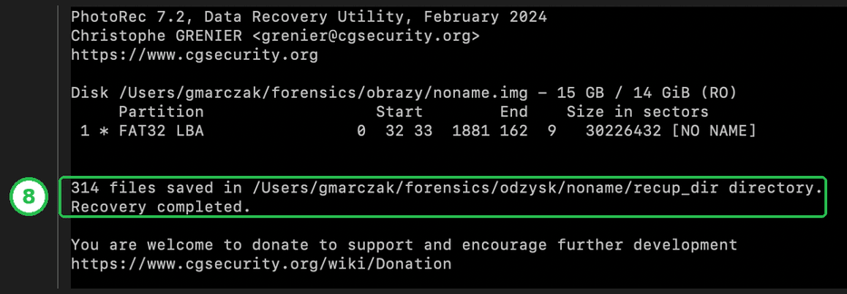

**8** Wynik: `314 files saved in …/recup_dir directory. Recovery completed.` PhotoRec przeszukał całe wolne miejsce partycji.

### 9 · liczenie wyników bez oglądania zawartości

```bash
find folder -path '*/recup_dir.*' -type f ! -name report.xml | sed 's/.*\.//' | sort | uniq -c | sort -rn
```

`find` wypisuje wszystkie odzyskane pliki (tylko te z folderów `recup_dir.*`, bez `photorec.log`). `! -name report.xml` pomija raport, który PhotoRec sam zapisuje w `recup_dir.1` (to nie jest odzyskany plik; bez tego filtra suma wychodzi o 1 większa niż liczba podana przez PhotoRec). `sed` zostawia z każdej nazwy samo rozszerzenie, a `sort | uniq -c | sort -rn` liczy je i układa od najliczniejszego. Wynik wygląda np. tak: `142 jpg`, `9 mp4`. Dzięki temu do dokumentacji trafiają **liczby i typy**, a nie same pliki. Jeśli na karcie są cudze lub prywatne zdjęcia, nie ma potrzeby ich oglądać, żeby ćwiczenie miało sens.

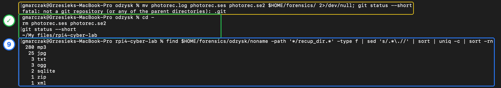

- Żółta ramka: `mv` z folderu `odzysk` przenosi log i sesję drugiego uruchomienia. `git status` odpowiada `fatal: not a git repository`, bo `odzysk` nie jest repozytorium. To nie błąd.
- **✓** `cd -` wraca do poprzedniego folderu (repo, wypisuje jego ścieżkę), `rm` usuwa pliki sesji z pierwszego uruchomienia, a `git status --short` nic nie wypisuje, więc w repo jest czysto.
- **9** Liczenie typów: 280 `mp3`, 25 `jpg`, 3 `txt`, 3 `ogg`, 2 `sqlite`, 1 `zip`, czyli razem 314. Linia `1 xml` to `report.xml` PhotoRec, a nie odzyskany plik (komenda w dokumencie ma już filtr, który go pomija).

## ❗ Wpadka: PhotoRec „0 files saved … Cannot create file in current directory”

**Co było widać:** PhotoRec przeszedł przez wszystkie menu (FAT32, `Other`, `Free`), po czym od razu pokazał `0 files saved in /Users/.../forensics/odzysk/noname/recup_dir directory` i `Cannot create file in current directory`.

**Przyczyna:** folder docelowy podany w `/d` nie istniał. W przygotowaniu powstał tylko `~/forensics/odzysk`, bez podfolderu `noname`, a PhotoRec nie tworzy brakujących folderów nadrzędnych. Nie mógł zapisać ani jednego pliku, więc zakończył pracę z wynikiem 0. To **nie** znaczy, że na obrazie nic nie ma.

**Rozwiązanie:** `mkdir -p $HOME/forensics/odzysk/noname` (komenda `# 6b`) i ponowne uruchomienie PhotoRec.

**Lekcja:** „0 znalezionych” i „0 zapisanych” to dwie różne rzeczy. Przy zerowym wyniku narzędzia najpierw sprawdź, czy w ogóle miało gdzie pisać.

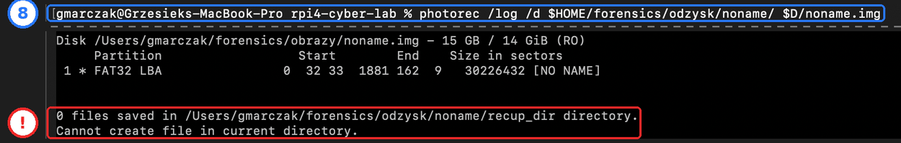

**8** Pierwsze uruchomienie, jeszcze z folderu repo i bez `mkdir`. **!** `0 files saved` i `Cannot create file in current directory`.

## ❗ Wpadka: logi narzędzi w folderze repo

**Co było widać:** PhotoRec uruchomiony z folderu repo zostawił tam trzy pliki. `ls -l *.log` pokazał `photorec.log`, a `git status --short` dwa nieśledzone pliki: `?? photorec.ses` i `?? photorec.se2`. (TestDisk loga nie zostawił, bo przy starcie wybrałem „No log”.)

**Przyczyna:** TestDisk i PhotoRec zapisują log (`*.log`) i plik sesji (`photorec.ses`, kopia `photorec.se2`, potrzebne do wznowienia przerwanego szukania) w **bieżącym folderze**, nie obok obrazu. Log może zawierać nazwy plików z karty, czyli cudze, prywatne dane. `*.log` był już w `.gitignore`, ale pliki sesji nie, więc `git add .` wrzuciłby je do publicznego repo.

**Rozwiązanie:** `mv photorec.log photorec.ses photorec.se2 $HOME/forensics/`, dopisanie `*.ses` i `photorec.se2` do `.gitignore` i od tej pory uruchamianie narzędzi po `cd $HOME/forensics/odzysk` (`# 6b`). Przeniesienie pliku sesji ma też tę zaletę, że PhotoRec nie proponuje wznowienia poprzedniej, nieudanej sesji. `.gitignore` to druga linia obrony, nie pierwsza: chroni przed przypadkowym `git add .`, ale nie przed plikiem, o którym nie wiedzieliśmy.

**Lekcja:** zanim uruchomisz narzędzie na cudzych danych, sprawdź, **gdzie** zapisuje swoje wyniki i logi.

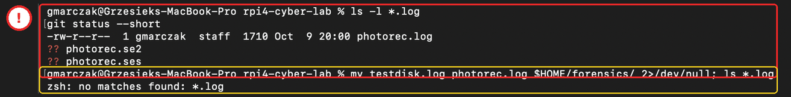

**!** `ls -l *.log` znajduje `photorec.log`, a `git status --short` dwa nieśledzone pliki (`??`): `photorec.se2` i `photorec.ses`. Żółta ramka: pierwsza próba sprzątania przeniosła tylko log. Pliki sesji usunąłem później (zrzut przy kroku 9).

## ❗ Wpadka: TestDisk podświetlił `Mac` zamiast `Intel`

**Co było widać:** na ekranie wyboru typu tablicy partycji kursor stał na `[Mac]`, a nie na `[Intel]`.

**Przyczyna:** TestDisk zgaduje typ na podstawie tego, co widzi, i nie zawsze trafia. Ta karta ma tablicę MBR (`FDisk_partition_scheme` w `diskutil list`), a MBR to w TestDisku `Intel/PC`. Z `Mac` nie zobaczyłby partycji FAT32.

**Rozwiązanie:** strzałkami wybrać `[Intel]`, Enter. Potem TestDisk pokazał partycję `FAT32 LBA [NO NAME]`.

**Lekcja:** podpowiedź narzędzia to propozycja, nie wynik. Typ tablicy sprawdzisz wcześniej w `diskutil list`: `FDisk_partition_scheme` to MBR (`Intel`), `GUID_partition_scheme` to GPT (`EFI GPT`).

## Wyniki

Obraz karty bez marki (`noname.img`, partycja FAT32 `NO NAME`, 30 226 432 sektory od sektora 2048).

**TestDisk (*undelete*):** spis plików FAT był cały, karta nie była sformatowana. W katalogu głównym widać wiele usuniętych wpisów `.mp3` (na czerwono), a w strukturze folderów ślady telefonu z Androidem. Pierwsza litera nazw usuniętych plików jest zamieniona na `_`, bo FAT oznacza usunięcie, nadpisując właśnie ten znak. Dokładnej liczby usuniętych wpisów nie liczyłem; da się ją wyciągnąć np. `fls` z pakietu The Sleuth Kit.

**PhotoRec (*carving*, tryb `Free`):** `314 files saved`, `Recovery completed`.

| Typ | Liczba | Skąd prawdopodobnie |
|---|---:|---|
| `mp3` | 280 | usunięta muzyka, ta sama, którą pokazał TestDisk |
| `jpg` | 25 | zdjęcia lub miniatury z telefonu |
| `txt` | 3 | pliki tekstowe, np. logi aplikacji |
| `ogg` | 3 | dźwięki (Android używa `ogg` m.in. do powiadomień i nagrań) |
| `sqlite` | 2 | bazy danych aplikacji |
| `zip` | 1 | archiwum |
| **razem** | **314** | zgadza się z liczbą podaną przez PhotoRec |

Plików nie otwierałem: to cudze dane, a do wniosków wystarczą liczby i typy.

**Wnioski:**

- Obie metody potwierdzają to samo: usunięte pliki leżą na karcie i da się je odzyskać, bo nikt ich nie nadpisał.
- PhotoRec znalazł typy, których TestDisk w katalogu głównym nie pokazał (`jpg`, `sqlite`, `ogg`). Carving nie potrzebuje wpisu w spisie plików, więc wyciąga też dane, po których wpis zniknął albo został nadpisany.
- PhotoRec gubi nazwy i foldery: wiemy, że jest 280 plików `mp3`, ale nie wiemy, jak się nazywały. TestDisk odwrotnie: zna nazwy, ale nie odzyska pliku, po którym nie ma wpisu.
- Liczba z PhotoRec to górna granica, a nie gwarancja: część plików może być ucięta albo sklejona z kawałków, zwłaszcza duże, pofragmentowane `mp3`. Sprawdzenie, ile z nich naprawdę działa, to zadanie kontrolowanego eksperymentu w części 3, gdzie znamy oryginały.
- **Dla właściciela karty:** zwykłe usunięcie plików z telefonu zostawia je do odzyskania przez każdego, kto dostanie kartę do ręki. Przed oddaniem lub sprzedażą kartę trzeba nadpisać (część 4), a nie tylko wyczyścić.

---

# Część 3: kontrolowany eksperyment

Na cudzych danych nie wiemy, ile **powinno** wrócić. Dlatego robimy własny test: zapisujemy znane pliki, usuwamy je i sprawdzamy, ile odzyskamy. Ta część **kasuje kartę**, więc robimy ją dopiero po częściach 1–2 (obraz oryginału już leży w `~/forensics/obrazy`).

Używamy karty **bez marki (15,5 GB)**, tej samej, z której zrobiłem wiarygodny obraz w części 1. SanDisk odpada, bo jego odczyty są niepowtarzalne, więc porównywanie sum po eksperymencie nie miałoby sensu. Rozmiar tej karty dzieli się bez reszty przez 4 MiB (3690 bloków), więc `bs=4m` w komendach niżej nie zostawia niepełnego ostatniego bloku. Suwak LOCK ustaw teraz w pozycji odblokowanej.

## Komendy w skrócie

```bash
diskutil eraseDisk FAT32 TEST MBRFormat /dev/diskN                         # 10
U=https://raw.githubusercontent.com/gmarczak/rpi4-cyber-lab/master/screenshots/2026-10-09-assembly
curl -fsSL -o /Volumes/TEST/10-board-unboxed.jpg $U/10-board-unboxed.jpg   # 11
curl -fsSL -o /Volumes/TEST/14-case-parts.jpg $U/14-case-parts.jpg         # 11
cupsfilter README.md > /Volumes/TEST/readme.pdf 2>/dev/null                # 11 (z folderu repo)
head -c 2097152 /dev/urandom > /Volumes/TEST/losowy.bin                    # 12
ls -l /Volumes/TEST/                                                       # 12a
shasum -a 256 /Volumes/TEST/* | tee $HOME/forensics/oryginaly.sha256       # 13
rm /Volumes/TEST/*                                                         # 14
diskutil unmountDisk /dev/diskN                                            # 15
caffeinate -i sudo dd if=/dev/rdiskN of=$HOME/forensics/obrazy/noname-po-usunieciu.img bs=4m   # 16
```

Potem powtórz kroki 6a–9 na nowym obrazie (tym razem TestDisk ma też **skopiować** odzyskane pliki), a na końcu porównaj odciski (krok 17):

```bash
chmod 444 $D/noname-po-usunieciu.img                                                                   # 6a
mkdir -p $HOME/forensics/odzysk/po-usunieciu-testdisk && cd $HOME/forensics/odzysk/po-usunieciu-testdisk   # 6b
testdisk $D/noname-po-usunieciu.img                                                                    # 7
```

## Co robi każda komenda

### 10 · `diskutil eraseDisk FAT32 TEST MBRFormat /dev/diskN`: czysta karta

Formatuje kartę jako **FAT32** (system plików typowy dla kart w aparatach) z tablicą partycji MBR i nazwą `TEST`. Dla nas karta wygląda potem na pustą, dlatego numer dysku sprawdź jeszcze raz (kroki 1–2): formatowanie złego dysku to utrata danych. Zapis musi być możliwy, więc suwak LOCK musi być odblokowany, a `diskutil info` pokazać `Media Read-Only: No`.

**Uwaga: formatowanie nie kasuje danych.** Zapisuje tylko nową tablicę partycji i nowy, pusty spis plików (w wyniku widać `hid=8192`, czyli partycja zaczyna się teraz od 4. MiB, oraz `bspf=14742`, czyli rozmiar jednej tablicy FAT w sektorach). Stare dane w pozostałym miejscu zostają nietknięte. Wynik PhotoRec niżej to pokazuje.

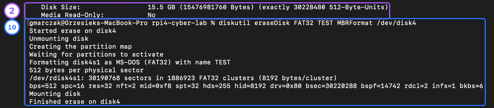

**2** `Media Read-Only: No`: blokada zdjęta. **10** `eraseDisk`: odmontowanie, nowa tablica partycji, formatowanie `disk4s1` jako FAT32 o nazwie `TEST` z klastrami po 8192 B, ponowne zamontowanie i `Finished erase on disk4`.

### 11–12 · pliki testowe

Pliki testowe pochodzą z tego repo, które jest publiczne. Na karcie nie ląduje więc nic prywatnego, a każdy może powtórzyć test na tych samych plikach.

- `U=...`: zmienna z adresem folderu ze zdjęciami z montażu Raspberry na GitHubie (`raw.githubusercontent.com` podaje same pliki, bez strony wokół).
- `curl -fsSL -o plik adres`: pobiera plik. `-f` przy błędzie (np. 404) nie zapisuje strony błędu jako pliku, `-sS` ukrywa pasek postępu, ale pokazuje błędy, `-L` idzie za przekierowaniami, a `-o` podaje, gdzie zapisać. Pobieramy z GitHuba zamiast kopiować z lokalnego repo, bo lokalna kopia może być starsza (patrz wpadka niżej).
- `cupsfilter README.md > /Volumes/TEST/readme.pdf 2>/dev/null`: `cupsfilter` to wbudowany w macOS konwerter z systemu druku (CUPS). Zamienia plik tekstowy w PDF i wypisuje go na standardowe wyjście, a `>` zapisuje to do pliku na karcie. Uruchom w folderze repo, bo tam jest `README.md`. Na ekran wypisuje dziesiątki linii `DEBUG:` (komunikaty diagnostyczne), które `2>/dev/null` wycisza.
- JPEG i PDF to typy, które PhotoRec zna po sygnaturach (`FF D8 FF` i `%PDF`).
- Na karcie FAT32 macOS może dopisać własne pliki `._*` i ukryte foldery systemowe (`.Spotlight-V100`, `.fseventsd`). To normalne ślady systemu, nie błąd. `*` w kolejnych komendach ich nie obejmuje, bo nie dopasowuje nazw zaczynających się od kropki.
- `head -c 2097152 /dev/urandom > ...` tworzy plik z **2 MiB losowych bajtów** (`/dev/urandom` to systemowe źródło losowych danych, a `head -c` bierze z niego tyle bajtów: 2 × 1024 × 1024 = 2097152). Losowe dane nie mają żadnej sygnatury, więc PhotoRec go nie rozpozna. To celowy „test kontrolny”.

`ls -l` (krok 12a) to kontrola: na karcie mają być 4 pliki, `10-board-unboxed.jpg` (279120 B), `14-case-parts.jpg` (350805 B), `losowy.bin` (2097152 B) i `readme.pdf`.

## ❗ Wpadka: pliki testowe, `No such file or directory` i `illegal byte count`

| | |
|---|---|
| **Co było widać** | `cp: screenshots/2026-10-09-assembly/10-board-unboxed.jpg: No such file or directory` (dwa razy), a potem `head: illegal byte count -- 2m`. `ls -l` pokazał tylko `readme.pdf` i **pusty** `losowy.bin` (0 B) |
| **Przyczyna** | 1) w pierwszej wersji kopiowałem zdjęcia z **lokalnego** repo, a lokalna kopia była starsza niż GitHub i tych zdjęć jeszcze nie miała. 2) `head` w macOS (wersja BSD) nie rozumie skrótu `2m`, który rozumie `dd`. `head` zgłosił błąd i nic nie wypisał, ale `>` zdążył już utworzyć pusty plik |
| **Rozwiązanie** | zdjęcia pobrane `curl` prosto z GitHuba, a w `head -c` liczba bajtów `2097152`. Potem `ls -l` i nowe `shasum` (`tee` nadpisuje stary plik z sumami) |
| **Lekcja** | ta sama komenda może mieć inne opcje na macOS (BSD) i na Linuksie (GNU). Przekierowanie `>` tworzy plik **zanim** komenda zacznie działać, więc pusty plik po błędzie to normalny ślad. Dlatego po każdym przygotowaniu danych testowych warto sprawdzić rozmiary przez `ls -l` |

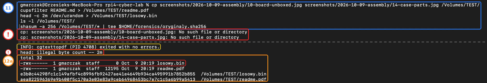

**11** pierwsza wersja komend. **!** `cp` nie znajduje zdjęć. Żółta ramka: `cupsfilter` kończy się bez błędów (dziesiątki linii `DEBUG:` nad nią wyciąłem). **!** `head` nie rozumie `2m`. **12a** `ls -l` pokazuje pusty `losowy.bin` (0 B, czerwona ramka). Jego SHA-256 `e3b0c442…b855` to odcisk **pustego** pliku, który warto rozpoznawać na pierwszy rzut oka.

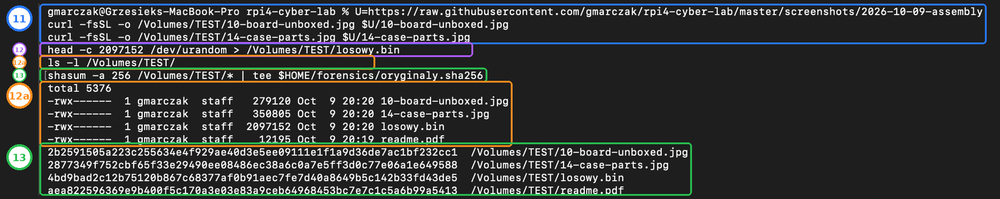

**11** pobranie zdjęć z GitHuba (`readme.pdf` został z pierwszej próby). **12** 2 MiB losowych danych. **12a** kontrola: 4 pliki o oczekiwanych rozmiarach. **13** odciski oryginałów, zapisane do `oryginaly.sha256`.

### 13 · `shasum -a 256 ... | tee plik`: odciski oryginałów

Liczy SHA-256 każdego pliku testowego i zapisuje listę do `oryginaly.sha256`. Po odzyskaniu porównamy te odciski z odciskami plików, które wrócą. `tee` wypisuje wynik na ekran i jednocześnie zapisuje do pliku.

### 14 · `rm /Volumes/TEST/*`: usunięcie

zsh przy `rm` z gwiazdką pyta `sure you want to delete all 4 files in /Volumes/TEST [yn]?`. To bezpiecznik powłoki (opcja `rmstar`), który chroni przed przypadkowym `rm *`. Odpowiedz `y`. Po usunięciu `ls -la /Volumes/TEST/` (`-a` pokazuje też pliki ukryte) wypisze już tylko ukryte foldery macOS, `.Spotlight-V100` i `.fseventsd`.

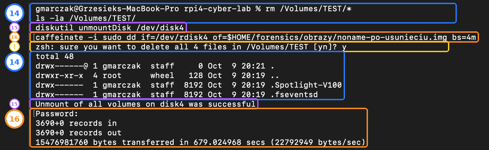

Cztery komendy wklejone naraz, a wyniki pojawiają się kolejno pod nimi. **!** (żółte) pytanie zsh przed `rm *`. **14** po usunięciu na karcie zostały tylko ukryte foldery macOS. **15** odmontowanie. **16** obraz: `3690+0 records`, pełne 15476981760 B w 679 s.

Usuwamy w terminalu, nie w Finderze. Finder tylko przenosi pliki do ukrytego folderu `.Trashes`, czyli nie jest to prawdziwe usunięcie. `rm` kasuje wpisy ze spisu plików, ale **nie rusza samych danych**. Dokładnie tak „usuwa” telefon czy aparat.

### 15–16 · odmontuj i zrób obraz

Jak w części 1 (kroki 3–4), tylko z nową nazwą obrazu. Tu nie liczymy sum w locie, bo ten obraz nie musi być dowodem: wystarczy, że zawiera skasowane pliki. Przy `dd ... of=plik` działa Ctrl+T (podgląd postępu). Karta bez marki dzieli się bez reszty przez 4 MiB, więc `bs=4m` daje `3690+0 records`.

### TestDisk: kopiowanie usuniętych plików

Uruchamiamy go z folderu docelowego (`cd` w kroku 6b), bo TestDisk proponuje kopiowanie do folderu, w którym go uruchomiono. Menu jak w kroku 7 (`[Intel]` → `[Advanced]` → partycja → `[Undelete]`), a na liście plików:

- `a`: zaznacz wszystkie pliki,
- `C` (wielkie): skopiuj zaznaczone. TestDisk pokaże wybór folderu docelowego, a drugie `C` zatwierdza bieżący,
- `q`: wyjście (kilka razy, po jednym poziomie menu).

Bezpieczniej niż `a` jest zaznaczyć tylko potrzebne pliki dwukropkiem `:` (pojawia się przy nich `*`), bo `a` zaznacza też ukryte foldery macOS.

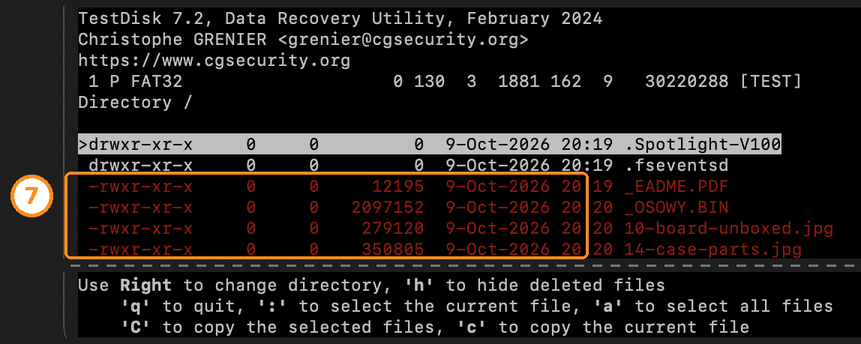

**7** Lista plików na obrazie po usunięciu. Na czerwono 4 usunięte pliki z dokładnie tymi rozmiarami co oryginały. `readme.pdf` i `losowy.bin` mają krótkie nazwy 8.3 (`README.PDF`, `LOSOWY.BIN`), zapisane w jednym wpisie, a FAT przy usuwaniu nadpisuje jego pierwszy znak: stąd `_EADME.PDF` i `_OSOWY.BIN`. Nazwy dłuższe niż 8 znaków mają dodatkowe wpisy z pełną nazwą, z których TestDisk odtwarza `10-board-unboxed.jpg` w całości.

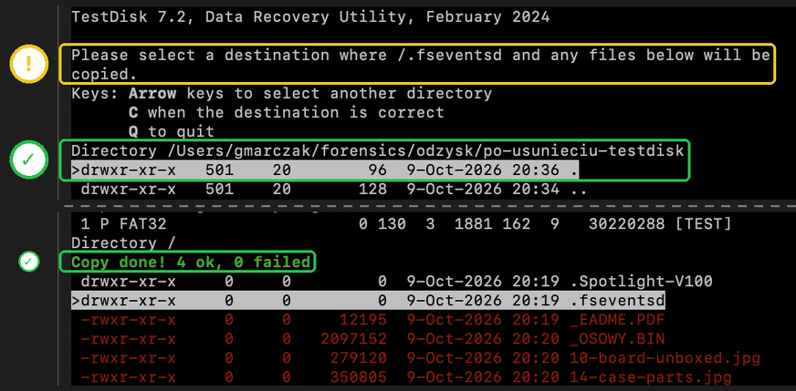

**!** (żółte) nagłówek mówi o `/.fseventsd`, czyli wpisie pod kursorem, choć kopiowane są zaznaczone pliki. **✓** Folder docelowy to `po-usunieciu-testdisk` (TestDisk proponuje folder, z którego go uruchomiono). **✓** `Copy done! 4 ok, 0 failed`.

## ❗ Wpadka: `chmod: Operation not permitted` i kopia, której „nie ma”

| | |
|---|---|
| **Co było widać** | 1) `chmod 444` na nowym obrazie: `Operation not permitted`. 2) Po kopiowaniu w TestDisku (`a`, `C`): `Copy done! 100 ok`, a `ls -lR` w folderze docelowym pokazał `total 0`. `find` z `-newer` i `mdfind` też niczego nie znalazły |
| **Przyczyna** | 1) obraz utworzyło `sudo dd ... of=plik`, więc jego właścicielem jest `root`, a zwykły użytkownik nie może zmieniać uprawnień cudzego pliku. W części 1 obraz zapisywał `tee` uruchomiony bez `sudo`, więc należał do mnie. 2) `a` zaznaczył także foldery `.Spotlight-V100` i `.fseventsd` z całą zawartością (stąd 100 plików). TestDisk zapisał je w folderze docelowym, a **`ls` bez `-a` nie pokazuje nazw zaczynających się od kropki**. Naszych 4 plików w folderze nie było; dlaczego TestDisk ich wtedy nie zapisał, nie ustaliłem. `find -newer` nie mógł pomóc, bo TestDisk przywraca plikom **oryginalne daty z karty**, starsze niż obraz |
| **Rozwiązanie** | 1) `sudo chmod 444`. 2) Ponowne kopiowanie: tylko 4 pliki zaznaczone `:`, zrzut ekranu wyboru folderu przed zatwierdzeniem, a potem `ls -la` (z ukrytymi). Wynik: `4 ok`, pliki na miejscu |
| **Lekcja** | `ls` bez `-a` kłamie przez przemilczenie. Gdy narzędzie mówi „skopiowano”, a folder wygląda na pusty, sprawdź `ls -la`. Narzędzia śledcze celowo zachowują oryginalne daty plików, więc szukanie „świeżych” plików po dacie zawodzi |

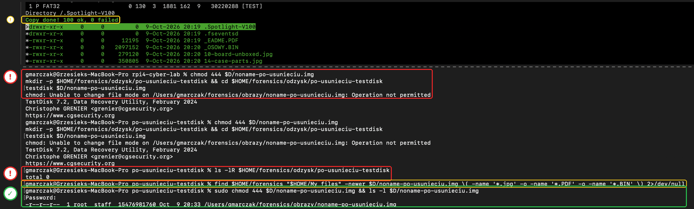

**!** (żółte) pierwsze kopiowanie: `100 ok`, bo zaznaczone były też foldery macOS. **!** `chmod` nie może zmienić uprawnień pliku należącego do `root`. **!** `ls -lR` nie widzi ukrytych folderów: `total 0`. Żółta ramka: `find -newer` nic nie znajduje. **✓** `sudo chmod 444`: obraz ma `-r--r--r--`.

### 17 · porównanie odcisków

**TestDisk** zachowuje nazwy, więc wystarczy policzyć odciski odzyskanych plików i położyć je obok odcisków oryginałów:

```bash
ls -la $HOME/forensics/odzysk/po-usunieciu-testdisk
shasum -a 256 $HOME/forensics/odzysk/po-usunieciu-testdisk/*
cat $HOME/forensics/oryginaly.sha256
```

**PhotoRec** nadaje plikom własne nazwy (`f0033036.jpg`), więc porównujemy same odciski:

```bash
P=$HOME/forensics/odzysk/po-usunieciu-photorec
find $P -path '*/recup_dir.*' -type f ! -name report.xml -exec shasum -a 256 {} + > $HOME/forensics/odciski-photorec.txt
awk '{print $1}' $HOME/forensics/oryginaly.sha256 > $HOME/forensics/odciski-oryginalow.txt
grep -F -f $HOME/forensics/odciski-oryginalow.txt $HOME/forensics/odciski-photorec.txt
```

- `find ... -exec shasum -a 256 {} +` liczy odcisk każdego odzyskanego pliku (`{}` to miejsce na nazwy znalezionych plików, `+` przekazuje je wszystkie do jednego wywołania `shasum`) i zapisuje listę do pliku.
- `awk '{print $1}'` wyciąga z listy oryginałów samą pierwszą kolumnę, czyli odciski.
- `grep -F -f wzorce plik` wypisuje linie z `plik`, w których występuje którykolwiek wzorzec z pliku `wzorce`. `-F` oznacza „dosłownie, bez wyrażeń regularnych”. Każda wypisana linia to plik odzyskany **co do bajta**, razem z nazwą nadaną przez PhotoRec.

**Czego się spodziewałem:** TestDisk odzyska wszystkie cztery pliki razem z nazwami, bo spis plików jeszcze pamięta wpisy. PhotoRec odzyska zdjęcia i PDF bez nazw, ale `losowy.bin` nie odzyska wcale, bo nie ma sygnatury. Oba przewidywania się sprawdziły (niżej).

## Wyniki

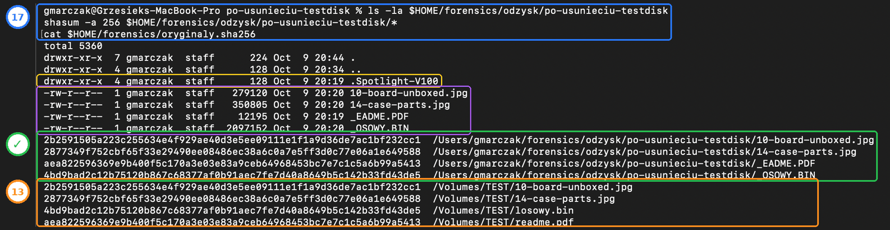

**17** Folder z odzyskanymi plikami: żółta ramka to ukryty `.Spotlight-V100` z pierwszego kopiowania, fioletowa to 4 pliki testowe. **✓** Odciski odzyskanych plików. **13** Odciski oryginałów: identyczne, linia w linię.

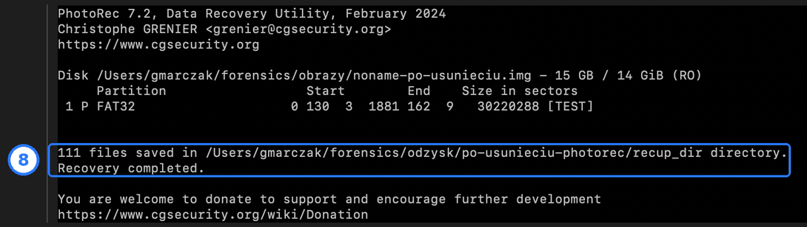

**8** PhotoRec (tryb `Free`) na tym samym obrazie: **111 plików**.

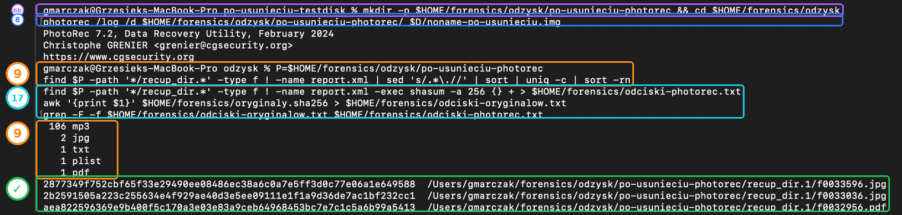

**6b**, **8** PhotoRec uruchomiony z folderu `odzysk`. **9** Typy: 106 `mp3`, 2 `jpg`, 1 `txt`, 1 `plist`, 1 `pdf`. **17** Porównanie odcisków. **✓** Trzy odzyskane pliki mają odciski identyczne z oryginałami: oba zdjęcia i PDF.

| Plik (oryginał) | Rozmiar | TestDisk | PhotoRec |
|---|---:|---|---|
| `10-board-unboxed.jpg` | 279120 B | ✅ identyczny, z nazwą | ✅ identyczny, jako `f0033036.jpg` |
| `14-case-parts.jpg` | 350805 B | ✅ identyczny, z nazwą | ✅ identyczny, jako `f0033596.jpg` |
| `readme.pdf` | 12195 B | ✅ identyczny, jako `_EADME.PDF` | ✅ identyczny, jako `f0032956.pdf` |
| `losowy.bin` | 2097152 B | ✅ identyczny, jako `_OSOWY.BIN` | ❌ nie znaleziony |
| **razem** | | **4 z 4** | **3 z 4** |

**Wnioski:**

- **Usunięcie pliku nie kasuje danych.** Oba narzędzia odzyskały pliki co do bajta, bo po `rm` na karcie nic ich nie nadpisało.
- **TestDisk wygrywa, dopóki spis plików pamięta wpisy:** odzyskał wszystko, także plik bez żadnej sygnatury, i prawie całe nazwy. Gubi tylko pierwszy znak krótkich nazw 8.3.
- **PhotoRec nie potrzebuje spisu, ale potrzebuje sygnatury.** Plik losowych bajtów jest dla niego niewidzialny: nie wie, gdzie się zaczyna ani gdzie kończy. Nazw nie odzyskuje wcale.
- **Formatowanie to nie kasowanie.** Usunęliśmy 4 pliki, a PhotoRec znalazł 111. Ponad sto to pozostałości sprzed formatowania (`eraseDisk` z kroku 10): 106 z 280 plików `mp3` z telefonu (ok. 38%). Z 25 zdjęć z telefonu nie wróciło żadne. Część starych danych przepadła, prawdopodobnie nadpisana przez nową tablicę partycji, tablice FAT i nasze pliki (wszystkie leżą na początku partycji), ale reszta przeżyła. Pliki `txt` i `plist` to prawdopodobnie usunięte pliki tymczasowe macOS (Spotlight). Wniosek praktyczny: karty po samym sformatowaniu nie można bezpiecznie oddać. Część 4 pokazuje, co robić zamiast tego.

---

# Część 4: bezpieczne kasowanie i dowód

Skoro wiemy, że „usunięcie” i nawet szybkie formatowanie niczego nie niszczą, sprawdzamy, co faktycznie zabezpiecza dane: **nadpisanie całej karty**.

## Komendy w skrócie

```bash
diskutil unmountDisk /dev/diskN                                            # 18
sudo dd if=/dev/zero of=/dev/rdiskN bs=4m                                  # 19
sudo dd if=/dev/rdiskN of=$HOME/forensics/obrazy/noname-po-zerach.img bs=4m   # 20
hexdump -C $HOME/forensics/obrazy/noname-po-zerach.img | head -5        # 21
cmp $HOME/forensics/obrazy/noname-po-zerach.img /dev/zero               # 22
photorec /log /d $HOME/forensics/odzysk/po-zerach/ $HOME/forensics/obrazy/noname-po-zerach.img   # 23
```

## Co robi każda komenda

### 18–19 · `dd if=/dev/zero of=/dev/rdiskN`: wypełnij zerami

`/dev/zero` to „źródło” nieskończonej liczby bajtów zerowych. Tym razem kierunek jest odwrotny niż w części 1: **czytamy** zera, **zapisujemy** na kartę. Jedna pełna runda nadpisuje każdy sektor, więc dawnych danych nie ma już skąd odczytać.

> ⚠️ **To jedyna komenda w tym rozdziale, która zapisuje na dysk bez pytania.** Błędny numer `diskN` skasuje inny dysk. Przed Enterem sprawdź ostatni raz: `diskutil info /dev/diskN` (karta, 16 GB, `Secure Digital`).

Czas: karta klasy 10 ok. 15–30 minut, karta klasy 4 nawet godzinę lub dłużej. Ctrl+T pokazuje postęp. Na końcu `dd` może zgłosić `end of device` albo `No space left on device`: to **normalne**, bo kończy się miejsce na karcie, czyli cała została nadpisana.

Alternatywa: `diskutil secureErase 0 /dev/diskN` (poziom 0 = jedno przejście zerami). Na nośnikach flash bywa niedostępna, dlatego tu używamy `dd`.

### 20 · obraz po kasowaniu

Jak wcześniej: robimy nowy obraz karty.

### 21 · `hexdump -C ... | head -5`: zobacz na własne oczy

Pokazuje początek obrazu w zapisie szesnastkowym. Po wyzerowaniu powinny być same `00`, a powtarzające się linijki `hexdump` zastępuje gwiazdką `*`.

### 22 · `cmp obraz /dev/zero`: dowód matematyczny

Porównuje obraz bajt po bajcie z nieskończonym strumieniem zer. Komunikat o **końcu pliku** (`EOF on ...`) znaczy, że cały obraz do ostatniego bajta jest zerami. Komunikat `differ` znaczy, że gdzieś jest coś innego niż zero.

### 23 · PhotoRec na wyzerowanym obrazie

Ten sam test co w części 2. Oczekiwany wynik: **0 odzyskanych plików**. To jest „po” do zestawienia z „przed”.

## ⚠️ Uczciwe zastrzeżenie: pamięć flash to nie dysk

Karta microSD ma kontroler, który rozkłada zapisy po komórkach (*wear leveling*) i trzyma rezerwowe bloki. Nadpisanie „całej karty” nadpisuje wszystko, co **widzi system**, ale nie gwarantuje, że wyczyszczone zostały też ukryte rezerwy. Do ćwiczeń i zwykłego pozbycia się karty to wystarczy. Przy naprawdę wrażliwych danych jedyne pewne metody to szyfrowanie **od początku** (wtedy po kasowaniu zostaje bezużyteczny szyfrogram) albo fizyczne zniszczenie karty.

## Wyniki

*(do uzupełnienia: czas kasowania, wynik `hexdump` i `cmp`, wynik PhotoRec po zerach)*

---

# Część 5: test autentyczności karty bez marki (f3)

Tanie, nieoznaczone karty często mają napisane 16 GB, a naprawdę mają np. 2 GB. Kontroler „przyjmuje” zapisy ponad prawdziwą pojemność i je gubi. Test **F3** zapisuje na kartę znane dane aż do końca, a potem odczytuje i sprawdza, czy wszystko wróciło.

Na macOS działają tylko `f3write` i `f3read`. Szybszy `f3probe` jest wyłącznie na Linuksa, więc robimy dłuższą, ale równie wiarygodną metodę.

## Komendy w skrócie

```bash
diskutil eraseDisk FAT32 TEST MBRFormat /dev/diskN   # 24
f3write /Volumes/TEST                                # 25
f3read /Volumes/TEST                                 # 26
```

## Co robi każda komenda

### 24 · format

Jak w kroku 10. Kasuje kartę, więc rób to po wykonaniu części 1–2 i na karcie **bez marki** (wymień `diskN`).

### 25 · `f3write /Volumes/TEST`: zapisz dane testowe

Wypełnia wolne miejsce plikami po 1 GB o znanej zawartości. Dla 16 GB to kilkanaście plików, a zapis na karcie klasy 4 trwa długo.

### 26 · `f3read /Volumes/TEST`: sprawdź

Czyta pliki i porównuje z tym, co zapisano. Na końcu wypisuje podsumowanie:

| Pole | Dobra karta | Fałszywa pojemność |
|---|---|---|
| `Data OK` | prawie cała pojemność | tylko prawdziwa pojemność |
| `Data LOST` | `0.00 Byte` | duża liczba |
| `Corrupted`, `Slightly changed` | `0` | `0` lub niewiele |

Dużo `Data LOST` oznacza, że karta kłamie. Wtedy jej realna pojemność to wartość `Data OK`.

Po teście karta jest pełna plików F3. Możesz je skasować komendą z kroku 10.

## Wyniki

*(do uzupełnienia: wynik f3read dla karty bez marki; opcjonalnie też dla SanDisk jako punkt odniesienia)*

---

## Co z tego mamy

- Dowód, że **usunięcie pliku i szybkie formatowanie nie niszczą danych**, a nadpisanie całej karty tak.
- Umiejętność zrobienia i zweryfikowanego **obrazu dysku**, czyli podstawę każdej analizy śledczej, razem z regułą „jeden odczyt to nie dowód”.
- Doświadczenie z nośnikiem, który **kłamie bez komunikatu o błędzie** (SanDisk): wiem, jak to wykryć i dlaczego zgodne sumy z dwóch odczytów są ważniejsze niż „skończyło się bez błędu”.
- Różnicę między odzyskiwaniem **ze spisu plików** (TestDisk) i **po sygnaturach** (PhotoRec).
- Praktyczną wiedzę do labu: gdy wycofujesz kartę z Raspberry albo sprzedajesz stary telefon, wiesz, jak ją **naprawdę** wyczyścić.

## Słowniczek

| Pojęcie | Znaczenie |
|---|---|
| Forensics | informatyka śledcza: zabezpieczanie i analiza danych tak, żeby dało się obronić wynik |
| Obraz dysku | plik będący dokładną kopią bit-w-bit całego nośnika |
| Suma kontrolna (SHA-256) | „odcisk palca” danych, służy do dowodu, że kopia jest wierna |
| Write blocker | sprzęt lub ustawienie, które pozwala tylko czytać nośnik, żeby go nie zmienić |
| Carving | wycinanie plików z surowych danych po sygnaturach, bez korzystania ze spisu plików |
| Sygnatura (*magic bytes*) | charakterystyczne bajty na początku pliku, np. JPEG zaczyna się od `FF D8 FF` |
| Wear leveling | rozkładanie zapisów po komórkach flash przez kontroler, żeby się równo zużywały |
| Odczyt powtarzalny | ten sam fragment nośnika czytany wielokrotnie zwraca za każdym razem te same dane. Bez tego żaden obraz nie jest dowodem |
| `tee` | polecenie, które kopiuje strumień danych do pliku i jednocześnie przepuszcza go dalej (w potoku) |
| Potok (`\|`) | łączy wyjście jednej komendy z wejściem następnej, bez plików pośrednich |
| `caffeinate` | polecenie macOS, które nie pozwala komputerowi zasnąć, dopóki działa wskazany program |

➡️ Następnie: wróć do [Etapu 3: Kali i cele ataku](04-attacker-kali.md)
