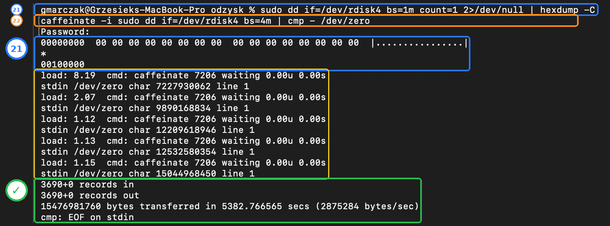
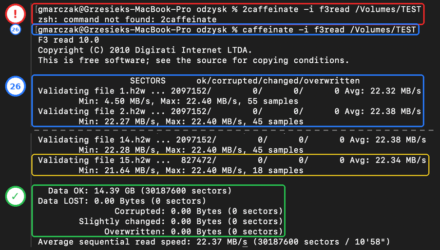

# Forensics kart microSD: podsumowanie

**Data:** 9–10.10.2026 · **Gdzie:** MacBook z wbudowanym czytnikiem SD · **Pełny opis krok po kroku:** [06 — Forensics na starych kartach microSD](06-forensics-karty-sd.md)

Krótka wersja ćwiczenia dodatkowego: po co je robiłem, co wyszło i czego mnie nauczyło. Wszystkie komendy z wyjaśnieniami, wpadki i pozostałe zrzuty są w rozdziale 06.

---

## Po co

Dwie stare karty microSD po 16 GB nie nadawały się na system dla Raspberry, więc posłużyły do nauki **informatyki śledczej** (*forensics*). Chciałem sprawdzić na prawdziwym nośniku:

- jak zrobić **obraz karty** (kopię bit po bicie) i udowodnić, że jest wierny,
- czy **usunięty plik** naprawdę znika,
- czy **formatowanie** kasuje dane,
- jak kartę **naprawdę wyczyścić** przed oddaniem,
- czy tania karta bez marki **nie kłamie co do pojemności**.

## Karty

| | SanDisk 16 GB (klasa 10) | Bez marki 16 GB (klasa 4) |
|---|---|---|
| Odczyt | **niepowtarzalny**: 3 odczyty, 3 różne sumy | stabilny: 3 zgodne sumy |
| Szybkość odczytu | 7 MB/s | 21 MB/s |
| Rola w ćwiczeniu | przykład nośnika, któremu nie można ufać | wszystkie 5 części |
| Co było na karcie | muzyka z telefonu z Androidem (cudze dane) | to samo, potem moje pliki testowe |

## Wynik w jednej tabeli

| Część | Co sprawdzałem | Wynik |
|---|---|---|
| 1 · obraz | czy kopia jest wierna | karta bez marki: **3 zgodne sumy SHA-256**; SanDisk: **3 odczyty, 3 różne sumy** |
| 2 · odzysk z cudzej karty | ile usuniętych plików da się wyciągnąć | **314 plików** (PhotoRec), głównie `mp3` |
| 3 · kontrolowany eksperyment | ile wraca z moich 4 usuniętych plików | TestDisk **4 z 4**, PhotoRec **3 z 4**; po samym formatowaniu dalej **111 plików** |
| 4 · zerowanie | czy po nadpisaniu coś wraca | **0 różnych bajtów**, PhotoRec **0 plików** |
| 5 · test F3 | czy karta ma deklarowaną pojemność | **14,39 GB OK, 0 utraconych**: karta uczciwa, ale zapis słaby (3,6 MB/s) |

---

## Część 1: obraz karty i dowód sumami

**Po co:** w śledztwie pracuje się na **kopii**, nigdy na oryginale. Kopia jest coś warta tylko wtedy, gdy da się udowodnić, że jest identyczna z oryginałem. Dowodem są sumy **SHA-256** („odciski palca” danych) z kilku niezależnych odczytów.

```bash
diskutil list                              # która to karta (po rozmiarze)
diskutil unmountDisk /dev/disk4            # odmontuj, żeby system nic nie zmieniał
caffeinate -i sudo dd if=/dev/rdisk4 bs=3m | tee noname.img | shasum -a 256   # obraz + suma w locie
shasum -a 256 noname.img                   # suma pliku
caffeinate -i sudo dd if=/dev/rdisk4 bs=3m | shasum -a 256                    # drugi odczyt karty
```

Przed włożeniem karty suwak **LOCK** na adapterze SD przesunięty na blokadę. To najprostszy *write blocker*: system może tylko czytać.


Karta bez marki: odczyt z kopiowania, plik obrazu i drugi odczyt dają tę samą sumę `7a90d2cf…7edf` → `ZGODNE`.

**Najważniejsza lekcja całego ćwiczenia** przyszła jednak z SanDiska. Kopiowanie skończyło się bez błędu, a mimo to każdy odczyt tej karty dawał **inne dane**: 48 mln różnych bajtów, bez żadnego komunikatu.


Wniosek: **jeden odczyt to nie dowód**, a „skończyło się bez błędu” też nie. Dlatego przed każdym obrazem robię szybki test powtarzalności (funkcja `stab` w [06, krok 3a](06-forensics-karty-sd.md#3a--stab-czy-karta-czyta-się-powtarzalnie)).

## Część 2: co zostało na cudzej karcie

**Po co:** „usunięcie” pliku zwykle tylko oznacza miejsce jako wolne. Dwa narzędzia odzyskują dane na dwa sposoby:

| | **TestDisk** (*undelete*) | **PhotoRec** (*carving*) |
|---|---|---|
| Jak działa | czyta spis plików i znajduje wpisy oznaczone jako usunięte | ignoruje spis, szuka plików po charakterystycznych pierwszych bajtach (np. JPEG: `FF D8 FF`) |
| Nazwy plików | zachowuje | gubi (`f0033036.jpg`) |
| Plik bez znanej sygnatury | odzyska | nie zobaczy |

```bash
chmod 444 noname.img                       # obraz tylko do odczytu
testdisk noname.img                        # menu: Intel → Advanced → Undelete
photorec /log /d odzysk/noname/ noname.img # menu: FAT32 → Other → Free
```


PhotoRec: **314 plików** (280 `mp3`, 25 `jpg`, 3 `txt`, 3 `ogg`, 2 `sqlite`, 1 `zip`). Plików nie otwierałem: to cudze dane, do wniosków wystarczą liczby i typy. Na zrzucie z TestDiska nazwy zamazałem.

## Część 3: kontrolowany eksperyment

**Po co:** na cudzych danych nie wiadomo, ile **powinno** wrócić. Więc: formatuję kartę, zapisuję 4 znane pliki (2 zdjęcia, PDF, 2 MiB losowych bajtów), zapisuję ich odciski, usuwam je i sprawdzam, co odzyskam.


| Plik | TestDisk | PhotoRec |
|---|---|---|
| 2 zdjęcia JPG | ✅ identyczne, z nazwami | ✅ identyczne, bez nazw |
| `readme.pdf` | ✅ identyczny (`_EADME.PDF`) | ✅ identyczny |
| `losowy.bin` (losowe bajty) | ✅ identyczny (`_OSOWY.BIN`) | ❌ niewidzialny: brak sygnatury |
| **razem** | **4 z 4** | **3 z 4** |

Do tego PhotoRec znalazł jeszcze **106 starych `mp3`** sprzed formatowania. **Formatowanie to nie kasowanie.**

## Część 4: bezpieczne kasowanie i dowód

**Po co:** skoro ani usunięcie, ani formatowanie nie niszczą danych, sprawdzam, co działa: **nadpisanie całej karty zerami**, i dowodzę, że nic nie wraca.

```bash
caffeinate -i sudo dd if=/dev/zero of=/dev/rdisk4 bs=4m    # zapis zer na całą kartę (31 min)
sudo dd if=/dev/rdisk4 bs=1m count=1 | hexdump -C          # początek karty: same 00
caffeinate -i sudo dd if=/dev/rdisk4 bs=4m | cmp - /dev/zero   # cała karta porównana z zerami
```

> ⚠️ `dd ... of=/dev/rdiskN` kasuje bez pytania. Zły numer dysku = utrata danych na MacBooku. Numer zawsze sprawdzam `diskutil info`.



`cmp: EOF on stdin`: koniec karty bez **ani jednej** różnicy. PhotoRec na wyzerowanej karcie: **0 plików**.

Uczciwe zastrzeżenie: karta ma kontroler z ukrytymi blokami rezerwowymi (*wear leveling*), do których `dd` nie sięga. Na zwykłe pozbycie się karty zerowanie wystarcza; przy naprawdę wrażliwych danych pewne jest tylko szyfrowanie od początku albo zniszczenie karty.

## Część 5: czy karta bez marki nie kłamie (F3)

**Po co:** tanie karty potrafią udawać 16 GB, mając 2 GB. **F3** zapisuje w każdym miejscu inne, znane dane i sprawdza, czy wszystko wróciło. Samo zerowanie tego nie wykryje, bo zera nadpisane zerami wyglądają tak samo.

```bash
diskutil eraseDisk FAT32 TEST MBRFormat /dev/disk4
caffeinate -i f3write /Volumes/TEST        # zapis 15 plików po 1 GB (1 h 8 min)
caffeinate -i f3read /Volumes/TEST         # odczyt i sprawdzenie (11 min)
```



`Data OK: 14.39 GB`, `Data LOST: 0.00 Bytes`. Karta jest **uczciwa**. Słabo zapisuje (średnio 3,6 MB/s, mniej niż obiecuje klasa 4), więc do nagrywania wideo się nie nadaje, ale do plików i ćwiczeń jest w porządku.

---

## Najważniejsze wpadki

Pełna lista z przyczynami w [06](06-forensics-karty-sd.md).

| Wpadka | Lekcja |
|---|---|
| SanDisk: 3 odczyty, 3 różne sumy, bez błędu | jeden odczyt to nie dowód; błąd, który nie krzyczy, jest najgroźniejszy |
| `dd` zakończył się `Operation timed out`, obraz krótszy o 3 MiB | zawsze porównuję rozmiar obrazu z rozmiarem karty |
| Moja pierwsza hipoteza („winne duże bloki”) była błędna | wygodne wyjaśnienie to hipoteza, dopóki test go nie potwierdzi |
| `diskutil list external` nic nie pokazał | wbudowany czytnik to `internal`; kartę rozpoznaję po rozmiarze |
| PhotoRec: `0 files saved` | „0 zapisanych” to nie „0 znalezionych”: folder docelowy nie istniał |
| Logi PhotoRec w folderze repo | narzędzia piszą logi w bieżącym folderze; na cudzych danych pracuję poza repo |
| TestDisk podpowiadał `Mac` zamiast `Intel` | podpowiedź narzędzia to propozycja, nie wynik |
| Kopia TestDiska „pusta” | `ls` bez `-a` nie pokazuje plików zaczynających się od kropki |
| `head -c 2m` nie działa na macOS | ta sama komenda ma inne opcje na macOS (BSD) i Linuksie (GNU) |

## Czego mnie to nauczyło

- **Usunięcie i szybkie formatowanie nie niszczą danych.** Nadpisanie całej karty tak.
- **Wierny obraz** wymaga zgodnych sum z co najmniej dwóch niezależnych odczytów.
- **TestDisk** odzyskuje ze spisu plików (z nazwami), **PhotoRec** po sygnaturach (bez nazw, ale też po formatowaniu).
- Przed oddaniem lub sprzedażą karty, telefonu czy pendrive'a: **nadpisać**, nie tylko wyczyścić.
- **F3** sprawdza, czy karta nie kłamie co do pojemności.

## Słowniczek

| Pojęcie | Znaczenie |
|---|---|
| forensics | informatyka śledcza: zabezpieczanie i analiza danych tak, żeby dało się obronić wynik |
| obraz dysku | plik będący dokładną kopią bit po bicie całego nośnika |
| SHA-256 | suma kontrolna, „odcisk palca” danych; zmiana jednego bitu daje zupełnie inny odcisk |
| write blocker | sprzęt lub ustawienie, które pozwala nośnik tylko czytać |
| undelete / carving | odzysk ze spisu plików / wycinanie plików z surowych danych po sygnaturach |
| sygnatura | charakterystyczne pierwsze bajty pliku, np. `%PDF` |
| wear leveling | kontroler karty rozkłada zapisy po komórkach, ma też ukryte bloki rezerwowe |

## Porządki po ćwiczeniu

Na MacBooku w `~/forensics/obrazy` zostały obrazy kart (`noname.img`, `noname-po-usunieciu.img`, `sandisk16.img`), razem ok. **47 GB**, plus odzyskane pliki w `~/forensics/odzysk`. Nie są już potrzebne. Część to cudze dane z karty z telefonu, więc lepiej je usunąć niż trzymać.

➡️ Wróć do [ROADMAP](../ROADMAP.md) albo do pełnego rozdziału [06](06-forensics-karty-sd.md).
