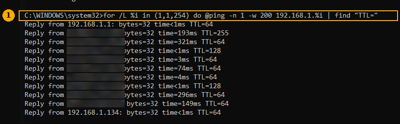
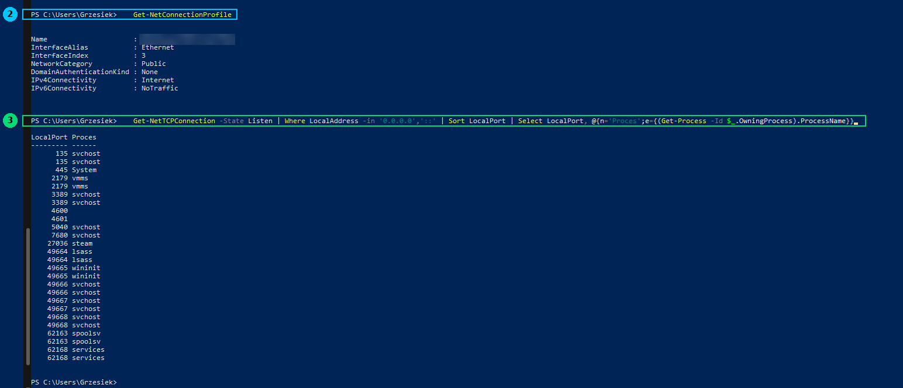
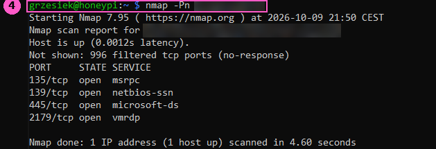
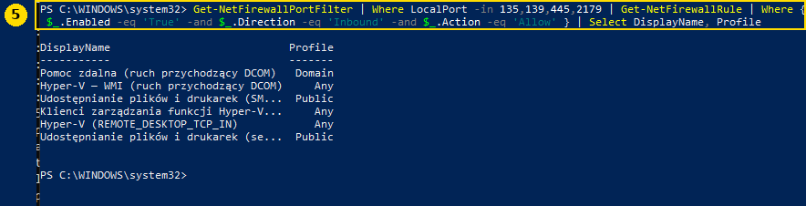
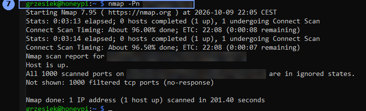

# 07 — Misja dodatkowa: z Raspberry atakuję własny PC

Czas: ~1 godzina. Raspberry (`honeypi`) i PC z Windows 10.

> 🍎 Podmisja: to samo dla MacBooka w [07b](07b-skan-macbooka.md).

Zwykle w tym labie Raspberry jest **obrońcą**. Tym razem role się odwracają: Raspberry skanuje mój PC tak, jak zrobiłby to atakujący, który dostał się do sieci domowej. Cel to odpowiedź na dwa pytania:

1. **Co widzi mój PC** w sieci domowej?
2. **Kto widzi mój PC** i co mógłby przez to zrobić?

> ⚠️ Skanuję **tylko własny komputer we własnej sieci**. Skanowanie cudzych urządzeń bez zgody to przestępstwo (art. 267 kk).

## Wynik w skrócie

| | Przed | Po |
|---|---|---|
| Otwarte porty widoczne z sieci | 135, 139, 445, 2179 | **brak** |
| Czas skanu `nmap` | 4,6 s | 201,4 s |
| Wynik `nmap` | 4 usługi widoczne | `All 1000 scanned ports … filtered` |

Po zmianach PC jest dla innych urządzeń w sieci domowej „cichy”: nie odpowiada na żadnym z 1000 najpopularniejszych portów TCP.

---

## Komendy w skrócie

Numery zgadzają się z ramkami na zrzutach.

```bat
:: --- na PC, w cmd ---
:: 1. kto jest w sieci (ping do każdego adresu 1–254)
for /L %i in (1,1,254) do @ping -n 1 -w 200 192.168.1.%i | find "TTL="
```

```powershell
# --- na PC, w PowerShellu ---
# 2. w jakiej sieci jest PC (Public / Private)
Get-NetConnectionProfile

# 3. na jakich portach PC nasłuchuje
Get-NetTCPConnection -State Listen | Where LocalAddress -in '0.0.0.0','::' | Sort LocalPort | Select LocalPort, @{n='Proces';e={(Get-Process -Id $_.OwningProcess).ProcessName}}
```

```bash
# --- na Raspberry ---
sudo apt install -y nmap

# 4. skan PC z perspektywy atakującego (PRZED)
nmap -Pn ADRES_PC
```

```powershell
# --- na PC, PowerShell jako administrator ---
# 5. które reguły firewalla otwierają znalezione porty
Get-NetFirewallPortFilter | Where LocalPort -in 135,139,445,2179 | Get-NetFirewallRule | Where { $_.Enabled -eq 'True' -and $_.Direction -eq 'Inbound' -and $_.Action -eq 'Allow' } | Select DisplayName, Profile

# 6. wyłączenie NetBIOS na wszystkich kartach sieciowych
Get-CimInstance Win32_NetworkAdapterConfiguration -Filter "IPEnabled=True" | Invoke-CimMethod -MethodName SetTcpipNetbios -Arguments @{TcpipNetbiosOptions=2}
ipconfig /all | findstr NetBIOS
```

Do tego dwie zmiany w okienkach (opis w kroku 6) i restart PC.

```bash
# --- na Raspberry ---
# 7. ten sam skan PO zmianach
nmap -Pn ADRES_PC
```

`ADRES_PC` to adres PC w sieci domowej (z `ipconfig`). W repo go nie podaję, tak jak adresów innych urządzeń.

---

## Co robi każda komenda

### 1. Ping do całej sieci

| Fragment | Co robi |
|---|---|
| `for /L %i in (1,1,254) do …` | pętla w cmd: `%i` przyjmuje wartości od 1 do 254 co 1 |
| `@` | nie wypisuje samej komendy przy każdym obrocie pętli |
| `ping -n 1` | wysyła tylko jeden pakiet |
| `-w 200` | czeka na odpowiedź najwyżej 200 ms |
| `192.168.1.%i` | kolejne adresy w mojej podsieci |
| `\| find "TTL="` | pokazuje tylko linijki z odpowiedzią (każda odpowiedź zawiera `TTL=`) |

**TTL** podpowiada system: `64` to zwykle Linux, Android, iPhone albo Mac, `128` to Windows, `255` to często drukarka lub router.

### 2. `Get-NetConnectionProfile`

Pokazuje, jak Windows traktuje sieć. **Public** oznacza „obca sieć”: firewall blokuje większość ruchu przychodzącego. **Private** oznacza „zaufany dom”: PC jest widoczny dla innych.

### 3. `Get-NetTCPConnection -State Listen …`

| Fragment | Co robi |
|---|---|
| `-State Listen` | tylko porty, które czekają na połączenie |
| `Where LocalAddress -in '0.0.0.0','::'` | tylko te nasłuchujące na wszystkich kartach sieciowych, IPv4 i IPv6 |
| `Sort LocalPort` | sortuje po numerze portu |
| `@{n='Proces';e={…}}` | dodaje kolumnę z nazwą programu, który trzyma port |

### 4. i 7. `nmap -Pn ADRES_PC`

`nmap` sprawdza 1000 najpopularniejszych portów TCP i mówi, które odpowiadają.

| Fragment | Co robi |
|---|---|
| `-Pn` | nie sprawdzaj najpierw pingiem, czy host żyje, tylko od razu skanuj. Firewall Windowsa w profilu Public ignoruje ping, więc bez tej opcji `nmap` uznałby PC za wyłączony |

Stany portów: **open** to usługa odpowiada, **closed** to nic tam nie ma, ale komputer odpowiedział, **filtered** to cisza, bo firewall wyrzucił pakiet.

### 5. Reguły firewalla

| Fragment | Co robi |
|---|---|
| `Get-NetFirewallPortFilter \| Where LocalPort -in …` | szuka reguł dotyczących znalezionych portów |
| `Get-NetFirewallRule` | dobiera do nich pełne reguły |
| `Enabled -eq 'True'` | tylko włączone |
| `Direction -eq 'Inbound'` | tylko ruch przychodzący |
| `Action -eq 'Allow'` | tylko te, które przepuszczają |
| `Select DisplayName, Profile` | nazwa reguły i w jakim profilu sieci działa (`Domain`, `Private`, `Public`, `Any` = wszędzie) |

### 6. Wyłączenie NetBIOS i dwie zmiany w okienkach

| Fragment | Co robi |
|---|---|
| `Win32_NetworkAdapterConfiguration -Filter "IPEnabled=True"` | wszystkie aktywne karty sieciowe |
| `SetTcpipNetbios … TcpipNetbiosOptions=2` | `2` = wyłącz NetBIOS przez TCP/IP. `ReturnValue : 0` oznacza sukces |
| `ipconfig /all \| findstr NetBIOS` | sprawdzenie: każda karta powinna mieć `Disabled` |

Zmiany w okienkach:

- **Udostępnianie plików i drukarek wyłączone dla sieci publicznych**: Panel sterowania → Centrum sieci i udostępniania → Zmień zaawansowane ustawienia udostępniania → Publiczne. Zamyka porty 139 i 445.
- **Hyper-V wyłączony**: Start → „Włącz lub wyłącz funkcje systemu Windows” → odznaczyć Hyper-V. Zamyka 135 i 2179 (porty zarządzania maszynami Hyper-V).

  > ℹ️ **Poprawka (2026-10-10):** wyłączenie funkcji Hyper-V **nie** przyspieszyło VirtualBoxa. Hypervisor Windowsa dalej działa, bo potrzebuje go Integralność pamięci (VBS/HVCI), a VirtualBox chodzi wtedy w wolnym trybie (zielony żółw). Śledztwo: [04e, część 2](04e-zabezpieczenie-kali-i-stabilnosc.md#część-2-śledztwo--dlaczego-cele-się-zawiesza).

---

## Wyniki krok po kroku

### Kto jest w sieci (1)



Odpowiedziało 11 urządzeń, w tym router (`192.168.1.1`), mój PC (TTL 128), drugi Windows, `honeypi` (`192.168.1.134`) i telefony. Część telefonów ma losowe adresy MAC („prywatny adres Wi-Fi” w iOS i Androidzie). Jedno urządzenie było w tablicy `arp -a`, ale nie odpowiedziało na ping: **brak odpowiedzi na ping nie znaczy, że urządzenia nie ma**.

### Profil sieci i porty od środka (2, 3)



Sieć jest w profilu **Public**, czyli w teorii PC powinien być schowany. Mimo to nasłuchuje wiele usług, m.in. 135 (RPC), 445 (SMB), 2179 (Hyper-V) i 3389 (Pulpit zdalny). Nasłuchiwanie nie oznacza jeszcze, że port jest dostępny z sieci. O tym decyduje firewall, więc trzeba to sprawdzić z zewnątrz.

### Skan z Raspberry: PRZED (4)



Mimo profilu Public z sieci widać **4 otwarte porty**: 135, 139, 445 i 2179. RDP (3389) nie ma na liście, więc firewall go blokuje.

### Które reguły to otwierają (5)



| Reguła | Profil | Port | Co to jest |
|---|---|---|---|
| Pomoc zdalna (DCOM) | Domain | 135 | zaproszenie kogoś do pomocy zdalnej. Działa tylko w sieci firmowej, więc u mnie nieaktywna |
| Hyper-V – WMI (DCOM) | Any | 135 | zdalne zarządzanie maszynami Hyper-V |
| Udostępnianie plików i drukarek (SMB-In) | **Public** | 445 | udostępnianie folderów (`\\KOMPUTER\folder`) |
| Klienci zarządzania funkcji Hyper-V | Any | 135 | Menedżer Hyper-V z innego komputera |
| Hyper-V (REMOTE_DESKTOP_TCP_IN) | Any | 2179 | okno podglądu maszyny wirtualnej (VMConnect) |
| Udostępnianie plików i drukarek (Session-In) | **Public** | 139 | NetBIOS, starsza droga udostępniania plików |

Port **135** to „centrala telefoniczna” Windowsa (RPC/DCOM): program z innego komputera dzwoni tam i pyta, pod jakim numerem jest potrzebna mu usługa.

Najciekawsze były dwie reguły udostępniania działające w profilu **Public**. Prawdopodobnie kiedyś kliknąłem „Włącz udostępnianie” i Windows włączył je dla bieżącej sieci.

### Skan z Raspberry: PO (7)



`All 1000 scanned ports … filtered`. Skan trwał 201 sekund zamiast 4,6, bo firewall po cichu wyrzuca pakiety i `nmap` przy każdym porcie czeka na odpowiedź, której nie dostanie. Dla atakującego to wolne i bezużyteczne.

`Host is up` nie znaczy, że PC odpowiada. To efekt opcji `-Pn`: `nmap` z góry zakłada, że host działa.

---

## Czy przed zmianami ktoś mógł mi coś zrobić?

**Realnie ryzyko było niskie.** Porty widziały tylko urządzenia w sieci domowej. Router robi NAT, więc z internetu nikt by się do nich nie dostał, chyba że router przekierowuje porty albo ma włączone UPnP.

Atakujący musiałby najpierw być w mojej sieci (zarażone urządzenie IoT lub telefon, gość z hasłem do Wi-Fi), a potem jeszcze:

| Port | Bez hasła | Z hasłem lub luką | Ryzyko |
|---|---|---|---|
| 445 (SMB) | nazwa PC, wersja Windowsa, zgadywanie hasła | dostęp do udostępnionych folderów; przy niezałatanej luce przejęcie PC (tak rozprzestrzeniał się WannaCry w 2017) | niskie przy aktualnym Windowsie i dobrym haśle |
| 139 (NetBIOS) | nazwa PC i grupa robocza | to samo co SMB | niskie |
| 135 (RPC) | lista usług Windowsa | zdalne polecenia, ale z kontem administratora | niskie |
| 2179 (Hyper-V) | prawie nic | sterowanie maszynami wirtualnymi (admin Hyper-V) | bardzo niskie |

Ryzyko byłoby realne, gdyby dodatkowo: konto Windows nie miało hasła albo miało słabe, jakiś folder był udostępniony dla „Wszyscy”, hasło wyciekło z innego serwisu albo Wi-Fi miało słabe hasło.

**Większe zagrożenie jest gdzie indziej:** Windows 10 nie dostaje już zwykłych łatek bezpieczeństwa, a najczęstsza droga infekcji to przeglądarka i pobrane pliki, nie otwarte porty.

> ℹ️ **Poprawka (2026-10-10):** pierwotnie stało tu, że program ESU dla domu kończy się 13.10.2026 (źródło: wątek na forum Microsoft Q&A). Oficjalna strona Microsoftu dla Europy podaje **12.10.2027** ([Microsoft: ESU](https://www.microsoft.com/en-ie/windows/extended-security-updates)). PC został zapisany do ESU 10.10.2026, opis w [części 2](#część-2-dokończenie-misji-10102026).

---

## ❗ Wpadki i ciekawostki

### ❗ Widok od środka był niepełny

| | |
|---|---|
| **Co było widać** | `nmap` z zewnątrz pokazał port **139**, którego nie było na liście z komendy 3 |
| **Przyczyna** | komenda 3 filtrowała tylko porty na `0.0.0.0` i `::`. NetBIOS nasłuchuje na konkretnym adresie karty sieciowej, więc filtr go pominął |
| **Lekcja** | lista portów od środka to tylko podpowiedź. Prawdziwą odpowiedź na „kto mnie widzi” daje skan z innego urządzenia |

### ❗ „SSH działa” na porcie 22 to był honeypot

| | |
|---|---|
| **Co było widać** | `Test-NetConnection honeypi.local -Port 22` na PC zwrócił `TcpTestSucceeded : True` |
| **Przyczyna** | prawdziwy SSH jest na porcie **2222** ([docs/02c](02c-ssh-hardening.md#część-3-prawdziwy-ssh-na-porcie-2222)). Na 22 odpowiada pułapka OpenCanary |
| **Lekcja** | otwarty port nie mówi, *co* za nim jest. Atakujący widzi dokładnie to samo i właśnie dlatego honeypot działa. To połączenie powinno być widoczne w logach OpenCanary |

### ❗ Procesy na portach 4600 i 4601 bez nazwy

| | |
|---|---|
| **Co było widać** | w komendzie 3 brak nazwy procesu, a `tasklist /fi "PID eq …"` zwrócił `No tasks are running` |
| **Przyczyna** | proces się zakończył albo zmienił PID między komendami |
| **Lekcja** | z zewnątrz tych portów nie widać (skan 4), więc nie były problemem. Najpierw sprawdzaj, co widać z sieci, potem szukaj winnych |

### Indeksator Windows Search zjadał procesor po restarcie

Po restarcie `SearchIndexer.exe` brał 30% procesora i 140 MB/s dysku. To normalne po zmianach w systemie. Sprawdzenie, czy to prawdziwy plik: Menedżer zadań → „Otwórz lokalizację pliku”. Prawdziwy leży w `C:\Windows\System32`. Plik o systemowej nazwie w `AppData` albo `Temp` byłby powodem do niepokoju.

---

# Część 2: dokończenie misji (10.10.2026)

Pierwszego dnia zamknąłem 4 otwarte porty. Drugiego dnia dokończyłem listę „Do zrobienia”: wszystko, co nie było widać w zwykłym skanie, ale też należy do „co mój PC wystawia i komu”.

## Komendy w skrócie (część 2)

```powershell
# --- na PC, PowerShell jako administrator ---
# 8. czy pulpit zdalny (RDP) jest wyłączony: 1 = wyłączony
(Get-ItemProperty 'HKLM:\System\CurrentControlSet\Control\Terminal Server').fDenyTSConnections
# 9. czy coś nasłuchuje na porcie RDP (oczekiwane: nic)
Get-NetTCPConnection -LocalPort 3389 -State Listen -ErrorAction SilentlyContinue

# 10. udostępnione foldery i kto ma do nich dostęp
Get-SmbShare
Get-SmbShareAccess -Name Users
# 11. usunięcie udziału Users (pliki zostają na dysku)
Remove-SmbShare -Name Users

# 12. ostatnie łatki po zapisie do ESU
Get-HotFix | Sort-Object InstalledOn -Descending | Select-Object -First 3

# 13. czy coś nasłuchuje na porcie z przekierowania w routerze i czy są reguły dla Javy
Get-NetTCPConnection -LocalPort 25565 -State Listen -ErrorAction SilentlyContinue
Get-NetFirewallRule -Direction Inbound -Enabled True | Where-Object DisplayName -match 'java|minecraft' | Select-Object DisplayName, Profile, Action

# 14. wyłączenie reguł firewalla dla Node.js i kontrola
Get-NetFirewallRule -DisplayName "Node.js JavaScript Runtime" | Disable-NetFirewallRule
Get-NetFirewallRule -DisplayName "Node.js JavaScript Runtime" | Select-Object DisplayName, Enabled
```

```bash
# --- na Raspberry ---
# 15. pełny skan: wszystkie porty TCP (SYN) i 100 najpopularniejszych UDP
sudo nmap -Pn -p- -T4 --max-retries 1 ADRES_PC
sudo nmap -Pn -sU --top-ports 100 -T4 ADRES_PC
# 16. co z tego zobaczył obrońca
bash ~/check-logs.sh
```

Kroki w Windows Update i w panelu routera to klikanie, opisane niżej.

## Wyniki

| Co | Znalezione | Zrobione |
|---|---|---|
| **RDP** | `fDenyTSConnections = 1`, port 3389 nie nasłuchuje | ✅ wyłączony (bez zmian) |
| **Udostępnione foldery** | oprócz systemowych `ADMIN$`, `C$`, `D$`, `IPC$` był udział **`Users` → `C:\Users`** z prawem **Wszyscy: Full** | ✅ udział usunięty; pliki zostały |
| **Windows Update** | „koniec wsparcia”, „brakuje ważnych poprawek”: PC nie był zapisany do ESU | ✅ zapis do ESU (bezpłatnie, konto Microsoft), ważne do **12.10.2027**; łatki zainstalowane 10.10.2026 |
| **Windows 11** | i5-7600K nie spełnia wymagań | decyzja: Windows 10 z ESU do 10.2027, potem nowy sprzęt |
| **Router: NAT/PAT** | przekierowanie **`minecraft`** TCP/UDP 25565 → PC; na PC nic na tym porcie nie nasłuchuje | ✅ martwa reguła usunięta |
| **Router: UPnP** | włączone; jeden wpis po urządzeniu `.27`, którego już nie ma w sieci (UDP 9308) | ✅ martwy wpis usunięty; **UPnP zostaje** dla PS5 (świadoma decyzja) |
| **Router: DMZ** | brak | ✅ |
| **Router: Wi-Fi** | WPA2 Personal; **WPS włączony** w sieciach domowych | ✅ WPS wyłączony (2.4 i 5 GHz); w sieci IoT nie da się go wyłączyć, sieć IoT jest wyłączona. Hasło i szyfrowanie zostają (decyzja domowa) |
| **Firewall Windows** | dwie reguły **Node.js JavaScript Runtime**: Allow w profilach Private i **Public** | ✅ wyłączone |
| **Nieznane urządzenie** `.16` (`localhost`, MAC Samsunga) | **telewizor Samsung** | ✅ zidentyfikowane; pomysł: później sieć IoT dla TV i pralki |
| **Pełny skan TCP** | `All 65535 scanned ports … are in ignored states`, `65535 filtered`, 1314 s | ✅ |
| **Skan UDP (100 portów)** | `100 open\|filtered`, żadnego czystego `open`, 3,5 s | ✅ |

### Co zobaczył obrońca

Skan szedł **z** Raspberry, a Suricata na Raspberry obserwuje cały jego ruch. W `fast.log` pojawiło się kilkanaście alertów, każdy z adresem Raspberry jako źródłem:

| Rodzaj | Przykłady (port) |
|---|---|
| TCP, `ET SCAN Suspicious inbound to …` | Oracle (1521), PostgreSQL (5432), MSSQL (1433), VNC (5800–5820) |
| UDP, `GPL …` / `ET …` | SNMP (161), XDMCP (177), TFTP (69, priorytet 1), DNS version (53), PCAnywhere (5632), Vuze BT, `ET DOS Possible SSDP Amplification Scan` (1900) |

**Wniosek na Etap 4:** Suricata nie ma reguły „ktoś skanuje porty”. Alarmuje tylko wtedy, gdy skan trafi w port, dla którego ma konkretną regułę (bazy danych, VNC, SNMP…). Z 65 535 sprawdzonych portów zauważyła kilkanaście. Własna reguła wykrywająca skan po liczbie prób to dobry kandydat na zadanie „własna reguła Suricaty” w Etapie 4.

Przy okazji w logu honeypota widać połączenie **z PC na port 22** (9.10, test z [Etapu 2](03-defender-raspberry.md)), co zamyka ostatni punkt starej listy.

## ❗ Wpadki i ciekawostki (część 2)

| Problem | Co było widać | Przyczyna | Rozwiązanie | Lekcja |
|---|---|---|---|---|
| Udział `Users` z prawem Wszyscy: Full | `Get-SmbShareAccess` → `Wszyscy  Allow  Full` | kiedyś utworzony udział (przeze mnie albo program) | `Remove-SmbShare -Name Users` | „port zamknięty w firewallu” to nie powód, żeby zostawić otwarte to, co jest za nim; każdą warstwę sprawdzam osobno |
| Martwe przekierowanie `minecraft` | reguła NAT/PAT 25565 → PC, a na PC nic nie słucha | stary serwer Minecrafta | reguła usunięta | przekierowania w routerze żyją dłużej niż programy, dla których powstały |
| Komenda „java” znalazła Node.js | `Node.js JavaScript Runtime` w wynikach filtra `java` | „JavaScript” zawiera „java” | przypadkowe, ale cenne znalezisko | każde „Zezwól” kliknięte kiedyś na szybko zostaje w firewallu na lata |
| Kliknięcie WPS w panelu uruchomiło parowanie | przycisk WPS zaczął migać | to przycisk akcji (parowanie przez ~2 min), nie przełącznik | wyłączenie w ustawieniach sieci: pole „WPS: Aktywny” | zanim kliknę w panelu routera, sprawdzam, czy to przełącznik, czy akcja |
| Zrzut ustawień Wi-Fi pokazał hasło | pole „Hasło Wi-Fi” i kod QR otwartym tekstem | panel Orange pokazuje hasło bez maskowania | zrzut nie trafia do repo | kod QR to zapisane hasło; zrzuty z panelu routera przycinam przed wysłaniem |
| Prawdziwe hasło w logu honeypota | wpis `logtype 4002` z MacBooka (9.10): login `gmarczak` i hasło, które wyglądało na prawdziwe | `ssh` z MacBooka trafiło na port 22, czyli w honeypota, a nie w prawdziwe SSH na 2222 | hasło do zmiany tam, gdzie jest używane; log na Raspberry zostaje (to dowód działania pułapki) | honeypot zapisuje **wszystko**, także pomyłki właściciela. Z innych urządzeń łączę się `ssh -p 2222` albo przez skrót z `~/.ssh/config` |
| Skan UDP trwał 3,5 s, a TCP 22 min | dwa bardzo różne czasy | UDP: tylko 100 portów; TCP: 65 535 portów i czekanie na każdą odpowiedź, która nie przychodzi | nic | przy firewallu, który milczy, czas skanu rośnie z liczbą portów |

---

## Do zrobienia

- [x] Wyłączyć Pulpit zdalny (RDP) — był już wyłączony, potwierdzone 10.10
- [x] `Get-SmbShare`: zostały tylko udziały systemowe (usunięty `Users`)
- [x] Router: brak przekierowań do PC, martwy wpis UPnP usunięty, DMZ wyłączone, WPS wyłączony; UPnP zostaje dla PS5
- [x] Decyzja o Windows 10: ESU do 12.10.2027, potem nowy sprzęt
- [x] Logi OpenCanary: połączenie z PC na port 22 jest w logu
- [x] Pełny skan TCP i UDP: nic otwartego
- [ ] Zrzuty z części 2 obrobione i dodane (bez hasła Wi-Fi, kodu QR, e-maila, adresów MAC i nazw sieci)
- [ ] Pomysł na później: sieć IoT dla telewizora i pralki

📋 Krótka wersja całej misji: [podsumowanie](07-skan-pc-podsumowanie.md). Podmisja dla MacBooka: [07b](07b-skan-macbooka.md).

➡️ **Następnie:** [Etap 3: Atakujący — Kali i cele na PC](04-attacker-kali.md)
